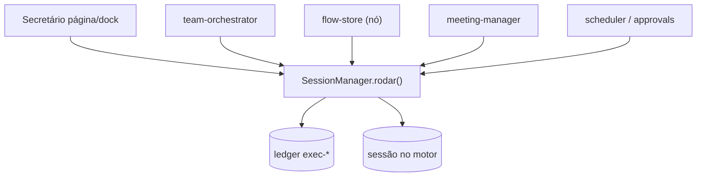

# Plano Mestre — Ecossistema OpenCorp: chat único, fluxos, reuniões, @, skills e loja de assets

> Origem: todas as conversas desta sessão (dock lateral do Secretário, 409/evicção,
> agrupamento do Histórico, sessões em reuniões e fluxos, juiz de loop, taxonomia @ vs /,
> prompts.json, skills, loja de assets, nó ad-hoc, ficha do agente, isolamento de motores).
> Status: PLANEJAMENTO — nada aqui está implementado (exceção: Fase 0, já entregue).
> Convenção: CLI primeiro → Web → E2E. Sem emoji na UI (só ícones lucide).

## Princípio arquitetural (tese confirmada no código)

**1 ordem = 1 sessão no motor + 1 exec no ledger.** `SessionManager.rodar({agente, ordem, ...})`
(`src/core/session-manager.ts:532`) é o funil único: chat, task, nó de fluxo, reunião,
scheduler, aprovação retomada. Cada chamada gera `exec-*` em `registries/execucoes`
(tag `sessao`) + sessão no harness (`ses_*` no opencode, sessão local nos CLIs).

**Agente = arquivo `.md`** (`<ws>/.opencorp/agents/<id>.md`): frontmatter
(model, tools, permissions, budget, memory, `skills[]` — novo) + corpo (system prompt).
Conversar com outro agente = trocar o campo `agent` no envio. Nó com agente = herdar
tudo do `.md`; nó sem agente = modo ad-hoc (prompt_sistema + model inline).

---

## Fase 0 — Entregue (base pronta)

- `src/web/lib/chat/{store.tsx,constants.ts}`: máquina única do chat (página + dock).
- `src/web/components/SecretarioDock.tsx`: dock lateral global (overlay no mobile,
  oculto em `/secretario`, FAB inferior-direito, Ctrl+J, fecha ao cruzar p/ mobile).
- Servidor: 409 anti duplo-run com **evicção de órfão** (Map sessão→res) + fila com
  retry no `adiantarFila`/fila automática (`enviarMensagem → boolean`, rollback do otimismo).
- Contexto de página: `contexto: ["localização: /rota"]` fora de `/secretario`.
- Suite verde: E2E 281/281, vitest 803, `tsc` limpo, produção `:4100` redeployada.

## Fase 1 — Sessões: continuar, duplicar, fila por sessão (agnóstico a motor)

Matriz de capability verificada nos binários (claude sem plano: declarado, não testado):

| Motor | Continuar | Fork | Mecanismo |
|---|---|---|---|
| opencode | sim | reidratar | API `ses_*` |
| claude | `--resume`/`--continue` | — | flags existem |
| agy | `-c`, `--conversation` | — | confirmado |
| copilot | `--continue`, `--connect=` | — | confirmado |
| codex | `resume` | **`fork` nativo** | confirmado |
| cursor-agent | `--resume`, `--continue` | — | confirmado |
| crom-agente | `--session` | — | já aceita, desplugar |
| aider/outros | reidratar + `reidratada_de` | reidratar | fallback honesto |

- `SessionManager`: `capabilities()` por driver + `continuar(id)` / `duplicar(id)`.
  **Duplicar nunca exige motor**: snapshot (transcript+contexto+config) → sessão nova
  com `fork_de`; ledger nunca reescrito (copy-on-write, original auditável).
- Nó de fluxo ganha `session_mode: nova | reaproveitar | continuar | duplicar`
  + `session_from: <noId>` restrito a **nós ancestrais** (validação topológica:
  causalidade, aciclicidade, contexto disponível; resto vira erro legível).
- Fanout/review/debate/decisão/fanout-paralelo no mesmo alvo: **fila FIFO por sessão**
  (lock com dono + lease; `429 queued, posição N`) em vez de 409 seco no conflito real.
  Evicção de órfão (Fase 0) mantida como primeira linha.

## Fase 2 — Loops: juiz + interrupção 100% automática

Estado atual: validação (`max_iteracoes` 1–100, `retornar_para`/`saida_final`, DFS rejeita
ciclo sem nó `loop`, subflow anti-recursão) + runtime (teto global 100 passos, journal
por volta com `motivo_encerramento`). **Sem pausa humana** (decisão): só guard/HITL
existente pausa; loop nunca pede "continuo?".

- Juiz mora no nó `loop`: `juiz: { a_partir_da_volta, regras[] }`.
- Regras: `sem-melhora` (output repetido), `orcamento` (custo/tempo), `condicao_parada`
  evoluída (string → regex → juiz-LLM desempate), determinístico antes do LLM.
- `teto_atingido | condicao | sem_melhora | orcamento` sempre com motivo no journal + UI.
- Corrigir: nó comum acima do teto hoje é pulado **em silêncio** → passa a emitir evento.
- Aprendizado: motivos passados viram exemplos do juiz (sem re-treino, só contexto).

## Fase 3 — Gramática `@` vs `/` vs `!` + registro `@` pesquisável

Taxonomia (violações atuais mapeadas e a corrigir):

| Prefixo | Posição | Papel | Estado |
|---|---|---|---|
| `/` | início da linha | **executa ação** (fast-path whitelist; resto = ajuda/erro, nunca LLM silencioso) | `/status`, `/task run`, `/doctor`… hoje caem no LLM |
| `!` | início da linha | shell (`POST /terminal`) | ok |
| `@` | qualquer posição | **só puxa** (nunca executa) | `@agente` em task dispara run; `@arquivo` ecoa nome sem conteúdo |

Três visuais: `@contexto` → chip/bloco resolvido + preview; `@prompt` → expande para
**texto editável** (Esc desfaz); `@agente` → pill de destinatário. Preview no cliente,
verdade no servidor (mesma regex, servidor autoritativo). Catálogo `@` documentado;
novos `@` entram como assets (Fase 5). Resolver `pagina`/`tasks`/`custos`/`agente/*`
no servidor antes do envio, em bloco estruturado com fontes citadas.

## Fase 4 — prompts.json central

Textos reutilizáveis saem dos `.md` espalhados para um JSON versionável
(`chave → texto com {{vars}}`), puxado por agentes, nós de fluxo, drawer e `@prompt`.
**Decisão pendente**: global (`~/.opencorp/prompts.json`) vs por workspace
(`.opencorp/prompts.json` + fallback global). Proposta: por workspace com fallback
global (mesmo padrão dos agentes).

## Fase 5 — Skills no agente (multi-seleção)

- Formato: `.opencorp/skills/<nome>/SKILL.md` (padrão Anthropic:
  `name, description, allowed-tools?` + corpo) + `skill.json` opcional
  (`versao, requires`) só para versionar.
- Declaração: `skills: string[]` no frontmatter (zod, kebab-case, ausente = erro legível).
- Injeção no `rodar` via `sincronizarAgente()`: seção `## Skills`, ordem alfabética,
  teto ~8k chars com aviso. Skills = markdown instruído; **não executa skill como código**.
- CLI: `oc skill instalar <pasta|git|tar> | listar | mostrar`;
  `oc agent skills <id> --add a,b --remove c --set a [--json]`.
- Web: checkboxes multi + badge no drawer de agentes; `PUT /agents/:id {skills:[...]}`.

## Fase 6 — Loja de assets (`oc asset`, CLI primeiro)

Kinds: `agente | skill | prompt | task(s) | flow | pack | workspace-parcial`.
Pack = pasta ou `.corp` (tar.gz) com `asset.json`
`{kind, kindVersion, nome, versao(semver), dependeDe[{kind,nome,versaoMin}], autor}`.

- Exportar: `oc asset exportar --tipo X --somente ids -o out.corp`; workspace parcial
  filtra por tipo (só tasks, só skills…).
- Importar: `oc asset importar <arquivo|pasta|URL> [--dry-run] [--para ws]
  [--como novo-id] [--sobrescrever]`; conflito de id = erro que sugere `--como`;
  `--dry-run` lista arquivos+deps sem gravar; `kindVersion` dispara migração pura pré-zod.
- **Segredo nunca entra no pack** (denylist do template estendida:
  `secrets/`, `*.pem`, `.env`, `corp.db`).
- NÃO fazer agora: marketplace remoto/auth, versionamento automático de breaking,
  formato binário novo (manter `.md/.json/.corp`).

## Fase 7 — Nó ad-hoc + ficha do agente

- Nó `agente` com `agente?` opcional: sem agente → `prompt_sistema` + `model` inline;
  com agente → herda tudo (system, model, tools, permissions, budget, `skills[]`).
  **Hoje NÃO existe nó LLM-direto sem `.md`** (verificado: `flow-store.ts:353-359`
  exige `config.agente`; nenhum tipo `llm/modelo/prompt`). Multi-turno no nó agente
  hoje só via `loop`/`review`/`debate`; `session_mode` já cobre `reaproveitar/
  continuar/duplicar`.
- Ficha do agente (consultável isolada, por categoria): sessões (`listarSessoes`
  por prefixo — já existe), execuções (campo `agente` no ledger), tasks
  (`responsavel`), custos/falhas (telemetria por agente). Exposta via `@agente/*`
  + endpoint/CLI (`oc agent ficha <id>`). O frontmatter `memory.reads` continua
  declarando o que o agente pode lembrar.

## Fase 10 — Join de múltiplas entradas (barreira)

**Hoje NÃO existe barreira** (verificado): `filaNos` é FIFO simples
(`flow-store.ts:807,828-829`); ao terminar, cada nó enfileira todos os alvos das
arestas de saída (`1620-1624`). Nó com 2+ arestas de entrada executa **N vezes**
(uma por aresta), com o contexto de cada predecessor; o último a terminar sobrescreve
o estado. O mapa `reverso` (`309-328`) já calcula as entradas, mas só é usado para
`session_from`.

- Implementar "esperar todas as entradas" (estilo n8n "Wait for all incoming"):
  grau de entrada por nó + `contadorPendente`/`bufferEntradas`; só enfileirar/executar
  quando o contador zerar, com contexto mesclado (concatenação) — ou regra explícita
  (`primeira | última | concat | sintese`). Contexto por-aresta em vez do `contexto`
  compartilhado (`800,831`).
- Config por nó: `join: "all" | "any"` (default `all` para >1 entrada, `any` para
  manter comportamento antigo em fluxos legados).

## Fase 8 — Isolamento de motores (prova)

Isolamento hoje: `cwd` = workspace + driver sandbox/host/container + XDG/tmp/DNS
isolados (+ `--sandbox workspace-write` no codex). Ponto fraco: dotfiles/globais
de cada motor (auth, `~/.claude.json`, caches). Prova: E2E "agente do ws-A não
alcança arquivo do ws-B" por harness.

## Fase 9 — Grupos de agentes (team): verificar e fechar lacunas

Estado (investigado 2026-09-12): `src/core/team-store.ts` (JSON, padrões
`pipeline|fanout|review|debate`), `team-orchestrator.ts` (uma sessão POR integrante,
nunca sessão única; sem transcript compartilhado — contexto flui por concatenação
`{{entrada}}/{{anterior}}/{{ajustes}}`), síntese/moderador/revisor consolidam.
Nós `fanout/review/debate` fundidos em `flow-store.ts` (sem kanban). Testes de
unidade/CLI/API existem (`team-store|team-orchestrator|team-cli|flow-migrate.test.ts`),
mas **a execução end-to-end nunca foi testada**. Lacunas a fechar:

1. Execução dos nós fundidos `fanout/review/debate` (`flow-store.ts:869-960`)
   nunca testada end-to-end (só conversão e validação).
2. Divergência de contrato legacy×fundido: debate fundido ignora `moderador.ordem`;
   fanout/review não usam `{{anterior}}/{{ajustes}}`. Precisa teste de paridade.
3. Sem verificação de que a saída completa (não só 1ª linha/600 chars) chega à
   síntese/moderador em casos longos.
4. Comportamento "sessões sempre separadas" no grupo não está documentado/testado
   (grupo não tem `session_mode`).
5. `team-orchestrator.ts:239` usa `resultados.indexOf(r)` para indexar subtask em
   falha — bug potencial com múltiplas falhas simultâneas.
6. Sem teste de `POST /teams/:id/run` de ponta a ponta.

## Verificação (todo ciclo e final)

Por ciclo: `tsc` + build + specs-alvo do touch + `doctor`. Final: full E2E
(281+novas), vitest, `doctor`, redeploy `:4100` via daemon (stop → kill serve →
start `--com-serve`, aguardar tick 15s, health 200). Sem commit sem pedido.
