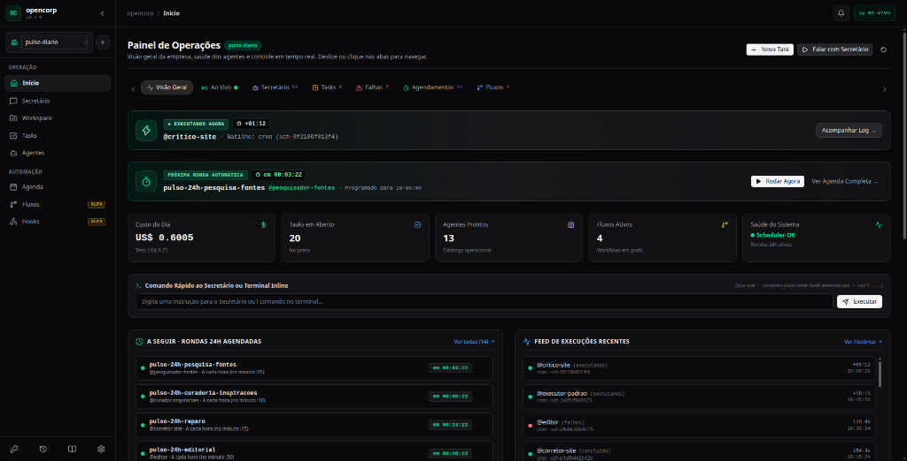
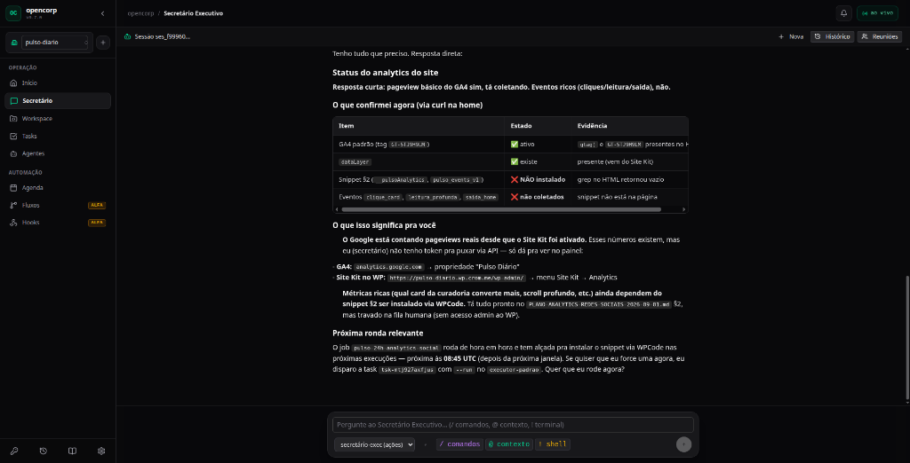
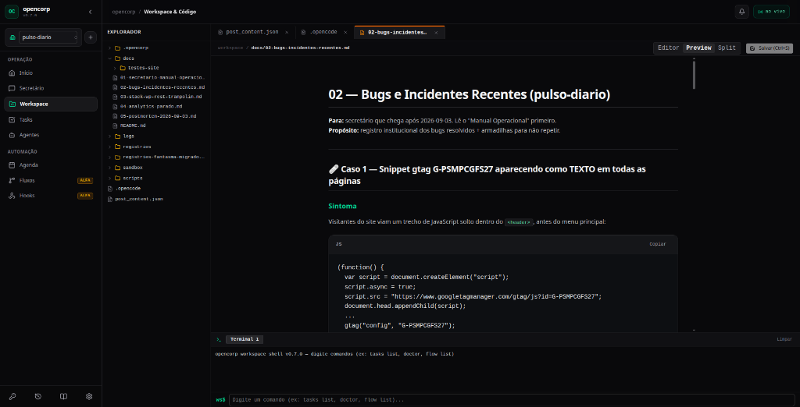
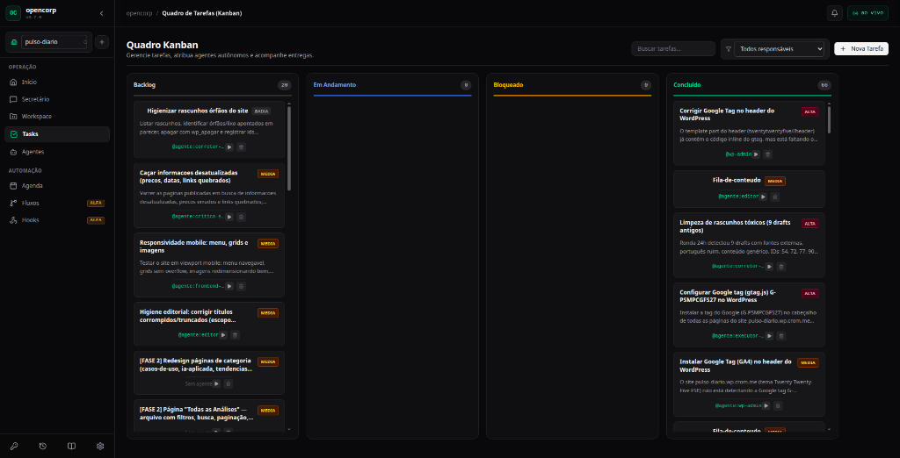
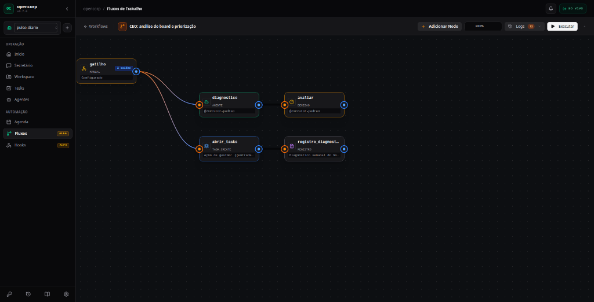
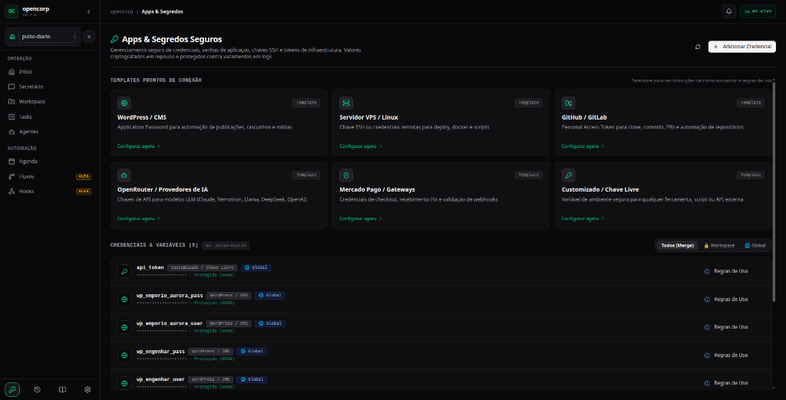
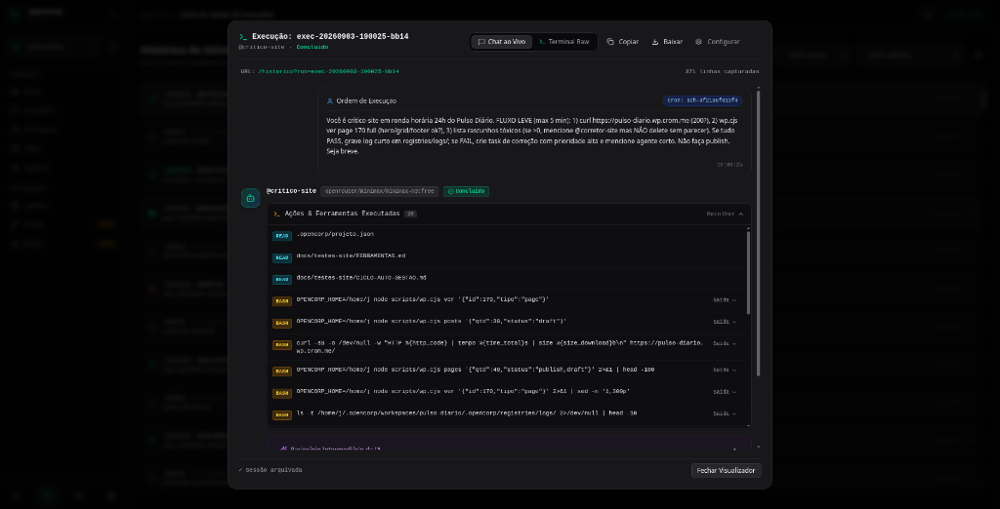
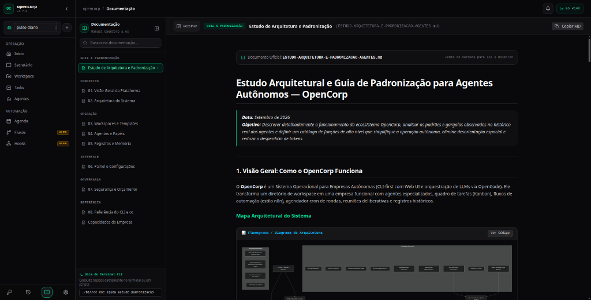
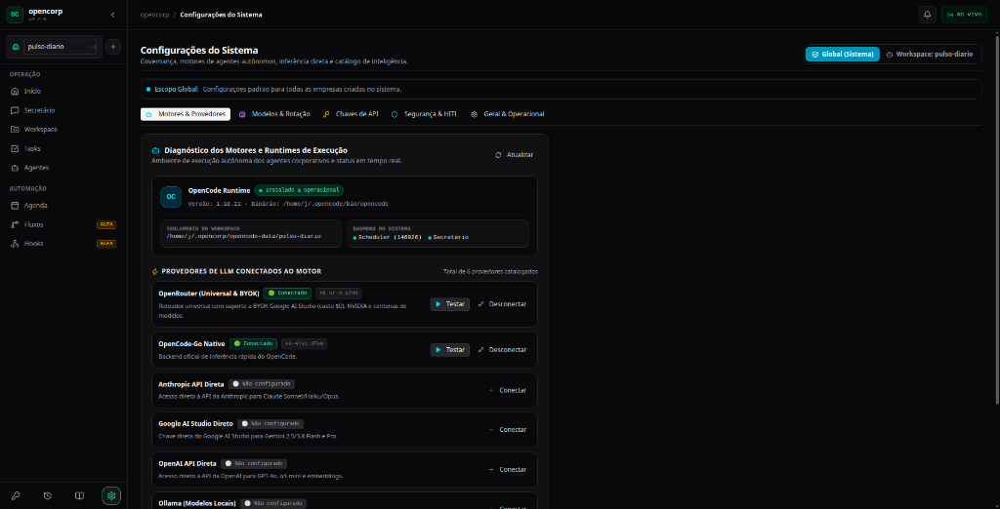

# 🏢 OpenCorp — Sistema Operacional de Empresas Autônomas

[](LICENSE)
[](https://nodejs.org)
[](https://www.typescriptlang.org)
[](https://opencode.ai)

O **OpenCorp** é um sistema operacional distribuído para governar empresas autônomas movidas por agentes de IA. Ele orquestra sessões de modelos de linguagem sobre múltiplos harnesses ([OpenCode](https://opencode.ai), [Claude Code](https://claude.ai), [Antigravity](https://github.com)), mantendo cada empresa (workspace) isolada com seu próprio banco de dados SQLite, sistema de segredos, arquivos de tarefas, registros e auditoria.

> **Filosofia Core:** Tudo vive no sistema de arquivos em formatos legíveis e versionáveis (`.md`, `.json`, `.db`). O painel web reativo (SolidJS + TailwindCSS) espelha 100% dos comandos do terminal.

---

## 🌐 Repositórios & Links

* 🏛️ **Repositório Oficial (Organização):** [crom-org/opencorp](https://github.com/crom-org/opencorp) · Org: [crom-org](https://github.com/crom-org)
* 🛠️ **Repositório de Desenvolvimento Ativo:** [MrJc01/crom-opencorp](https://github.com/MrJc01/crom-opencorp) · Mantenedor: [@MrJc01](https://github.com/MrJc01)

---

## 📋 Pré-requisitos

* **Node.js**: `>= 20.0.0` (recomendado Node 22+)
* **npm** ou **pnpm**
* **Git**
* *(Opcional)* Runner do [OpenCode](https://opencode.ai) instalado no PATH para execução local (`opencode`).

---

## 🚀 Instalação

```bash
# 1. Clone o repositório oficial (ou o repositório de desenvolvimento)
git clone https://github.com/crom-org/opencorp.git
cd opencorp

# (Para desenvolvimento ativo):
# git clone https://github.com/MrJc01/crom-opencorp.git && cd crom-opencorp

# 2. Instale as dependências
npm install

# 3. Compile o core (TypeScript) e a interface web (SolidJS)
npm run build

# 4. (Opcional) Crie um link global para usar o comando "oc" de qualquer pasta
npm link
```

Se preferir não usar `npm link`, utilize o executável direto: `./bin/oc`.

---

## 🖥️ Início Rápido (Quickstart)

### 1. Iniciar o Servidor API e Painel Web

Inicie o daemon em background com o comando `serve`:

```bash
# Inicia a API e a interface web na porta 4100
oc serve --port 4100

# Ou em foreground com logs ao vivo
oc serve start --foreground --port 4100
```

Abra no navegador: **`http://localhost:4100`** para acessar o painel de controle.

---

## 📸 Demonstração da Interface (Screenshots)

### 1. Painel de Operações & Rondas 24h
> Visão geral da saúde da empresa, custos do dia, status dos agentes e feed de execuções em tempo real.


---

### 2. Secretário Executivo Autônomo
> Conversação fluida com o Secretário Executivo para obter diagnósticos, status de infraestrutura e delegar ordens.


---

### 3. Workspace & Editor com Terminal Integrado
> Navegação direta nos arquivos da empresa, documentações, logs e terminal inline isolado.


---

### 4. Quadro Kanban de Tarefas
> Acompanhamento de entregas, tarefas bloqueadas e atribuição direta a agentes autônomos.


---

### 5. Fluxos de Trabalho & Automação Visual
> Construtor de automações em grafo: conecte gatilhos, tomadas de decisão e agentes corporativos.


---

### 6. Apps & Gestão Segura de Segredos
> Gerenciamento seguro de credenciais (WordPress, VPS, GitHub, LLMs) com isolamento por workspace e proteção `chmod 600`.


---

### 7. Histórico & Rastreabilidade de Execuções
> Inspeção transparente de cada ordem, ferramentas chamadas (bash, curl, APIs) e tempo de resposta.


---

### 8. Documentação Interna & Diagramas Mermaid
> Renderização nativa de manuais, playbooks e diagramas de arquitetura com alternância de código.


---

### 9. Configurações de Governança & Motores LLM
> Diagnóstico de runtimes em tempo real, alternância de escopos (Global vs. Workspace) e controle de chaves de API.


---

### 2. Gerenciando Workspaces (Empresas)

Cada workspace representa uma organização independente com seus próprios agentes, tarefas e dados:

```bash
# Criar uma nova empresa com o template padrão
oc workspace create minha-empresa

# Listar todas as empresas cadastradas
oc workspace list

# Definir a empresa ativa globalmente
oc workspace use minha-empresa

# Exportar empresa completa como pacote .corp (segredos são excluídos automaticamente)
oc template export minha-empresa -o /tmp/empresa.corp

# Importar um pacote .corp existente
oc template import /tmp/empresa.corp --as filial-sp
```

---

### 3. Agentes e Execuções

O CLI `oc` é contextual: quando executado dentro de uma empresa ou por um agente, **opera automaticamente no workspace ativo sem exigir flags adicionais**:

```bash
# Listar os agentes da empresa ativa
oc agent list

# Disparar uma tarefa para um agente
oc run "Analise a fila de rascunhos e faça uma auditoria de qualidade" --agent corretor-site

# Inspecionar detalhes de um agente
oc agent show editor

# Ver histórico de execuções da empresa
oc historico --limite 15
```

---

### 4. Gestão Segura de Segredos e Credenciais (`oc secrets`)

O OpenCorp conta com um sistema hierárquico de credenciais com isolamento estrito por workspace:

```
┌─────────────────────────────────────────────────────────────┐
│ 1. 🔒 WORKSPACE:  <workspace_dir>/.opencorp/secrets.json     │  (Maior prioridade)
│ 2. 🌐 GLOBAL:     ~/.opencorp/secrets.json                  │  (Fallback compartilhado)
└─────────────────────────────────────────────────────────────┘
```

* Os valores são protegidos no disco com permissão `chmod 600`.
* A listagem **nunca expõe valores sensíveis em texto claro** — apenas nomes, tipos e origem.

```bash
# Listar segredos disponíveis no workspace atual (merge workspace + global)
oc secrets list

# Listar apenas os exclusivos do workspace atual
oc secrets list --scope workspace

# Cadastrar um segredo isolado neste workspace (padrão)
oc secrets set wp_app_pass "minha-senha-secreta"

# Cadastrar um segredo global compartilhado com todas as empresas
oc secrets set openrouter_api_key "sk-or-v1-..." --scope global

# Obter o valor de um segredo (saída limpa para scripts/agentes)
oc secrets get wp_app_pass

# Remover um segredo
oc secrets delete wp_app_pass --scope workspace
```

---

### 5. Tarefas e Kanban

```bash
# Criar uma tarefa no quadro da empresa
oc task create --titulo "Publicar artigo sobre IA" --descricao "Revisar fontes e agendar post"

# Listar tarefas abertas
oc task list

# Mover tarefa no fluxo Kanban
oc task move <task-id> "em-andamento"
```

---

### 6. Diagnóstico e Monitoramento do Sistema

```bash
# Diagnóstico completo de saúde do ambiente, daemons e dependências
oc doctor

# Visão rápida da saúde da empresa (execuções, workers e pids)
oc saude

# Monitor em tempo real no terminal (TUI)
oc monitor
```

---

## 🧩 Arquitetura & Motores Suportados

O OpenCorp oferece suporte a múltiplos motores de execução (harnesses):

* **OpenCode Engine:** Runner local isolado com suporte a MCP, ferramentas customizadas e histórico de sessões.
* **Claude Code Engine:** Execução orquestrada com Claude.
* **Antigravity Engine:** Integração com o ecossistema Antigravity.
* **Provedores de Inferência Direta:** Conexão nativa com OpenRouter, Google AI Studio, Anthropic e OpenAI com rotatividade automática em caso de rate-limit.

---

## 🧪 Testes Automatizados

O projeto conta com cobertura de testes unitários e de integração utilizando Vitest:

```bash
# Executar a bateria de testes unitários
npm test

# Executar testes específicos de isolamento de segredos
npx vitest run tests/secrets-store.test.ts

# Executar testes de isolamento de workspaces
npx vitest run tests/workspace-isolation.test.ts
```

---

## 🔒 Segurança e Privacidade

1. **Isolamento Total:** Cada workspace possui seu próprio banco SQLite (`corp.db`), sessões e diretórios de dados.
2. **Proteção contra Vazamentos:** Arquivos `.corp` exportados passam por sanitização automática que remove chaves de API, senhas e arquivos de ambiente (`.env`, `secrets.json`, `auth.json`).
3. **Nível de Intervenção Humana (HITL):** Suporte a políticas de segurança configuráveis por workspace (`permissivo`, `moderado`, `estrito`).

---

## 📄 Licença

Este projeto está licenciado sob os termos da licença [MIT](LICENSE).
