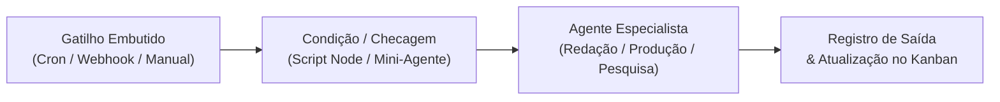

# 01 — Visão Geral do OpenCorp (v0.7.0)

## O que é o OpenCorp

O **OpenCorp** é um **Sistema Operacional de Empresas Autônomas Multi-Agente** desenhado para orquestrar fluxos de trabalho inteligentes, supervisão executiva e esteiras de produção digital de ponta a ponta.

No OpenCorp, cada empresa ou projeto opera como um **Workspace** isolado com:
- **Fluxos como Motor Central (Paradigma n8n)**: Automações visuais e declarativas onde gatilhos (`cron`, `webhook`, `manual`, `subflow`), mini-agentes, scripts, condições e saídas trabalham em um grafo executivo. O fluxo é a espinha dorsal de tudo.
- **Supervisor e Scheduler Global Unificado**: Um daemon central que gerencia os ciclos de execução (ticks), escuta webhooks e despacha os fluxos ativos de todos os workspaces sem necessidade de agendadores fragmentados.
- **Secretário Executivo Residente**: O cérebro supervisor de cada workspace. Ele audita histórico, responde ao operador humano, diagnostica falhas, analisa métricas e orquestra ações.
- **Quadro Kanban de Tarefas (CRUD de Tasks)**: O painel operacional onde os próprios agentes se organizam (criando e movendo cards durante o fluxo) e exibem de forma transparente o progresso para o cliente e para o Secretário.
- **Hub Multi-Motor de IA**: Suporte desacoplado aos principais motores de execução da indústria:
  - **Google Antigravity Engine (AGY)**: Raciocínio avançado nativo com modelos Gemini 2.5/3.8 Flash e Pro, suporte a skills e subagentes.
  - **OpenCode Engine**: Motor de execução flexível com suporte a modelos de cota zero e OpenRouter.
  - **OpenAI Codex CLI & GitHub Copilot CLI**: Especialistas em geração de código e refatoração.
  - **Claude Code & Cursor**: Runtimes complementares integrados.

---

## O Fluxo é o que Comanda Tudo

Diferente de sistemas legados orientados a scripts infinitos (`while true`), o OpenCorp adota o paradigma declarativo moderno:

- **Agendamento vive no Fluxo**: Cada fluxo define seu gatilho temporal (`cron`) ou de chamada externa (`webhook`).
- **Nós Especializados**: Suporte a nós de `agente`, `mini-agente`, `script` (Node/Python/Bash), `condicao`, `fanout`, `review`, `debate`, `reuniao`, `subflow` e `http_request`.
- **Mini-Agentes vs Modelos de Raciocínio**: Nós simples usam modelos leves (<14B) para economia e velocidade; nós complexos usam modelos de raciocínio (>70B / Flagships).

---

## Conceitos Fundamentais

| Conceito | Definição no OpenCorp v0.7.0 |
|---|---|
| **Workspace (Corp)** | Diretório autocontido em `~/.opencorp/workspaces/<id>/` com fluxos, agentes, registros e configurações próprios. |
| **Fluxo (Flow)** | Grafo direcionado de execução (`.opencorp/flows/<id>.json`) que comanda as rotinas e automações do workspace. |
| **Gatilho (Trigger)** | Nó de entrada do fluxo que dispara a execução: temporal (`cron`), evento HTTP (`webhook`) ou ação manual. |
| **Secretário Executivo** | Agente inteligente supervisor que conhece a documentação, os fluxos e orienta o operador humano. |
| **Kanban de Tasks** | Banco de dados SQLite (`tasks.db`) onde os agentes registram seus cards de trabalho para fácil consulta visual. |
| **Motor (Engine)** | Runtime que executa os turnos de LLM e ferramentas (`AGY`, `OpenCode`, `Codex`, `Copilot`). |
| **Registros (Registries)** | Memória viva e estruturada do workspace (`pautas.json`, `roteiros/`, `execucoes/`, `chats/`). |

---

## Princípios de Design e Governança

1. **O Fluxo comanda a execução**: Não há scripts de loop soltos. O supervisor global invoca os fluxos nos horários ou eventos determinados.
2. **Dimensionamento Inteligente de Modelos (xB)**: Alocar mini-modelos para checagens simples e flagships para supervisão e criação. Proibição estrita de modelos < 4B e roteadores cegos em agentes com ferramentas.
3. **Isolamento Rigoroso**: Um workspace nunca altera dados de outro workspace sem autorização de subcorp.
4. **Resiliência e Auto-Cura (Circuit Breaker)**: Fluxos que falham consecutivamente entram em quarentena preventiva para não queimar cotas nem travar o host.
5. **Transparência Visual**: O operador e o Secretário podem inspecionar todo o progresso via Studio Web ou CLI `oc`.
