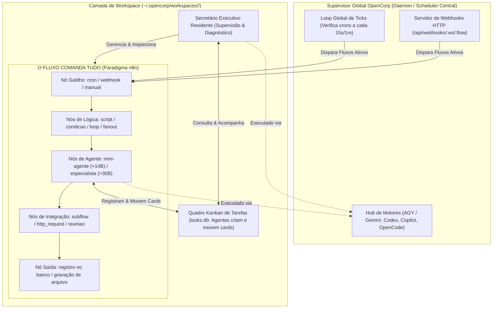

# 02 — Arquitetura do OpenCorp (v0.7.0)

## Visão Geral em Camadas



---

## 1. O Supervisor Global (Daemon Central)

Em vez de agendadores múltiplos e fragmentados por workspace, o OpenCorp opera com um **Supervisor Global Unificado**:
- **Loop de Ticks**: A cada tick (intervalo regular de 15 segundos ou 1 minuto), o supervisor consulta a base global de agendamentos e fluxos ativos (`scheduler.db` e `.opencorp/flows/*.json`).
- **Verificação de Gatilhos**: Se um fluxo ativo possui um nó `cron` cuja expressão coincide com o timestamp atual, o supervisor despacha uma execução assíncrona isolada.
- **Roteador de Webhooks**: Escuta chamadas HTTP externas e encaminha o payload como contexto de entrada para fluxos que possuem o nó de início do tipo `webhook`.
- **Circuit Breaker (Auto-Cura)**: Se um fluxo falha consecutivamente (por exemplo, 3 falhas seguidas), o supervisor coloca o job em quarentena preventiva (`quarentena: 1`, `ativo: 0`), notificando o Secretário e evitando queima inútil de tokens ou travamento do host.

---

## 2. A Camada do Workspace

Cada workspace é uma empresa autônoma e autocontida:

```
~/.opencorp/workspaces/<workspace-id>/
├── .opencorp/
│   ├── config.json              # Configurações do workspace (modelos, rotação, limites)
│   ├── security_policy.json     # Allowlist e blocklist de comandos e domínios
│   ├── budget.json              # Teto orçamentário diário e histórico de consumo
│   ├── tasks.db                 # Banco SQLite do Kanban de tarefas
│   ├── flows/                   # Arquivos de fluxo JSON (yt-producao, yt-pautador, etc.)
│   └── agents/                  # Definições Markdown dos agentes (.md com frontmatter)
├── registries/                  # Memória viva e dados estruturados
│   ├── pautas.json              # Catálogo de pautas apuradas
│   ├── roteiros/                # Roteiros estruturados em JSON para produção
│   ├── execucoes/               # Journals de execuções de fluxos e agentes
│   └── auditorias/              # Relatórios de validação e pareceres de qualidade
├── apps/                        # Mini-aplicativos e esteiras do workspace (ex: youtube-factory)
├── assets/                      # Imagens de banco, áudios, trilhas, fontes
├── exports/                     # Arquivos gerados (vídeos MP4, artigos, relatórios)
└── logs/                        # Logs detalhados de stdout e stderr de cada sessão
```

---

## 3. O Fluxo como Orquestrador Mestre

Os fluxos são definidos em JSON seguindo o schema rigoroso do Zod (`flowSchema`):
- **Nós de Gatilho**:
  - `cron`: Gatilho periódico configurável com sintaxe cron padrão de 5 campos.
  - `webhook`: Gatilho disparado por requisições HTTP REST.
  - `manual`: Disparado sob demanda pelo operador humano ou pelo Secretário (`oc flow run <id>`).
- **Nós de Execução**:
  - `script`: Executa scripts em Node.js, Python ou Bash em ambiente controlado.
  - `agente`: Despacha um agente autônomo com prompt, ferramentas e modelo configurados.
  - `subflow`: Encapsula e executa outro fluxo existente, permitindo composição modular.
  - `reuniao`: Conduz reunião multi-agente deliberativa entre diferentes papéis.
- **Nós de Controle de Fluxo**:
  - `condicao`: Roteamento condicional baseado no contexto ou saída do nó anterior.
  - `loop`: Execução iterativa com guardrails de juiz (limite de voltas, custo ou padrão regex).
  - `fanout`: Disparo paralelo de múltiplos ramos com barreira de junção (`join: all` ou `join: any`).

---

## 4. O Quadro Kanban (CRUD de Tasks)

O CRUD de tarefas (`oc task`) cumpre um papel operacional fundamental:
- **Organização Própria dos Agentes**: Os agentes criam cards de backlog, assumem responsabilidades (`doing`) e marcam conclusão (`done`) automaticamente ao longo do fluxo.
- **Visibilidade Instantânea**: Permite ao **Operador Humano** e ao **Secretário** inspecionarem em tempo real o que está pendente, em execução ou concluído, sem necessidade de ler logs brutos.

---

## 5. O Hub de Motores (Engine Registry)

O OpenCorp desacopla a lógica dos agentes do runtime da LLM através de drivers de motor padronizados:

| Motor | ID | Mantenedor | Modelo Recomendado | Casos de Uso |
| :--- | :--- | :--- | :--- | :--- |
| **Google Antigravity** | `antigravity` | Google DeepMind | `google/gemini-2.5-flash`, `google/gemini-3.8-flash` | Secretário, pesquisa complexa, análise de código, raciocínio avançado |
| **OpenCode Engine** | `opencode` | OpenCode | `nemotron-3-ultra-free`, `glm-5.3-flash`, `qwen3.8-27b` | Rotação de cota zero, mini-agentes, esteiras de texto |
| **OpenAI Codex** | `codex` | OpenAI | Modelos de geração e edição de código | Refatoração de scripts, manutenção automatizada |
| **GitHub Copilot** | `copilot` | GitHub / Microsoft | CLI herdado | Auxílio em tarefas de repositório e git |
