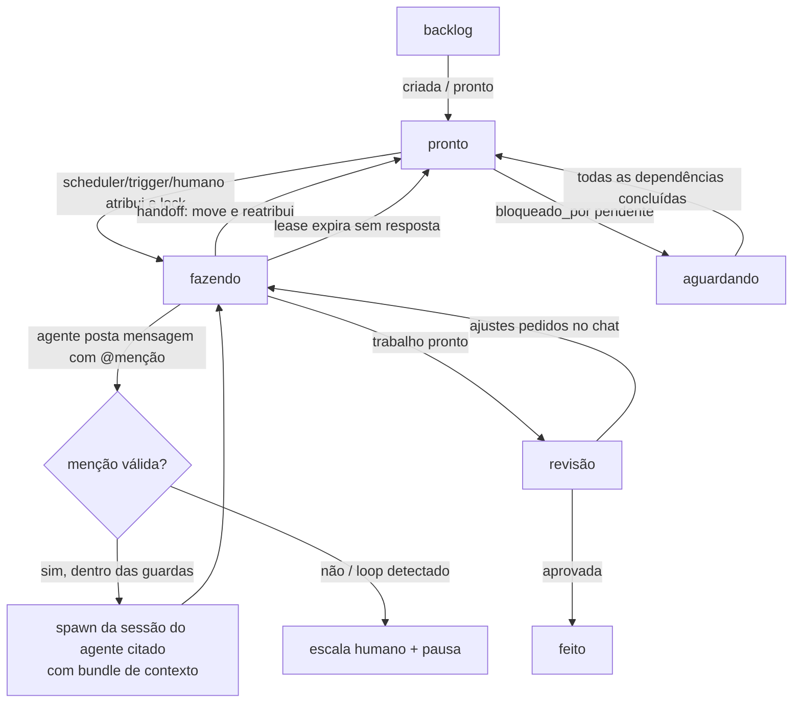
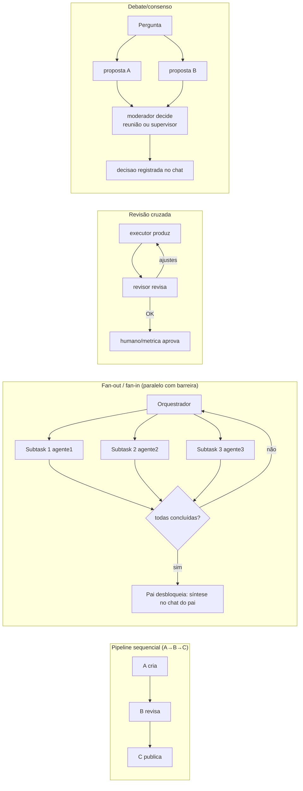
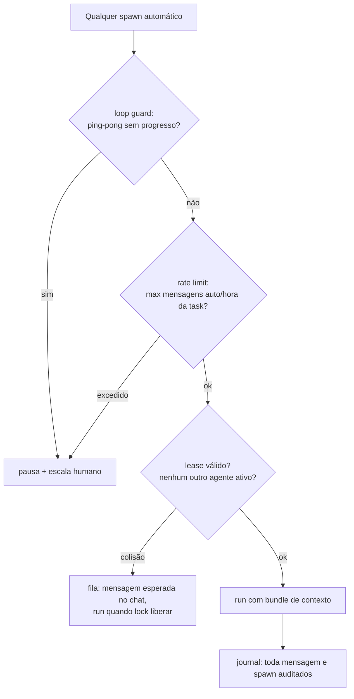

# 14 · Análise — Colaboração Multi-agente e Chat Interno de Tasks

> Análise de arquitetura solicitada para avaliar as ideias: chat interno por task, comunicação entre agentes quando mais de um é pedido, e coordenação com espera/handoff sem perder informação. **Documento de avaliação** — define a forma antes de implementar (etapas 19 e 24 do plano 13).

## 1 · Requisitos extraídos das ideias

| # | Ideia do usuário | Tradução técnica |
|---|---|---|
| 1 | "Chat interno para cada task" | Thread de mensagens persistida por task — histórico audível, legível por humano e agentes |
| 2 | "mais de um agente devem se comunicar" | Mensagens com menções (`@agente`) que disparam a execução do agente citado |
| 3 | "esperar ou fazer" | Dependências (`bloqueado_por`) e barreira de conclusão (fan-out/fan-in); lease/lock de task |
| 4 | "não se perder" | Contexto compactado injetado a cada run + journal completo + guardas de loop |

## 2 · Modelos de comunicação avaliados

| Modelo | Como funciona | Prós | Contras | Veredito |
|---|---|---|---|---|
| **A · Pipeline puro (kanban)** | Handoff por colunas: A move card e atribui a B | Determinístico, auditável, simples | Sem diálogo; rígido para tarefas que exigem ida-e-volta | ✅ **base** |
| **B · Chat com menções** | Agentes postam no chat da task; `@agente` dispara run do citado com contexto | Flexível, humano acompanha e participa do mesmo fio | Risco de loop/ruído; precisa de guardas | ✅ **camada de conversa** |
| **C · Orquestrador central** | Supervisor lê eventos do chat e decide quem atua a seguir | Controle e dedup centralizados; bom p/ "mais de um agente" | Ponto único; atraso de 1 tick | ✅ **para multi-agente explícito** |
| **D · Reunião (boardroom)** | Debate síncrono com turnos, ata automática | Melhor para decisão/consenso | Custo alto; não é para execução contínua | ✅ **complemento pontual** (já existe) |

**Decisão: híbrido A+B+C** — o kanban dá a espinha determinística; o chat dá a conversa assíncrona persistente; o supervisor atua quando a ordem pede explicitamente mais de um agente (fan-out, barreira, revisão cruzada). Reuniões ficam para decisões pontuais. Humano sempre pode participar do chat da task (mesma thread).

## 3 · Estrutura de dados

**Task (etapa 19)** ganha campos de coordenação:

```jsonc
{
  "id": "tsk_a1b2", "titulo": "...", "coluna": "fazendo",
  "responsavel": "agente:executor-padrao",   // agente:xxx | humano
  "bloqueado_por": ["tsk_9f8e"],             // espera: não inicia até filhas concluírem
  "task_pai": null,                          // fan-out: pai agrega
  "lock": { "por": "agente:analista", "expira_em": "..." }, // lease anti-colisão
  "max_mensagens_auto_h": 20                 // guarda de loop
}
```

**Nova tabela `task_mensagens`** (corp-db):

```jsonc
{
  "id": "msg_x1", "task_id": "tsk_a1b2",
  "autor": "agente:executor-padrao",        // humano | agente:xxx | sistema
  "tipo": "comentario",                     // comentario | handoff | sistema | artefato | decisao
  "corpo": "análise pronta, revisão pedida @revisor",
  "menciona": ["agente:revisor"],           // dispara execução (com guardas)
  "refs": ["registries/conteudo/..."],      // artefatos anexados
  "criado_em": "..."
}
```

**Bundle de contexto** (gerado a cada spawn — a resposta ao "não se perder"):

```
[tarefa] título, descrição, checklist, coluna, responsável
[histórico] últimas 30 mensagens do chat (compacted: autor + tipo + 1ª linha)
[artefatos] caminhos de arquivos referenciados (não o conteúdo)
[contrato] "você é X; responda no chat da task via opencorp task chat <id>; mencione @agente se precisar de Y"
```

## 4 · Fluxogramas

### F1 · Ciclo de vida da task (com espera e lock)



### F2 · Fluxo do chat → execução → resposta (o coração do sistema)

```mermaid
sequenceDiagram
  participant Ag as Agente A (sessão opencode)
  participant EB as eventBus (sessao/task)
  participant Tg as Triggers (daemon serve/scheduler)
  participant DB as corp-db (task_mensagens)
  participant AgB as Agente B (novo spawn)
  participant Hu as Humano (web/CLI/SSE)

  Ag->>Ag: termina turno; roda "opencorp task chat tsk_a1b2 --msg ... @revisor"
  Ag->>DB: grava mensagem (tipo comentario, menciona B)
  DB->>EB: evento task.mensagem
  EB->>Tg: trigger avalia
  Tg->>Tg: guardas: loop? rate limit? B existe? task em fazendo/lock?
  alt aprovado
      Tg->>DB: lock da task por B (lease 30min)
      Tg->>AgB: spawn "opencode run" com bundle de contexto
      AgB->>DB: posta resposta/artefato; move card ou @menção de volta
      DB->>Hu: SSE atualiza chat da task ao vivo
  else bloqueado por guarda
      Tg->>DB: mensagem "sistema: pausado, escala humano"
      DB->>Hu: notificação de aprovação
  end
```

### F3 · Padrões multi-agente (o orquestrador escolhe por config)



### F4 · Garantias "não se perder" (guardas)



## 5 · Encaixe no plano 13

- **ETAPA 19 (Task Board)** absorve o chat: tabela `task_mensagens`, `opencorp task chat <id> [--msg] [--de]`, bundle de contexto, lock/lease, guardas básicas (rate limit + loop), SSE do chat no web.
- **NOVA ETAPA 24 · Orquestração multi-agente** — usa chat+triggers+tools: padrões pipeline/fan-out/revisão/debate como configs declarativas (`opencorp team ...` ou trigger JSON), barreira de dependências (`bloqueado_por`), supervisor como orquestrador padrão. (Plano 13 renumerado: bateria final vira **25**.)
- **ETAPA 22 (Tools/MCP)** expõe `task.chat.send/read` como tools — agentes conversam por MCP sem parse de CLI.
- **ETAPA 23 (Mini-apps)** widget `chat` para acompanhar/interagir com a thread da task.

## 6 · Riscos específicos

| Risco | Mitigação |
|---|---|
| Loop infinito A↔B mencionando um ao outro | loop guard (sem progresso → pausa), max turnos por menção (2), max auto/hora |
| Dois agentes na mesma task ao mesmo tempo | lease/lock com expiração; fila via chat |
| Contexto explode (histórico longo) | bundle compactado (últimas 30, resumo de handoffs, artefatos por referência) |
| Custo de tokens (modo free) | spawns por menção só com guardas aprovadas; reuniões continuam com `max_minutes` |
| Mensagem perdida se daemon morrer | mensagens são persistidas antes do trigger; triggers reavaliam pendências ao subir (reconciliação, como o supervisor já faz) |

## 7 · Decisões registradas

1. Híbrido A+B+C (pipeline + chat com menções + supervisor orquestrador); reunião para consenso pontual.
2. Chat é **persistente e audível** — o journal é a verdade; o chat é a visão organizada.
3. Todo spawn automático passa pelas 3 guardas (loop, rate, lock) e pelo SecurityGuard existente.
4. Humano entra na mesma thread (CLI/web), com poder de pausar e aprovar — HITL permanece central.
