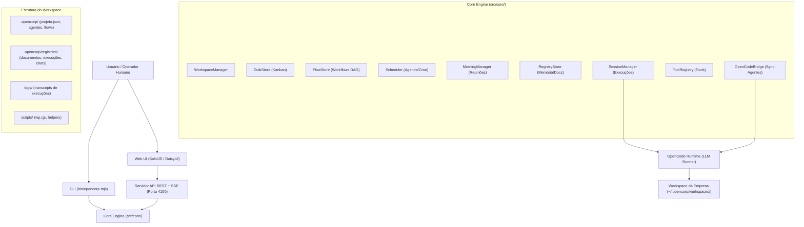
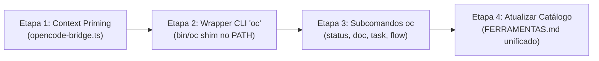

# Estudo Arquitetural e Guia de Padronização para Agentes Autônomos — OpenCorp

> **Data:** Setembro de 2026  
> **Objetivo:** Descrever detalhadamente o funcionamento do ecossistema OpenCorp, analisar os padrões e gargalos observados no histórico real dos agentes e definir um catálogo de funções de alto nível que simplifique a operação autônoma, elimine desorientação espacial e reduza o desperdício de tokens.

---

## 1. Visão Geral: Como o OpenCorp Funciona

O **OpenCorp** é um Sistema Operacional para Empresas Autônomas (CLI-first com Web UI e orquestração de LLMs via OpenCode). Ele transforma um diretório de workspace em uma empresa funcional com agentes especializados, quadro de tarefas (Kanban), fluxos de automação (estilo n8n), agendador cron de rondas, reuniões deliberativas e registros históricos.

### Mapa Arquitetural do Sistema



### Componentes Chave

1. **Workspaces (`WorkspaceManager`)**:
   - Cada empresa reside em `~/.opencorp/workspaces/<nome>` (ex.: `pulso-diario`, `engenhar`, `emporio-aurora`, `norteia`).
   - Contém o arquivo `projeto.json` (missão, regras, identidade, tom de voz) e a pasta `.opencorp/`.

2. **Quadro de Tarefas (`TaskStore`)**:
   - Quadro Kanban por empresa com colunas: `backlog` ➔ `fazendo` ➔ `feito` (e suporte a `bloqueado` com aprovação HITL).
   - Cada tarefa tem ID (`tsk-...`), título, descrição, prioridade (`baixa`, `media`, `alta`), responsável (`agente:<id>` ou humano) e um chat interno com histórico de decisões.

3. **Workflows e Grafos (`FlowStore`)**:
   - Automação em Grafo Acíclico Dirigido (DAG) estilo n8n.
   - Nós suportados: `manual` (gatilho), `agente` (execução de ordem), `script` (código Node/Python/Bash), `condicao` (if/else), `decisao` (escolha por LLM), `task_create` (gera card no board), `registro` (grava documento), `reuniao` (convoca agentes), `webhook` (gatilho HTTP) e padrões coletivos (`fanout`, `review`, `debate`).
   - Permite múltiplas saídas paralelas por nó com propagação de contexto (`{{entrada}}`, `{{$input}}`, `{{json}}`, `{{$node["id"]}}`).

4. **Agenda e Rondas (`Scheduler`)**:
   - Motor de agendamento em background (cron padrão de 5 campos ou intervalos em segundos).
   - Dispara rondas periódicas (ex.: curadoria a cada hora, verificação de SEO, auditoria de métricas).

5. **Mesa de Reuniões (`MeetingManager`)**:
   - Convoca múltiplos agentes para debater uma pauta estruturada em turnos (rodadas de manifestação) e sintetiza uma ata final gravada em documento.

6. **Memória e Registros (`RegistryStore`)**:
   - Sistema de arquivos estruturado para guardar relatórios (`documentos`), metadados de execução (`execucoes`), custos financeiros de LLM (`custos`), auditorias e logs.

7. **Sessões e OpenCode (`SessionManager` & `OpenCodeBridge`)**:
   - Quando um agente é acionado, o `OpenCodeBridge` gera a definição do agente em `.opencorp/opencode/agent/<id>.md` e executa o processo `opencode run --auto --agent <id> --dir <ws> "<ordem>"`.
   - Controla timeouts (watchdogs), travas de segurança (`SecurityGuard`), teto de orçamento (`BudgetManager`) e histórico de auditoria.

---

## 2. Diagnóstico: O que o Histórico Real dos Agentes Revela

Analisamos centenas de logs reais de execuções gravadas no workspace `pulso-diario` (por exemplo, `exec-20260902-221016-bd6c.log` e `exec-20260902-214515-b8b1.log`). Os dados mostram gargalos severos e padrões repetitivos que precisam ser padronizados.

### Principais Problemas Identificados

| Problema Observado | O que o Agente Faz Hoje | Impacto no Sistema |
|-------------------|--------------------------|---------------------|
| **1. Desorientação Espacial ("Onde estou?")** | Roda de 5 a 15 comandos `Read .`, `Read .opencorp`, `find /home/j/...` e `ls -la` no início de **toda** sessão só para descobrir o que é a empresa e onde estão os arquivos. | Gasta de 30% a 50% dos tokens da sessão com exploração cega antes de produzir qualquer valor. |
| **2. O "Path Fantasma" (`registries` vs `.opencorp/registries`)** | Ora grava em `registries/documentos/`, ora em `.opencorp/registries/documentos/`. Tenta ler caminhos errados, toma `File not found` e precisa rodar `find` para achar o arquivo que ele próprio ou outro agente acabou de salvar. | Erros de leitura, duplicação de pastas e falhas de encadeamento entre agentes. |
| **3. Invocação CLI Longa, Frágil e Feia** | Executa comandos gigantescos no bash: `cd /home/j/Documentos/GitHub/crom-worker-opencode && OPENCORP_HOME=/home/j node bin/opencorp.mjs task list --workspace pulso-diario`. | Se errar o `cd`, o caminho relativo ou o nome do workspace, o comando falha. Modelos menores erram a sintaxe frequentemente. |
| **4. Ferramentas Inexistentes / Tentativas Inválidas** | O modelo tenta chamar a tool `glob` nativa do OpenCode (que está desabilitada para o agente) e recebe `Invalid Tool: Model tried to call unavailable tool 'glob'`. | Perda de turnos e confusão do modelo. |
| **5. Operações Complexas com curl e pipe no Bash** | Escreve comandos como `curl -s "https://site/wp-json/..." \| python3 -m json.tool` para obter posts ou estatísticas. | Baixa robustez, vulnerável a falhas de escape de aspas e quebra de payload. |
| **6. Falta de Primitivas para Ações do Sistema** | Não há funções para o agente criar uma rotina na agenda, disparar um fluxo ou convocar uma reunião de forma simples. Ele nem tenta ou tenta inventar comandos inexistentes. | O agente fica restrito apenas a scripts manuais ou edição direta de arquivos. |

---

## 3. Solução 1: Injeção de Contexto Inicial (Context Priming)

O agente **nunca mais deve começar uma sessão sem saber exatamente onde está e o que tem ao seu redor**.

O `OpenCodeBridge` (`src/core/opencode-bridge.ts`) deve injetar automaticamente um bloco estruturado de **Contexto Inicial** diretamente no System Prompt do agente antes da execução:

```markdown
# AMBIENTE OPERACIONAL (INJETADO AUTOMATICAMENTE PELO OPENCORP)
- **Empresa / Workspace:** pulso-diario (~/.opencorp/workspaces/pulso-diario)
- **Seu Papel:** @curador-inspiracoes (Curadoria e pauta de conteúdo)
- **Diretório Raiz (CWD):** Você JÁ ESTÁ dentro da raiz do workspace.
- **Pasta de Registros Oficiais:** .opencorp/registries/ (documentos, execucoes, logs)

## ESTADO IMEDIATO DA EMPRESA:
- **Tarefas em Andamento (fazendo):** 0
- **Tarefas Pendentes (backlog):** 3 (tsk-123: "Revisar SEO", tsk-124: "Publicar post sobre IA")
- **Últimos Documentos Gerados:**
  * FONTES-2026-09-02-21.md (há 15 min)
  * INSPIRACOES-2026-09-02-20.md (há 45 min)
- **Ferramenta de Linha de Comando Rápida:** Use o comando local `oc` (já configurado no seu PATH).
```

Com essa injeção de 20 linhas, o agente **não precisa rodar nenhum `find`, nenhum `ls` inicial e nenhum `Read .`**. Ele vai direto para a ordem que recebeu.

---

## 4. Solução 2: O Catálogo Unificado de Funções do Agente

Transformamos todas as ações repetitivas do agente em **comandos simples de uma única linha** através do utilitário padronizado `oc` (ou funções diretas no catálogo de ferramentas).

O agente não precisará mais digitar caminhos absolutos nem prefixos de diretório. Ele simplesmente executará:

```
oc <modulo> <acao> [argumentos]
```

### Módulo 1: Consulta & Orientação (`oc status` / `oc ver`)

| Função | Sintaxe | O que faz | Retorno |
|---|---|---|---|
| `empresa_status` | `oc status` | Resume tudo da empresa em 1 segundo: tarefas ativas, últimos documentos, estado do WordPress e alertas. | JSON conciso com resumo operacional. |
| `documento_ler_recente` | `oc doc ultimo [padrao]` | Lê o arquivo mais recente que casa com o padrão (ex.: `oc doc ultimo "FONTES-*"`). | Conteúdo limpo do arquivo sem precisar de `find \| sort \| tail`. |
| `documento_buscar` | `oc doc buscar "<termo>"` | Busca menções a termos em registros e documentos oficiais. | Lista de arquivos e trechos correspondentes. |
| `wp_ultimos_posts` | `oc wp posts [qtd]` | Lista os últimos N posts publicados no WordPress. | `[{id, titulo, status, link, data}]` |

### Módulo 2: Tarefas & Kanban (`oc task`)

| Função | Sintaxe | O que faz |
|---|---|---|
| `task_listar` | `oc task list [--coluna fazendo\|backlog]` | Lista as tarefas do board da empresa atual. |
| `task_criar` | `oc task create "<titulo>" [--prioridade alta\|media\|baixa] [--responsavel agente:<id>] [--descricao "..."]` | Cria um card novo no backlog ou na coluna indicada. |
| `task_assumir` | `oc task assumir <task-id>` | Move a tarefa para `fazendo`, define o agente como responsável e posta anúncio no chat interno. |
| `task_concluir` | `oc task concluir <task-id> [--resumo "..."]` | Move a tarefa para `feito` e registra o parecer de conclusão no histórico. |
| `task_bloquear` | `oc task bloquear <task-id> --motivo "..."` | Move a tarefa para `bloqueado` e aciona o alerta de aprovação humana no painel. |
| `task_comentar` | `oc task chat <task-id> "<mensagem>"` | Adiciona comentário/progresso no histórico da tarefa. |

### Módulo 3: Workflows & Fluxos (`oc flow`)

| Função | Sintaxe | O que faz |
|---|---|---|
| `fluxo_listar` | `oc flow list` | Lista todos os workflows disponíveis no workspace. |
| `fluxo_executar` | `oc flow run <flow-id> [--entrada "..."]` | Dispara a execução de um workflow do n8n/OpenCorp com entrada contextual. |
| `fluxo_status` | `oc flow status <flow-id>` | Retorna o status da última execução (nós concluídos, nós com falha e output). |

### Módulo 4: Agenda & Rotinas (`oc schedule`)

| Função | Sintaxe | O que faz |
|---|---|---|
| `agenda_listar` | `oc schedule list` | Lista todas as rotinas agendadas (cron e intervalos) da empresa. |
| `agenda_criar` | `oc schedule add --cron "0 * * * *" --agente <id> --ordem "..."` | Agenda uma nova tarefa recorrente para um agente. |
| `agenda_pausar` | `oc schedule pause <job-id>` | Pausa temporariamente uma rotina agendada. |
| `agenda_retomar` | `oc schedule resume <job-id>` | Reativa a rotina pausada. |

### Módulo 5: Reuniões de Agentes (`oc meeting`)

| Função | Sintaxe | O que faz |
|---|---|---|
| `reuniao_convocar` | `oc meeting start --pauta "<pauta>" --agentes "editor,critico-site"` | Inicia uma deliberação em mesa redonda entre os agentes e gera uma ata. |
| `reuniao_ler_ata` | `oc meeting ata <sala-id>` | Lê o parecer e a conclusão consolidada da reunião. |

### Módulo 6: Registros & Memória (`oc doc`)

| Função | Sintaxe | O que faz |
|---|---|---|
| `registro_gravar` | `oc doc salvar <categoria> <nome-arquivo.md> [--conteudo "..."]` | Grava o documento no caminho canônico correto (`.opencorp/registries/<categoria>/`), **eliminando de vez o path fantasma**. |
| `notificar` | `oc notificar --titulo "..." --corpo "..." [--tipo info\|aviso\|sucesso]` | Envia uma notificação visual que aparece imediatamente na barra e no sino da Web UI. |

---

## 5. Exemplo Prático: Antes vs. Depois

Veja a diferença real na execução de um agente:

### 🔴 ANTES (Como o agente fazia até hoje):
```bash
# 1. Tenta descobrir onde está e quais arquivos existem (5 comandos)
Read .
Read registries
find /home/j/.opencorp/workspaces/pulso-diario -name "FONTES-*.md" | sort | tail -5
ls -la /home/j/.opencorp/workspaces/pulso-diario/registries/documentos/
cat /home/j/.opencorp/workspaces/pulso-diario/.opencorp/registries/documentos/FONTES-2026-09-02-21.md

# 2. Chama WordPress via script complexo
OPENCORP_HOME=/home/j node scripts/wp.cjs posts '{"qtd":5}'

# 3. Cria tarefa com comando gigante
cd /home/j/Documentos/GitHub/crom-worker-opencode && OPENCORP_HOME=/home/j node bin/opencorp.mjs task create --workspace pulso-diario --titulo "Publicar post sobre IA" --prioridade alta

# 4. Grava arquivo com cat EOF correndo risco de errar pasta
cat > registries/documentos/INSPIRACOES-2026-09-02-22.md << 'EOF'
...
EOF
```
*Total de turnos gastos:* 8 a 14  
*Tokens consumidos:* ~15.000 a 30.000  
*Risco de quebra:* Alto (erro de CWD, path errado, aspas).

---

### 🟢 DEPOIS (Com o padrão padronizado):
```bash
# 1. O agente já recebe o contexto inicial e sabe o que fazer.
# 2. Lê a fonte mais recente com 1 comando:
oc doc ultimo "FONTES-*"

# 3. Consulta posts do WP:
oc wp posts 5

# 4. Grava a inspiração no lugar canônico:
oc doc salvar documentos INSPIRACOES-2026-09-02-22.md --arquivo-origem ./rascunho.md

# 5. Cria a task no board com 1 linha:
oc task create "Publicar post sobre IA" --prioridade alta --responsavel agente:editor

# 6. Notifica o painel do usuário:
oc notificar --titulo "Curadoria #10 Concluída" --corpo "3 inspirações geradas e task atribuída ao @editor" --tipo sucesso
```
*Total de turnos gastos:* 3 a 5  
*Tokens consumidos:* ~4.000  
*Risco de quebra:* Zero.

---

## 6. Plano de Implementação Técnica

Para transformar esse estudo em realidade sem introduzir complexidade desnecessária, o plano é dividido em 4 etapas diretas:



### Detalhamento das Etapas

1. **Etapa 1 — Injeção de Contexto Primário (`src/core/opencode-bridge.ts`)**:
   - Atualizar a função `gerarAgenteOpencode` para anexar automaticamente ao system prompt:
     - Nome do workspace (`wsId`), diretório base, lista de tarefas em andamento e resumo dos 3 documentos mais recentes.
   - **Resultado imediato:** Agentes param de rodar `find` e `ls` no início das sessões.

2. **Etapa 2 — Shim Executável `oc` no Workspace**:
   - Disponibilizar um executável leve `oc` no diretório do workspace ou no PATH do processo OpenCode:
     - O script `oc` detecta automaticamente o diretório atual do workspace (`PWD`) e o executável central `bin/opencorp.mjs`.
     - Elimina a necessidade de o agente rodar `cd /home/j/Documentos/...` e `OPENCORP_HOME=/home/j`.

3. **Etapa 3 — Comandos Simplificados no Core CLI**:
   - Adicionar ao `opencorp` comandos de alta conveniência focados em agentes:
     - `opencorp status`: Devolve um resumo conciso em JSON (board + docs + alertas).
     - `opencorp doc ultimo <padrao>`: Devolve o conteúdo do documento mais recente.
     - `opencorp doc salvar <cat> <id> [texto]`: Salva diretamente em `.opencorp/registries/<cat>/`.
     - `opencorp notificar --titulo ... --corpo ...`: Chama o `NotificationStore` diretamente.

4. **Etapa 4 — Atualização do `FERRAMENTAS.md`**:
   - Reescrever o catálogo em `templates/default/docs/testes-site/FERRAMENTAS.md` e nos 4 workspaces ativos (`pulso-diario`, `engenhar`, `emporio-aurora`, `norteia`).
   - Apresentar a nova sintaxe simplificada e remover os contratos legados prolixos.

---

## 7. Conclusão

Com esta padronização:
1. **Os agentes tornam-se 3x mais rápidos** e consomem menos da metade dos tokens por sessão.
2. **O problema da desorientação espacial é extinto**, pois o agente já acorda sabendo exatamente seu workspace, suas tarefas pendentes e o caminho dos arquivos.
3. **Erros de path fantasma (`registries` vs `.opencorp/registries`) são eliminados na raiz** através de funções com caminhos canônicos garantidos.
4. **O sistema ganha extensibilidade real**, permitindo que qualquer nova funcionalidade (novos nós de fluxo, novas reuniões, novas automações de agenda) se torne imediatamente uma função padrão acessível a qualquer agente.
