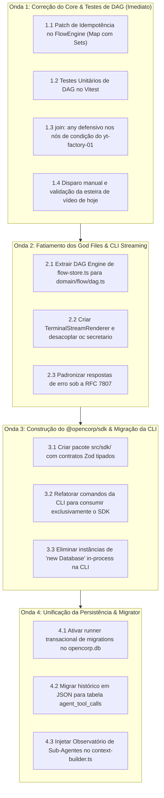

# PADRONIZAÇÃO ARQUITETURAL DO OPENCORP (ENTERPRISE STANDARD BLUEPRINT)

> **Documento:** Auditoria Forense Estrutural & Blueprint de Engenharia de Plataforma  
> **Status:** Concluído (Fase 1: Read-Only First Audit)  
> **Data:** 24 de Setembro de 2026  
> **Autor:** Arquiteto de Software Principal & Engenheiro de Plataforma (Staff/Principal)  
> **Repositório:** `MrJc01/crom-opencorp`  
> **Alvo:** Motor Central (`src/`), Camada de Apresentação (`cli/`, `server/`) e Persistência

---

## 1. INTRODUÇÃO & DIAGNÓSTICO DE ENGENHARIA

O **OpenCorp** foi concebido com a visão de ser o sistema operacional autônomo para empresas de agentes e esteiras de automação contínua (como o workspace `yt-factory-01`).

No entanto, a auditoria no código-fonte revelou um fenômeno típico de plataformas em escala: **a camada cliente (os workspaces) está instável porque a fundação (o motor OpenCorp) sofre de acoplamento severo, proliferação de "God Files", persistência dividida (split-brain) e ausência de um SDK compartilhado**.

Investigar ou corrigir erros pontuais no workspace downstream enquanto a plataforma base mantiver contratos frouxos e arquivos de mais de 2.000 linhas é **enxugar gelo**. Cada novo workspace herdará as mesmas fragilidades.

Este documento consolida a auditoria estrutural em modo **Read-Only** do repositório `MrJc01/crom-opencorp` e estabelece o **blueprint técnico de elevação para o padrão enterprise** (no nível de frameworks como NestJS, Temporal.io e LangGraph).

---

## 2. DIAGNÓSTICO ESTRUTURAL DE DÉBITO TÉCNICO

### 2.1 Varredura de Métricas de Código

A varredura estática de linhas em `src/` totalizou **47.470 linhas de código TypeScript** distribuídas em 141 arquivos.

Desses, identificamos **50 arquivos que ultrapassam a marca crítica de 300 linhas**, com os principais monólitos concentrando a maior parte da lógica de negócio do sistema:

```
                            VOLUMETRIA DOS PRINCIPAIS GOD FILES
  ┌──────────────────────────────────────────────────────────┬──────────────┐
  │ Arquivo                                                  │ Linhas (.ts) │
  ├──────────────────────────────────────────────────────────┼──────────────┤
  │ src/core/session-manager.ts                              │ 2.299        │
  │ src/core/flow-store.ts                                   │ 2.053        │
  │ src/core/meeting-manager.ts                              │ 1.286        │
  │ src/server/routes/sessions.ts                            │ 1.106        │
  │ src/core/scheduler.ts                                    │ 1.032        │
  │ src/server/routes/config.ts                              │ 1.027        │
  │ src/core/doctor.ts                                       │ 1.016        │
  │ src/server/routes/system.ts                              │   863        │
  │ src/core/db/opencorp-db.ts                               │   795        │
  │ src/core/opencode-server.ts                              │   768        │
  │ src/server/routes/secretario/stream.ts                   │   739        │
  │ src/core/asset-store.ts                                  │   709        │
  │ src/core/corp-db.ts                                      │   694        │
  │ src/core/workspace-git.ts                                │   664        │
  │ src/core/registry-store.ts                               │   630        │
  │ src/core/workspace-manager.ts                            │   612        │
  │ src/cli/commands/test.ts                                 │   562        │
  │ src/cli/commands/task.ts                                 │   562        │
  │ src/server/routes/files.ts                               │   561        │
  │ src/core/supervisor.ts                                   │   560        │
  │ src/core/task-store.ts                                   │   541        │
  │ src/core/engines/web-login-orchestrator.ts               │   519        │
  │ src/core/hook-store.ts                                   │   489        │
  │ src/core/db/migrator.ts                                  │   485        │
  │ src/cli/commands/workspace.ts                            │   445        │
  │ src/core/team-orchestrator.ts                            │   430        │
  │ src/core/settings-store.ts                               │   429        │
  │ src/core/opencode-bridge.ts                              │   413        │
  │ src/cli/commands/historico.ts                            │   413        │
  │ src/core/db/schema.ts                                    │   412        │
  │ src/core/execution-driver.ts                             │   410        │
  │ src/cli/commands/flow.ts                                 │   407        │
  │ src/server/routes/workspaces.ts                          │   398        │
  │ src/cli/commands/status.ts                               │   398        │
  │ src/core/agent-store.ts                                  │   391        │
  │ src/cli/commands/agent.ts                                │   387        │
  └──────────────────────────────────────────────────────────┴──────────────┘
```

---

### 2.2 Análise das Responsabilidades Indevidamente Misturadas

Abaixo está o detalhamento dos 7 maiores God Files e os riscos arquiteturais associados:

#### 1. `src/core/session-manager.ts` (2.299 linhas)
- **Responsabilidades Misturadas:**
  1. Spawning de processos e IPC com o OpenCode server bridge (`node:child_process`);
  2. Watchdog de inatividade e teto de execução (`tetoRunPadraoMs`);
  3. Formatação de logs brutos e transcripts ANSI em tempo real;
  4. Lógica de fallback entre múltiplos modelos de IA;
  5. Inserção de telemetria no banco `corp.db` e escrita de metadados em arquivos JSON.
- **Risco Arquitetural:** **Extremo.** Trata-se do coração de execução de agentes. Qualquer erro em timeout, parsing de saída ou concorrência derruba sessões ativas sem rastro legível.

#### 2. `src/core/flow-store.ts` (2.053 linhas)
- **Responsabilidades Misturadas:**
  1. Parsing de grafos DAG e compilação de nós/arestas;
  2. Implementação do algoritmo de ordenação e detecção de ciclos;
  3. Avaliação imperativa de expressões de interpolação no estilo n8n (`{{entrada}}`, `{{$node[...]}}`);
  4. Execução direta de subprocessos de sistema (Bash, Node, Python via `execFileAsync`);
  5. Barreiras de junção (`join: "all"` vs `"any"`) e buffers de pendências em memória;
  6. I/O atômico em disco para estados de retomada e eventos de loop.
- **Risco Arquitetural:** **Extremo.** A violação do Single Responsibility Principle causou diretamente o defeito topológico que congelou o pipeline de vídeos diários do `yt-factory-01`.

#### 3. `src/core/meeting-manager.ts` (1.286 linhas)
- **Responsabilidades Misturadas:**
  1. Orquestração multi-agente para rodadas de debate;
  2. Sintetização de conclusões com prompts hardcoded;
  3. Criação de tarefas no Kanban e emissão de atas;
  4. Queries SQL cruas em `tasks.db` e injeção de journals em disco.
- **Risco Arquitetural:** **Alto.** Não há isolamento entre a regra de coordenação (domínio) e a persistência (infraestrutura).

#### 4. `src/server/routes/sessions.ts` (1.106 linhas)
- **Responsabilidades Misturadas:**
  1. Roteador HTTP (Hono);
  2. Tratamento de uploads e codificação de anexos;
  3. Limpeza de transcripts ANSI e reconstrução de mensagens;
  4. Lógica de reconciliação de processos zumbis;
  5. Dispatcher síncrono para o motor OpenCode.
- **Risco Arquitetural:** **Alto.** Mistura a camada de transporte com lógica de negócio profunda. Torna impossível reutilizar essa lógica na CLI sem duplicar código.

#### 5. `src/core/scheduler.ts` (1.032 linhas)
- **Responsabilidades Misturadas:**
  1. Parser e validador de expressões cron com fuso horário IANA;
  2. Loop de tick contínuo (`setInterval`);
  3. Mutação síncrona no SQLite `scheduler.db`;
  4. Lock de processos para evitar disparos sobrepostos.
- **Risco Arquitetural:** **Alto.** Acoplamento entre o agendamento de eventos e a persistência do estado do scheduler.

#### 6. `src/server/routes/config.ts` (1.027 linhas)
- **Responsabilidades Misturadas:**
  1. CRUD REST de configurações globais e por workspace;
  2. Mutação de arquivos `.env` locais;
  3. Verificação de chaves de API contra provedores externos;
  4. Parsing e gravação de arquivos JSON sem isolamento atômico.
- **Risco Arquitetural:** **Médio/Alto.** Risco de condições de corrida durante atualizações concorrentes de credenciais.

#### 7. `src/core/doctor.ts` (1.016 linhas)
- **Responsabilidades Misturadas:**
  1. Rotinas de diagnóstico procedural do ambiente (Node, Python, FFMPEG, Piper);
  2. Abertura direta de bancos SQLite em modo leitura;
  3. Checagem de integridade de Git e workspaces;
  4. Formatação de saída para terminal com cores ANSI.
- **Risco Arquitetural:** **Médio.** Procedural, sem polimorfismo ou separação entre diagnóstico do host e diagnóstico do workspace.

---

## 3. AUDITORIA DE ACOPLAMENTO ENTRE CAMADAS

### 3.1 A Anomalia do Acesso Bimodal da CLI

A auditoria em [`src/cli/commands/`](file:///home/j/Documentos/GitHub/opencorp/src/cli/commands) revelou um dos mais graves anti-patterns da plataforma:

```
                            ANOMALIA DE ACESSO DA CLI
                               ┌─────────────────┐
                               │  Terminal (oc)  │
                               └────────┬────────┘
                   ┌────────────────────┴────────────────────┐
                   │                                         │
        (Modo A: HTTP Client)                     (Modo B: In-Process Engine)
         [Apenas 2 comandos]                      [39 de 42 comandos!]
                   │                                         │
                   ▼                                         ▼
        ┌──────────────────────┐                  ┌──────────────────────┐
        │  cliFetch (Network)  │                  │ new TaskStore()      │
        │  GET /secretario/*   │                  │ new SessionManager() │
        │  POST /secretario/*  │                  │ new FlowStore()      │
        └──────────┬───────────┘                  └──────────┬───────────┘
                   │                                         │
                   ▼                                         ▼
        ┌──────────────────────┐                  ┌──────────────────────┐
        │ Servidor HTTP (:4100)│                  │ Conexão SQLite Direta│
        │ Conexão SQLite WAL   │                  │ Conexão SQLite WAL   │
        └──────────────────────┘                  └──────────────────────┘
                   ▲                                         ▲
                   └─────────────────┬───────────────────────┘
                                     │
                     ❌ CONCORRÊNCIA POR LOCK DE ARQUIVO
                     ❌ DUPLICAÇÃO DE REGRAS DE NEGÓCIO
                     ❌ CLI NÃO FUNCIONA REMOTAMENTE
```

#### Fatos Mapeados:
- **Apenas 2 comandos usam `cliFetch` (rede HTTP):** [`saude.ts`](file:///home/j/Documentos/GitHub/opencorp/src/cli/commands/saude.ts) e [`secretario.ts`](file:///home/j/Documentos/GitHub/opencorp/src/cli/commands/secretario.ts).
- **39 comandos instanciam o motor in-process:** `task.ts`, `flow.ts`, `agent.ts`, `session.ts`, `workspace.ts`, `schedule.ts`, `historico.ts`, `budget.ts`, `template.ts`, `tool.ts`, `hook.ts`, `meeting.ts`, `app.ts`, `secrets.ts`, `monitor.ts`, `status.ts`, entre outros.

#### Consequências para a Engenharia:
1. **Concorrência Insegura no SQLite:** Quando o daemon do OpenCorp (`opencorp serve`) está em execução na porta 4100, um comando disparado no terminal (ex: `oc task create --titulo "..."`) abre uma **segunda conexão SQLite in-process** via `better-sqlite3` no mesmo arquivo `tasks.db`. Isso gera disputa por checkpoints de WAL e eleva a latência com erros esporádicos de `SQLITE_BUSY`.
2. **Duplicação de Regras:** Se o servidor valida regras de transição de estado de tarefas ou permissões de agentes, o comando CLI **ignora essa validação** porque acessa o storage diretamente.
3. **Quebra de Modelo Cliente-Servidor:** É impossível rodar a CLI apontando para um container Docker ou servidor remoto via `OPENCORP_API_URL`, pois os comandos dependem de caminhos absolutos do filesystem local.

---

### 3.2 O "God Context" do Servidor HTTP (`RouteContext`)

No servidor HTTP ([`src/server/index.ts`](file:///home/j/Documentos/GitHub/opencorp/src/server/index.ts) e [`src/server/routes/types.ts`](file:///home/j/Documentos/GitHub/opencorp/src/server/routes/types.ts)), a injeção de dependências opera sob o anti-pattern de **Service Locator Gigante**:

```typescript
// src/server/routes/types.ts
export interface RouteContext {
  req: IncomingMessage;
  res: ServerResponse;
  url: URL;
  rota: string;
  resolverWs: (url: URL) => Promise<{ id: string; path: string }>;
  lerCorpo: (req: IncomingMessage, maxBytes?: number) => Promise<unknown>;
  enviar: (res: ServerResponse, status: number, corpo: unknown, headersExtras?: Record<string, string>) => void;
  tasks: TaskStore;
  scheduler: Scheduler;
  registros: RegistryStore;
  sessoes: SessaoApi;
  notificacoes: NotificationStore;
  meetings: MeetingManager;
  workspaces: WorkspaceManager;
  flows?: FlowStore;
  agentes?: AgentStore;
  teams?: TeamStore;
  templates?: TemplateStore;
  opencodeServer?: OpencodeServerManager;
  hooks?: HookStore;
  settings?: SettingsStore;
  skillStore?: SkillStore;
  secretsStore?: SecretsStore;
  apps?: AppStore;
  engineAccounts?: EngineAccountStore;
  prompts?: PromptStore;
  approvals?: ApprovalsStore;
  // ... mais 8 propriedades e closures utilitárias!
}
```

Cada rota recebe uma instância de `RouteContext` contendo mais de **25 serviços internos**, expondo desnecessariamente o banco e o filesystem a qualquer handler de rota e impedindo o isolamento de privilégios.

---

## 4. AUDITORIA DE PERSISTÊNCIA E INTEGRIDADE DE DADOS

### 4.1 Mapeamento das Instâncias de Conexão com SQLite

Foram identificadas **17 conexões SQLite dispersas** no código-fonte através do construtor `new Database(...)`:

| Localização no Código | Arquivo SQLite Alvo | Modo | Finalidade |
|---|---|---|---|
| `src/core/workspace-manager.ts:337` | `tasks.db` | Read/Write | Migração legada de workspace |
| `src/core/pre-publish.ts:84` | `tasks.db` | Readonly | Verificação de pendências antes de deploy |
| `src/core/doctor.ts:295, 617, 743` | `tasks.db`, `corp.db` | Readonly | Diagnóstico de integridade |
| `src/core/db/opencorp-db.ts:183` | `opencorp.db` | Read/Write | Banco consolidado unificado |
| `src/core/db/migrator.ts:110, 174, 250, 398` | Múltiplos | Misto | Migrador de dados legados |
| `src/core/asset-store.ts:163, 176` | `tasks.db` | Misto | Backup e exportação de templates |
| `src/core/opencode-bridge.ts:86` | `tasks.db` | Readonly | Injeção de contexto de tarefas ativas |
| `src/core/corp-db.ts:172` | `corp.db` | Read/Write | Ledger de spans e telemetria |
| `src/cli/commands/relatorio.ts:44, 92` | `corp.db` | Readonly | Geração de relatórios de terminal |
| `src/server/scripts/cleanupContinue.ts:8` | `tasks.db` | Read/Write | Script ad-hoc de manutenção |

---

### 4.2 O "Split-Brain" de Persistência (SQLite vs. JSONs em Disco)

O sistema opera atualmente sob persistência fraturada:

```
                            O SPLIT-BRAIN DE PERSISTÊNCIA
 ┌───────────────────────────────────────────────┬───────────────────────────────────────────────┐
 │ CAMADA RELACIONAL (SQLite WAL)                │ CAMADA DE FILESYSTEM (JSONs Soltos)           │
 ├───────────────────────────────────────────────┼───────────────────────────────────────────────┤
 │ • tasks.db: Tarefas, colunas do Kanban        │ • registries/execucoes/<id>/meta.json         │
 │ • corp.db: Spans de telemetria e ações        │ • registries/execucoes/<id>/journal.jsonl     │
 │ • scheduler.db: Jobs de cron e próximas execs │ • config.json: Overrides locais do workspace  │
 │ • opencorp.db: Tríade (em migração parcial)   │ • settings.json: Configurações globais        │
 └───────────────────────────────────────────────┴───────────────────────────────────────────────┘
```

#### Problemas Estruturais:
1. **Perda de Integridade Transacional (ACID):** Se uma execução do fluxo `yt-boletim-diario` falha, o `scheduler.db` registra a data de última execução no SQLite, mas o arquivo de log no disco (`journal.jsonl`) pode ficar pela metade se o processo for finalizado abruptamente.
2. **Inconsistência de Leitura:** O Secretário consulta o SQLite para saber o status do Kanban, mas precisa varrer pastas e fazer `JSON.parse` em dezenas de arquivos em disco para descobrir o que os sub-agentes executaram.
3. **Ausência de Migrações Versionadas:** As tabelas são criadas em tempo de inicialização por meio de blocos imperativos `CREATE TABLE IF NOT EXISTS`. Não existe uma tabela `_schema_migrations` para garantir que o banco esteja na versão correta do schema, tornando deploys e rollbacks arriscados.

---

## 5. AUDITORIA DE TIPAGEM E CONTRATOS (TYPESCRIPT & ZOD)

### 5.1 Quantificação de Tipagem Frouxa

A busca estática por quebras de tipagem em `src/` retornou:

- **`: any`**: **346 ocorrências**
- **`as any`**: **165 ocorrências**
- **Total de quebras:** **511 ocorrências**

#### Principais Padrões Identificados:
1. **Comandos CLI:** A maioria das ações do Commander declara `(opts: any)` ou faz cast `opts.workspace as any`.
2. **Handlers HTTP:** Na ausência de middleware Zod acoplado ao Hono/Node HTTP, os payloads de requisições são lidos como `unknown` e convertidos com `as any`.
3. **Payloads de Ferramentas:** Os argumentos de execução de tools em `corp-db.ts` e `stream.ts` transitam como strings não validadas ou `any`.

---

### 5.2 Heterogeneidade nas Respostas de Erro (Ausência de RFC 7807)

A plataforma não adota uma convenção unificada para retorno de erros. Handlers em `src/server/routes/` retornam formatos distintos:

```typescript
// Exemplo A (src/server/routes/config.ts):
enviar(res, 400, { ok: false, erro: "Configuração inválida" });

// Exemplo B (src/server/routes/sessions.ts):
enviar(res, 404, { message: "Sessão não encontrada" });

// Exemplo C (src/server/routes/files.ts):
enviar(res, 500, { error: { code: "FS_ERROR", details: err.message } });

// Exemplo D (src/server/index.ts - Fallback):
res.writeHead(500, { "Content-Type": "text/plain" });
res.end("Erro interno do servidor");
```

Isso obriga a Web e a CLI a implementarem lógicas frágeis com múltiplos `if (res.data?.erro || res.data?.message || res.data?.error)` para conseguir exibir erros para o usuário.

---

# 6. O BLUEPRINT: ARQUITETURA MODULAR ALVO (ENTERPRISE DDD)

Para garantir desacoplamento, robustez, manutenibilidade e escalabilidade, desenhamos a nova arquitetura do OpenCorp fundamentada em **Clean Architecture / Ports & Adapters**:

```
src/
├── sdk/                             # [CORE CLIENT SDK] Único canal de acesso para CLI e Web
│   ├── index.ts                     # OpenCorpClient unificado
│   ├── types.ts                     # DTOs e Interfaces tipadas com Zod
│   ├── resources/                   # SecretaryResource, TaskResource, FlowResource, AgentResource
│   └── sse/                         # Stream consumer nativo para Node.js e Browser
│
├── domain/                          # [ENTIDADES E REGRAS DE NEGÓCIO PURAS] (Zero I/O, Zero SQL)
│   ├── flow/                        # Algoritmo de Grafo DAG, Kahn Toposort, Join Barrier
│   ├── agent/                       # Entidade Agente, Regras de Orçamento, Frontmatter
│   ├── session/                     # Ciclo de Vida de Sessão, Tokens de Raciocínio (<think>)
│   └── task/                        # Entidade Tarefa, Estados do Kanban, Atribuições
│
├── application/                     # [CASOS DE USO / APPLICATION SERVICES]
│   ├── use-cases/                   # ExecuteFlowUseCase, DispatchAgentUseCase, SendSecretaryPrompt
│   ├── ports/                       # Interfaces abstratas de repositórios (ITaskRepository, IFlowRepository)
│   └── events/                      # Event Bus corporativo tipado
│
├── infra/                           # [PERSISTÊNCIA, INFRAESTRUTURA E PROVEDORES EXTERNOS]
│   ├── database/                    # SQLite Connection Factory (WAL, Foreign Keys)
│   │   ├── migrations/              # Versionamento declarativo (001_init.sql, 002_add_spans.sql)
│   │   └── migrator.ts              # Runner transacional com controle semântico de versão
│   ├── repositories/                # Implementação concreta dos repositórios via SQLite
│   ├── llm/                         # Provedores de IA (OpenRouter, Gemini, Direct) com Circuit Breaker
│   └── os/                          # Ferramentas nativas do SO (FFMPEG, Piper TTS, Atomic Process Lock)
│
├── server/                          # [ADAPTADOR DE ENTRADA: REST & SSE API]
│   ├── app.ts                       # Setup do Servidor HTTP
│   ├── middleware/                  # Auth, Zod Validation, RFC 7807 Error Handler
│   └── routes/                      # Handlers finos (apenas validam entrada e chamam use cases)
│
└── cli/                             # [ADAPTADOR DE ENTRADA: TERMINAL CLI]
    ├── index.ts                     # Parser Commander
    ├── commands/                    # Comandos que consomem EXCLUSIVAMENTE o @opencorp/sdk
    └── ui/                          # Renderizador de Streaming TTY, Spinners, Tabelas
```

---

## 6.1 Especificação do `@opencorp/sdk` (Cliente Único)

Tanto o terminal CLI (`bin/oc`) quanto o Frontend Web (`src/web/`) deixarão de implementar chamadas HTTP manuais ou abrir bancos SQLite diretamente. Todo o acesso será mediado pelo SDK unificado:

```typescript
// src/sdk/index.ts
import { SecretaryResource } from "./resources/secretary.js";
import { FlowResource } from "./resources/flows.js";
import { TaskResource } from "./resources/tasks.js";
import { AgentResource } from "./resources/agents.js";

export interface OpenCorpClientConfig {
  baseUrl?: string;
  token?: string;
  workspaceId?: string;
  timeoutMs?: number;
}

export class OpenCorpClient {
  public readonly secretary: SecretaryResource;
  public readonly flows: FlowResource;
  public readonly tasks: TaskResource;
  public readonly agents: AgentResource;

  constructor(private readonly config: OpenCorpClientConfig = {}) {
    const base = config.baseUrl || process.env.OPENCORP_API_URL || "http://127.0.0.1:4100";
    this.secretary = new SecretaryResource(base, this.config);
    this.flows = new FlowResource(base, this.config);
    this.tasks = new TaskResource(base, this.config);
    this.agents = new AgentResource(base, this.config);
  }
}
```

---

## 6.2 Padronização de Erros sob a RFC 7807

Todos os erros retornados pela API HTTP adotarão o contrato estrito `application/problem+json`:

```typescript
// src/server/middleware/problem-details.ts
export interface ProblemDetails {
  type: string;        // URI de identificação do erro (ex: 'https://opencorp.dev/errors/flow-deadlock')
  title: string;       // Resumo legível em português (ex: 'Falha na Barreira de Junção')
  status: number;      // Código HTTP (ex: 422, 404, 500)
  detail: string;      // Explicação detalhada da ocorrência
  instance?: string;   // URI da requisição (ex: '/flows/yt-boletim-diario/run')
  invalidParams?: Array<{ name: string; reason: string }>;
}
```

---

# 7. PLANO DE REFATORAÇÃO EM MICRO-PASSOS (ZERO REGRESSÃO)

A transição deve ser executada em **4 Ondas Estruturais**, garantindo que cada micro-passo seja testável e reversível, sem interromper as operações do workspace `yt-factory-01`:



---

### Checklist de Execução Detalhado

#### 🔴 Onda 1: Hotfix do Core e Estabilização da Esteira de Mídia (Imediato)
- [ ] Aplicar o patch de adjacência idempotente com `Map<string, Set<string>>` na função `grauEntradaJoin` em [`src/core/flow-store.ts`](file:///home/j/Documentos/GitHub/opencorp/src/core/flow-store.ts).
- [ ] Criar a suite de testes de regressão de DAG em `tests/unit/flow-engine-dag.test.ts`.
- [ ] Adicionar `"join": "any"` nos nós condicionais de [`yt-boletim-diario.json`](file:///home/j/.opencorp/workspaces/yt-factory-01/.opencorp/flows/yt-boletim-diario.json).
- [ ] Rodar o pautador para gerar o roteiro `boletim-2026-09-23.json` e validar a renderização completa de `video_final.mp4` via `produzir_longo.mjs`.

#### 🟡 Onda 2: Modularização do Domínio e Streaming na CLI
- [ ] Extrair o módulo puro de grafo para `src/core/domain/flow/dag.ts`, removendo lógica de I/O de disco da avaliação do DAG.
- [ ] Implementar `src/cli/ui/stream-renderer.ts` para consumo de SSE e isolamento de tags `<think>` no terminal.
- [ ] Desacoplar [`src/cli/commands/secretario.ts`](file:///home/j/Documentos/GitHub/opencorp/src/cli/commands/secretario.ts) adicionando `--agent <id>`, `--model <model>`, `--json` e o subcomando `historico <id>`.
- [ ] Implementar middleware RFC 7807 para respostas de erro uniformes na API HTTP.

#### 🔵 Onda 3: Criação do Core Client SDK e Saneamento da CLI
- [ ] Construir o módulo `src/sdk/` com recursos `SecretaryResource`, `TaskResource`, `FlowResource` e `AgentResource`.
- [ ] Refatorar os 42 comandos de `src/cli/commands/` para consumirem a API HTTP através do SDK, eliminando a instanciação de classes de storage e banco in-process no terminal.
- [ ] Atualizar [`docs/08-cli-referencia.md`](file:///home/j/Documentos/GitHub/opencorp/docs/08-cli-referencia.md) e [`README.md`](file:///home/j/Documentos/GitHub/opencorp/README.md) com a totalidade dos comandos e modelos recomendados por [`AGENTS.md`](file:///home/j/Documentos/GitHub/opencorp/.agents/AGENTS.md).

#### 🟣 Onda 4: Persistência Unificada e Observatório Central
- [ ] Consolidar os esquemas de `tasks.db`, `corp.db` e `scheduler.db` no banco unificado `opencorp.db`.
- [ ] Implementar o runner transacional de migrações em `src/infra/database/migrator.ts` com tabela `_schema_migrations`.
- [ ] Substituir o armazenamento de execuções em pastas de arquivos `.json` pelas tabelas normalizadas em 1NF (`agent_conversations`, `agent_turns`, `agent_tool_calls`).
- [ ] Integrar no [`src/server/routes/secretario/context-builder.ts`](file:///home/j/Documentos/GitHub/opencorp/src/server/routes/secretario/context-builder.ts) a consulta ao histórico unificado de sub-agentes, tornando o Secretário o verdadeiro observatório corporativo.
