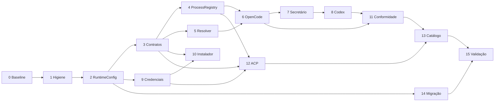

# Plano de execução da arquitetura multimotores do OpenCorp

> **Status:** pronto para implementação; todas as tarefas começam pendentes
> **Data-base:** 25 de setembro de 2026
> **Versão atual observada:** `0.7.0`
> **Documento pai:** [Reavaliação da arquitetura de motores: OpenCode como adaptador, não como fundação](REAVALIACAO-ARQUITETURA-MOTORES-E-OPENCODE.md)
> **Regra de escopo:** este documento autoriza um plano; a implementação somente deve começar quando o usuário solicitá-la explicitamente

## 1. Objetivo e resultado esperado

Este plano transforma as decisões arquiteturais aprovadas em unidades de trabalho verificáveis. O resultado final deve tornar o OpenCorp soberano sobre:

- seleção de motor, provedor, modelo e conta;
- execução pontual de agentes;
- conversas persistentes do Secretário;
- processos residentes e subprocessos;
- instalação e atualização de CLIs;
- credenciais e isolamento por workspace;
- catálogo e rotação de modelos;
- compatibilidade e migração de configurações legadas.

OpenCode continuará suportado, mas apenas como adaptador selecionável. Nenhuma parte genérica do produto deve depender diretamente de `OpencodeServerManager`, inferir OpenCode para IDs desconhecidos ou transformar outro motor em OpenCode silenciosamente.

### Teste arquitetural definitivo

> Com OpenCode indisponível, somente execuções configuradas para OpenCode devem falhar. O OpenCorp, scheduler, fluxos e Secretário usando outro runtime compatível devem continuar funcionando.

---

## 2. Decisões arquiteturais aprovadas

Estas decisões são contrato para a implementação. Mudanças exigem registro explícito no documento pai ou um ADR.

### D1 — Runtime padrão configurável e falha explícita

- Configuração global: `settings.default_conversation_engine`.
- Valor inicial: `opencode`.
- Override do workspace: `conversationEngineOverride`.
- Motor ausente, não autenticado ou não saudável: lançar `EngineUnavailableError`.
- É proibido fallback silencioso do runtime conversacional.

### D2 — Processo isolado por motor e workspace

- Chave canônica: `[engineId, workspaceId]`.
- Início sob demanda na primeira mensagem.
- `cwd`, ambiente, credenciais, MCPs e sessões isolados por workspace.
- Timeout ocioso: 15 minutos.
- Encerramento: `SIGTERM`, espera de 5 segundos e `SIGKILL` somente se necessário.

### D3 — Detect first, managed opt-in e sem instalação JIT

Precedência do binário:

1. `settings.engines[id].binary_path`;
2. executável no `PATH`;
3. instalação gerenciada explicitamente pela UI/API.

Ausência deve falhar no preflight com `PREFLIGHT_BINARY_MISSING`. Job e chat nunca instalam binários.

Destino gerenciado:

```text
~/.opencorp/engines/<engineId>/<version>/bin/
```

Toda instalação gerenciada exige versão fixada, origem conhecida, SHA-256, staging, probe e ativação atômica.

### D4 — Vault centralizado e injeção efêmera

- `CredentialsStore` será uma fachada sobre os mecanismos seguros existentes, não um cofre paralelo.
- API keys serão armazenadas por provedor/conta e poderão ser restringidas por workspace.
- Segredos serão injetados somente no ambiente do processo que os utiliza.
- OAuth nativo será aferido por comando/probe do CLI.
- Tokens de arquivos internos de CLIs não serão extraídos, copiados ou registrados.

### D5 — ACP de primeira classe

- `AcpClientAdapter` implementará `AgentRunner` e `ConversationRuntime`.
- Transporte, JSON-RPC, sessões, eventos, streaming e HITL serão reutilizados pelos motores compatíveis.
- Copilot e MiMo serão os primeiros candidatos, condicionados à conformidade das versões suportadas.

### D6 — Compatibilidade legada temporária

- `LegacyConfigTranslator` traduzirá em memória `runner.json`, prefixos legados e campos antigos.
- Toda tradução emitirá `[DEPRECATION NOTICE]` estruturado.
- `opencorp migrate-configs` e UI de migração terão preview, backup e aplicação explícita.
- O legado só será removido quando as três condições forem cumpridas:
  1. pelo menos 60 dias desde o aviso inicial;
  2. pelo menos duas versões menores publicadas com o tradutor;
  3. lançamento da versão `2.0.0` ou posterior.

Com data-base em 25/09/2026, a remoção nunca poderá ocorrer antes de 24/11/2026.

---

## 3. Protocolo obrigatório de limite do Codex

O implementador não deve afirmar que conhece o limite restante quando o cliente não o expõe.

### Antes de cada etapa

- [ ] Consultar o indicador de uso da interface ou executar `/status` em uma sessão ativa do Codex CLI.
- [ ] Registrar no handoff: data, indicador observado e origem (`UI`, `/status` ou `indisponível`).
- [ ] Estimar se há margem para código, testes, correções e commit da etapa.
- [ ] Se o indicador estiver baixo, não iniciar a etapa; concluir apenas documentação/handoff.
- [ ] Se o indicador estiver indisponível, reduzir a etapa para a menor unidade atômica possível.
- [ ] Confirmar que nenhuma migração de schema ou refactor transversal ficará pela metade.

### Durante cada etapa

- [ ] Manter um único objetivo técnico ativo.
- [ ] Não misturar correções visuais, features não relacionadas ou limpeza ampla.
- [ ] Rodar testes focados antes de expandir a mudança.
- [ ] Atualizar este checklist somente com evidência verificável.
- [ ] Se surgir trabalho adicional, registrar em “Pendências descobertas”; não ampliar silenciosamente o escopo.

### Ao encerrar cada etapa

- [ ] Rodar `git diff --check`.
- [ ] Rodar TypeScript e testes definidos na etapa.
- [ ] Verificar processos filhos e portas órfãs quando a etapa envolver runtimes.
- [ ] Registrar arquivos alterados, comandos e resultados.
- [ ] Criar commit semântico apenas com arquivos da etapa.
- [ ] Atualizar a tabela de status deste documento em commit separado ou no commit da própria etapa.
- [ ] Escrever handoff suficiente para retomada sem depender da conversa.
- [ ] Consultar novamente o limite antes de iniciar a próxima etapa.

### Modelo de registro de limite

```markdown
#### Limite Codex — início/fim da etapa N
- Momento: AAAA-MM-DD HH:mm TZ
- Fonte: UI | /status | indisponível
- Indicador exibido: <texto exato ou "não exposto pelo cliente">
- Decisão: iniciar | subdividir | encerrar e entregar handoff
```

O painel oficial ou `/status` são as fontes válidas. Estimativas internas de tokens não substituem o indicador do produto.

---

## 4. Regras gerais de implementação

- [ ] Preservar alterações preexistentes do usuário.
- [ ] Nunca instalar, atualizar, autenticar ou matar um motor fora do escopo explícito da etapa.
- [ ] Não ler nem imprimir segredos.
- [ ] Não usar instalação JIT durante job/chat.
- [ ] Não adicionar fallback silencioso.
- [ ] Não inferir motor apenas pelo prefixo do modelo no domínio novo.
- [ ] Não declarar capacidade que o adaptador ainda não implementa e testa.
- [ ] Usar JSON, JSONL, SSE ou protocolo estruturado quando o motor oferecer.
- [ ] Usar fake runtimes nos testes determinísticos.
- [ ] Manter probes reais opt-in, limitados por orçamento e desabilitados no CI comum.
- [ ] Manter compatibilidade somente na borda `LegacyConfigTranslator`.
- [ ] Não adicionar novas condicionais específicas de fornecedor ao núcleo.
- [ ] Todo recurso iniciado deve ter dono e encerramento garantido em `finally`/dispose.
- [ ] Documentar qualquer divergência entre documentação do fornecedor e comportamento observado.

---

## 5. Estado inicial observado

Use esta seção como baseline, confirmando novamente antes de implementar.

- Aproximadamente 85 mil linhas TypeScript/TSX no repositório.
- Aproximadamente 10,5 mil linhas nas áreas diretamente relacionadas a motores, execução e Secretário.
- Nove motores registrados.
- 24 arquivos com referências concretas ao OpenCode na auditoria inicial.
- 219 arquivos sob `tests/` na contagem inicial.
- `SessionManager` com aproximadamente 2.291 linhas.
- `OpencodeServerManager` com aproximadamente 769 linhas.
- Nenhuma implementação ACP localizada.
- `SecretsStore`, `EngineAccountStore` e `credentials-bridge.ts` já existem.
- `EngineDriver` mistura instalação, saúde, execução e cotas.
- Secretário depende diretamente do servidor OpenCode.
- `resolveDriver()` converte motor desconhecido em OpenCode.
- MiMo está registrado, mas não integra completamente a matriz tipada de capacidades.
- O endpoint de teste de motor executa apenas `checkHealth()`.
- A auditoria encontrou testes capazes de deixar `fake-opencode` órfão.

### Baseline obrigatório antes da Etapa 1

- [x] `git status --short` registrado.
- [x] Commit inicial anotado com `git rev-parse --short HEAD`.
- [x] `node --version`, `npm --version` e versão do pacote registrados.
- [x] `npx tsc --noEmit` aprovado.
- [x] `npx tsc --noEmit -p tsconfig.web.json` aprovado.
- [x] `npm test` executado e resultado registrado.
- [x] `npm run build` aprovado.
- [x] Inventário read-only de processos OpenCorp/OpenCode/fakes registrado.
- [x] Falhas preexistentes separadas das regressões da implementação.

---

## 6. Tabela de execução

Atualizar esta tabela após cada etapa. Não marcar “concluída” apenas porque o código foi escrito.

| Etapa | Resultado | Status | Commit | Evidência |
|---:|---|---|---|---|
| 0 | Baseline e plano congelado | ✅ Concluída | pendente neste checkpoint | 2 compilações TS, 128 arquivos/1.216 testes e build PASS |
| 1 | Higiene de processos e identidades | ✅ Concluída | `fix(engines): prevent orphan runtimes and engine impersonation` | 44 testes focados; 128 arquivos/1.217 testes; órfãos 0→0 |
| 2 | `RuntimeConfig`, erros e tradutor legado | ✅ Concluída | `feat(config): isolate legacy runtime configuration translation` | 4 arquivos focados (64 testes PASS); 2 compilações TS PASS; build PASS; órfãos 0→0 |
| 3 | Contratos e eventos canônicos | ✅ Concluída | `refactor(engines): introduce runtime ports and canonical agent events` | 6 arquivos focados (87 testes PASS); 2 compilações TS PASS; build PASS; órfãos 0→0 |
| 4 | `ProcessRegistry` | ⬜ Pendente | — | — |
| 5 | Resolução do runtime conversacional | ⬜ Pendente | — | — |
| 6 | Adaptador OpenCode completo | ⬜ Pendente | — | — |
| 7 | Secretário independente de OpenCode | ⬜ Pendente | — | — |
| 8 | Codex como segundo runtime | ⬜ Pendente | — | — |
| 9 | Vault e autenticação | ⬜ Pendente | — | — |
| 10 | Instalador gerenciado e preflight | ⬜ Pendente | — | — |
| 11 | Saúde funcional e conformidade | ⬜ Pendente | — | — |
| 12 | `AcpClientAdapter` | ⬜ Pendente | — | — |
| 13 | Catálogo e rotação soberanos | ⬜ Pendente | — | — |
| 14 | Migração CLI/UI e depreciação | ⬜ Pendente | — | — |
| 15 | Validação final e liberação | ⬜ Pendente | — | — |

Estados válidos: `⬜ Pendente`, `🟨 Em andamento`, `🟥 Bloqueada`, `✅ Concluída`.

---

## 7. Etapas detalhadas

## ETAPA 0 — Baseline e congelamento dos contratos

**Objetivo:** garantir que as regressões futuras sejam atribuíveis e que as decisões aprovadas não mudem durante o refactor.

### Tarefas

- [x] Executar todo o baseline da seção 5.
- [x] Confirmar os nove motores realmente registrados.
- [x] Mapear todos os imports de `OpencodeServerManager`.
- [x] Mapear leitura/escrita de `runner.json`.
- [x] Mapear campos de configuração global e de workspace.
- [x] Mapear rotas e telas que exibem estado de motor/Secretário.
- [x] Mapear processos residentes, pidfiles, portas e teardowns de testes.
- [x] Registrar contratos públicos atuais da API que precisarão de compatibilidade.
- [x] Criar ADR das seis decisões ou declarar este plano como contrato temporário.
- [x] Confirmar a semântica da janela de remoção: `60 dias E 2 versões menores E v2.0`.

### Critérios de aceite

- [x] Baseline reproduzível registrado.
- [x] Nenhum código funcional alterado.
- [x] Todas as superfícies de compatibilidade conhecidas estão listadas.

### Registro de execução

#### Limite Codex — início/fim da Etapa 0

- Momento: 2026-09-25 22:48 -03.
- Modelo informado pelo usuário: GPT-5.6 Sol, esforço light.
- Fonte: interface do cliente.
- Indicador exibido: não exposto pelo cliente; inventário CUA sem apps ou abas disponíveis.
- Decisão: executar somente baseline e documentação, concluir validações e criar checkpoint antes da Etapa 1.

#### Ambiente e validações

- Branch/base: `main` em `c426b83`.
- Versões: Node `v22.22.3`, npm `10.9.8`, OpenCorp `0.7.0`.
- Motores registrados: 9.
- `npx tsc --noEmit`: PASS.
- `npx tsc --noEmit -p tsconfig.web.json`: PASS.
- `npm test`: PASS — 128 arquivos, 1.216 testes aprovados e 1 `todo`.
- `npm run build`: PASS — backend TypeScript e Vite.
- Aviso de build preexistente: chunk `app.js` acima de 500 kB; não pertence a esta migração.

#### Processos observados sem mutação

- Daemon OpenCorp, scheduler e API na porta 4100 estavam ativos.
- OpenCode do Secretário estava ativo em loopback na porta 37895.
- Outra instância OpenCode escutava na porta 4096 e requer identificação antes de qualquer ação.
- Antes da suíte havia 4 processos `fake-opencode` órfãos, todos com PPID 1.
- Depois da suíte havia 6: a execução reproduziu a criação de mais 2 órfãos.
- Nenhum processo foi encerrado durante a Etapa 0.

#### Superfícies de compatibilidade registradas

- Rotas `/secretario/status|start|stop|sessoes|conversa|conversa/stream`.
- Rotas `/api/motores/*`, `/settings/runner`, `/modelos/*` e `/llm/*`.
- `runner.json` é lido/escrito pela CLI, API, `SessionManager` e `EngineAccountStore`.
- `OpencodeServerManager` entra pelo servidor, `RouteContext` e testes do Secretário.
- Este plano declara D1–D6 como contrato temporário até a criação de ADRs específicos.
- Regra de remoção confirmada: 60 dias **e** duas versões menores **e** versão 2.0 ou posterior.

### Commit sugerido

```text
docs(architecture): freeze multi-engine migration baseline and decisions
```

---

## ETAPA 1 — Higiene de processos e identidades de motores

**Objetivo:** estancar vazamentos e impedir que um motor se apresente como outro antes do refactor estrutural.

### Tarefas

- [x] Corrigir teardown de `tests/secretario-proxy.test.ts` com `manager.parar()`.
- [x] Corrigir teardown de `tests/secretario-erros.test.ts` com `manager.parar()`.
- [x] Auditar demais testes que constroem `OpencodeServerManager` real.
- [x] Garantir cleanup em `afterEach`/`afterAll` mesmo após assertion rejeitada.
- [x] Criar teste de “zero processos órfãos” após a suíte focada.
- [x] Remover fallback que cria `agy` executando OpenCode.
- [x] Fazer instalação AGY falhar explicitamente quando o AGY real não puder ser provisionado.
- [x] Impedir que `resolveDriver(idDesconhecido)` retorne OpenCode silenciosamente.
- [x] Criar erro tipado para motor desconhecido.
- [x] Preservar alias explícito e documentado, como `agy → antigravity`.

### Testes

- [x] Testes de `opencode-server`.
- [x] Testes de proxy/erros/resiliência do Secretário.
- [x] Testes do registro de motores.
- [x] Inspeção de processos antes/depois da suíte.
- [x] `npx tsc --noEmit`.

### Critérios de aceite

- [x] Nenhum fake runtime sobrevive aos testes.
- [x] Nenhum binário de um motor mascara outro.
- [x] ID desconhecido falha com erro explícito.

### Registro de execução

#### Limite Codex — início/fim da Etapa 1

- Fonte: interface do cliente.
- Indicador no início: não exposto; modelo informado pelo usuário GPT-5.6 Sol, esforço light.
- Indicador no encerramento: 33% restante, informado pelo usuário.
- Decisão: concluir suíte e commit da Etapa 1; não iniciar a Etapa 2 com margem insuficiente para schema, testes e rollback.

#### Alterações e evidências

- `EngineNotFoundError` substitui o fallback universal para OpenCode.
- Alias explícito `agy → antigravity` foi preservado.
- A instalação AGY não cria mais wrapper que executa OpenCode.
- Os testes de proxy e erros agora possuem e encerram o `OpencodeServerManager` criado.
- Seis processos fake antigos, identificados exatamente como fixtures de teste e com PPID 1, foram encerrados; serviços reais foram preservados.
- Suíte focada: 4 arquivos e 44 testes PASS; contagem de fake runtimes 6→6 antes da limpeza, comprovando que nenhum novo órfão foi criado.
- Suíte completa após a limpeza: 128 arquivos, 1.217 testes PASS e 1 `todo`; contagem de fake runtimes 0→0.
- Backend TypeScript: PASS.
- Frontend TypeScript: PASS.
- Build backend/Vite: PASS.

### Commit sugerido

```text
fix(engines): prevent orphan runtimes and reject engine impersonation
```

---

## ETAPA 2 — `RuntimeConfig`, erros e compatibilidade legada

**Objetivo:** separar motor, modo, provedor, modelo, conta e fallbacks em uma configuração tipada.

### Estrutura-alvo mínima

```ts
interface RuntimeConfig {
  engine: string;
  mode: "one-shot" | "conversation";
  model: {
    provider: string;
    id: string;
    accountId?: string;
  };
  fallback?: {
    engines: string[];
    models: Array<{ provider: string; id: string }>;
  };
}
```

### Tarefas

- [x] Criar schema Zod de `RuntimeConfig`.
- [x] Adicionar `settings.default_conversation_engine` com default `opencode`.
- [x] Adicionar `settings.engines[id].binary_path`.
- [x] Adicionar `conversationEngineOverride` ao schema de workspace.
- [x] Criar `EngineUnavailableError`.
- [x] Criar `PREFLIGHT_BINARY_MISSING` como código canônico.
- [x] Criar erros para autenticação, incompatibilidade de modelo e capacidade ausente.
- [x] Criar `LegacyConfigTranslator` puro, sem escrita em disco.
- [x] Traduzir `runner.json` para `RuntimeConfig` em memória.
- [x] Traduzir prefixos legados sem trocar motor silenciosamente.
- [x] Emitir evento/log estruturado `[DEPRECATION NOTICE]` uma vez por origem.
- [x] Guardar origem da tradução para auditoria.
- [x] Definir datas/versões da depreciação em constantes testáveis.

### Testes

- [x] Defaults globais.
- [x] Override por workspace.
- [x] Configuração inválida com caminho do campo no erro.
- [x] Tradução de cada formato legado conhecido.
- [x] Tradutor idempotente.
- [x] Ausência de escrita durante tradução.
- [x] Snapshot dos avisos de depreciação.

### Critérios de aceite

- [x] Modelo não determina motor no domínio novo.
- [x] Compatibilidade está isolada em um único módulo.
- [x] Configurações novas não dependem de `runner.json`.

### Registro da Etapa 2A — Fundação tipada

- Limite no início: não exposto pelo cliente após o reinício do computador.
- Limite confirmado durante a execução: 22% restante via `/status`, informado pelo usuário.
- Decisão: concluir apenas schema, campos e erros; não iniciar o `LegacyConfigTranslator`.
- Entregas: `RuntimeConfig`, `ModelRef`, configuração global/workspace e hierarquia de erros canônicos.
- Validação focada: 3 arquivos, 41 testes PASS.
- Backend TypeScript: PASS.
- Frontend TypeScript: PASS.
- Próximo passo exato: implementar o tradutor puro e seus testes em uma nova unidade, após nova verificação de limite.

### Registro da Etapa 2B — `LegacyConfigTranslator` e avisos de depreciação

- Limite no início: sessão Antigravity IDE (Gemini 3.8 Flash) sem indicador restritivo exposto pelo cliente; início às 23:19 -03.
- Limite no encerramento: sessão operacional e íntegra; encerramento às 23:30 -03.
- Decisão: implementar e validar integralmente a borda de compatibilidade pura e suíte de testes unitários.
- Entregas:
  - Módulo `src/core/engines/legacy-config-translator.ts` contendo `translateLegacyRuntimeConfig`, `LegacyConfigTranslationError`, `DeprecationEmitter`, `createDeprecationNotice` e constantes canônicas de depreciação (início `2026-09-25`, remoção não antes de `2026-11-24`, versão `2.0.0`, regra de 60 dias e 2 versões menores).
  - Exportação de compatibilidade através de `src/core/engines/index.ts`.
  - Suíte de 23 testes em `tests/legacy-config-translator.test.ts`.
- Formatos legados suportados e testados:
  - `runner.json` (mínimo, e com `binary_path`, `timeout_min` e `harness_fallback`);
  - Campos legados de agentes: `harness`, `engine`, `harness_fallback`, `engine_fallback`, `rotation`, `model_fallback`;
  - Prefixos de modelo: `opencode/*`, `opencode-go/*`, `claude-code/*`, `claude/*`, `antigravity/*`, `agy/*`, `crom-agente/*`, `crom/*`, `cursor/*`, `copilot/*`, `codex/*`, `aider/*`, `mimo/*`;
  - Preservação explícita de `openrouter/*` como provedor/modelo, sem conversão forçada para OpenCode;
  - Prevalência de motor explicitamente configurado sobre inferência de prefixo de modelo, com aviso detalhado de precedência;
  - Normalização de aliases legados (`agy → antigravity`, `crom → crom-agente`, `claude → claude-code`);
  - Ausência de escrita em disco e imutabilidade garantida com `Object.freeze`.
- Validação focada: 4 arquivos, 64 testes PASS (`tests/runtime-config.test.ts`, `tests/legacy-config-translator.test.ts`, `tests/settings-store.test.ts`, `tests/engine-drivers.test.ts`).
- Compilação: `npx tsc --noEmit` e `npx tsc --noEmit -p tsconfig.web.json` PASS.
- Build: `npm run build` PASS (backend e frontend Vite).
- Processos órfãos: 0 processos `fake-opencode` detectados.
- Próximo passo exato: Iniciar a Etapa 3 — Contratos e eventos canônicos (`EngineInstaller`, `EngineAuthenticator`, `AgentRunner`, `ConversationRuntime`, `ModelCatalogSource`, `EngineCapabilityManifest`, `AgentEvent`).

### Commits sugeridos

```text
feat(config): add typed runtime configuration and explicit engine errors
feat(config): isolate legacy runtime configuration translation
```

---

## ETAPA 3 — Contratos e eventos canônicos

**Objetivo:** substituir o `EngineDriver` monolítico por portas independentes sem quebrar os drivers existentes imediatamente.

### Contratos

- [x] `EngineInstaller`.
- [x] `EngineAuthenticator`.
- [x] `AgentRunner`.
- [x] `ConversationRuntime`.
- [x] `ModelCatalogSource`.
- [x] `EngineCapabilityManifest`.
- [x] Eventos canônicos `AgentEvent`.
- [x] Erros canônicos e normalização de erros de fornecedor.

### Tarefas

- [x] Definir tipos sem importar módulos concretos.
- [x] Separar capacidade declarada, integrada e verificada.
- [x] Representar suporte a streaming, continuação, fork, HITL, ferramentas, MCP, imagens e cancelamento.
- [x] Representar transporte: processo pontual, servidor HTTP, stdio JSON-RPC ou embutido.
- [x] Criar adaptador de compatibilidade para drivers atuais.
- [x] Fazer todo motor registrado fornecer um manifesto compilável.
- [x] Adicionar MiMo ao domínio tipado de capacidades.
- [x] Definir `unsupported` como resultado válido, nunca como simulação.

### Testes

- [x] Registro rejeita adaptador sem manifesto.
- [x] Eventos de drivers legados são normalizados.
- [x] Capacidade não integrada não aparece como disponível.
- [x] Tipos não dependem de OpenCode.

### Critérios de aceite

- [x] Adicionar um motor não exige editar tipos union manualmente em vários arquivos.
- [x] O núcleo conhece portas, não fornecedores.
- [x] Drivers atuais continuam funcionando pela camada de compatibilidade.

### Registro da Etapa 3 — Contratos e eventos canônicos

- Limite no início: sessão Antigravity IDE (Gemini 3.8 Flash) sem indicador restritivo exposto; início às 23:36 -03.
- Limite no encerramento: sessão operacional e íntegra; encerramento às 23:44 -03.
- Decisão: implementar as portas desacopladas, eventos canônicos, manifestos compiláveis e adaptador de compatibilidade com cobertura de testes completa.
- Entregas:
  - `src/core/engines/events.ts`: Eventos canônicos `AgentEvent` (`run.started`, `message.delta`, `tool.requested`, `tool.completed`, `approval.requested`, `usage.updated`, `run.completed`, `run.failed`) com payloads tipados;
  - `src/core/engines/manifests.ts`: `EngineCapabilityManifest` separando níveis (`unsupported`, `declared`, `integrated`, `verified`), transportes (`spawn_cli`, `http_server`, `stdio_jsonrpc`, `embedded`), helper `isCapabilityAvailable` e manifestos para os 9 motores;
  - `src/core/engines/ports.ts`: Contratos canônicos desacoplados (`EngineInstaller`, `EngineAuthenticator`, `AgentRunner`, `ConversationRuntime`, `ModelCatalogSource`, `EngineAdapter`);
  - `src/core/engines/error-normalizer.ts`: `normalizeEngineError` mapeando erros de fornecedor em erros canônicos (`PreflightBinaryMissingError`, `EngineAuthRequiredError`, `ModelIncompatibleError`, `EngineCapabilityUnavailableError`, etc.);
  - `src/core/engines/adapter-compat.ts`: `LegacyDriverAdapter` integrando os drivers existentes às novas portas canônicas;
  - `src/core/engines/capabilities.ts`: `mimo` integrado ao domínio de capacidades e `HarnessId` desacoplado de uniões rígidas;
  - `src/core/engines/registry.ts`: `EngineRegistry` atualizado com registro e validação de adaptadores (`registerAdapter`, `getAdapter`, `resolveAdapter`, `getManifest`, `listManifests`);
  - `tests/engine-ports-and-events.test.ts`: 15 testes unitários e de integração das novas portas;
  - Atualização em `tests/engine-capabilities.test.ts`.
- Validação consolidada: 6 arquivos focados, 87 testes PASS (`tests/runtime-config.test.ts`, `tests/legacy-config-translator.test.ts`, `tests/engine-ports-and-events.test.ts`, `tests/engine-capabilities.test.ts`, `tests/settings-store.test.ts`, `tests/engine-drivers.test.ts`).
- Compilação: `npx tsc --noEmit` e `npx tsc --noEmit -p tsconfig.web.json` PASS.
- Build: `npm run build` PASS (backend e frontend Vite).
- Processos órfãos: 0 processos `fake-opencode` detectados.
- Próximo passo exato: Iniciar a Etapa 4 — `ProcessRegistry` (registro de processos isolado por chave `[engineId, workspaceId]`, timeout ocioso de 15 minutos e shutdown gracioso).

### Commit sugerido

```text
refactor(engines): introduce runtime ports and canonical agent events
```

---

## ETAPA 4 — `ProcessRegistry`

**Objetivo:** possuir e controlar todos os processos de runtimes.

### Tarefas

- [ ] Criar chave tipada `{ engineId, workspaceId }`.
- [ ] Registrar PID, PGID, versão, cwd, transporte e porta.
- [ ] Registrar início, último uso e estado.
- [ ] Implementar referência/adopção/liberação.
- [ ] Implementar timer ocioso de 15 minutos.
- [ ] Implementar `SIGTERM` e espera de 5 segundos.
- [ ] Implementar `SIGKILL` apenas após timeout.
- [ ] Implementar encerramento global no shutdown.
- [ ] Implementar reconciliação de pidfiles/processos no boot.
- [ ] Não adotar processo cuja identidade não possa ser confirmada.
- [ ] Emitir eventos de lifecycle.
- [ ] Usar relógio e sinais injetáveis nos testes.
- [ ] Impedir compartilhamento acidental entre workspaces.

### Testes

- [ ] Dois workspaces do mesmo motor recebem processos isolados.
- [ ] Reuso ocorre apenas para a mesma chave.
- [ ] Atividade renova o timeout.
- [ ] Inatividade encerra após 15 minutos simulados.
- [ ] Processo cooperativo encerra com `SIGTERM`.
- [ ] Processo travado recebe `SIGKILL` após 5 segundos simulados.
- [ ] Shutdown encerra todos os recursos possuídos.
- [ ] Boot reconcilia órfãos conhecidos.
- [ ] Porta/PID obsoletos não são adotados.

### Critérios de aceite

- [ ] Zero processos órfãos em sucesso, erro, timeout e cancelamento.
- [ ] Nenhum estado global do OpenCode dentro do registro.
- [ ] Isolamento `[engineId, workspaceId]` comprovado.

### Commit sugerido

```text
feat(runtime): add workspace-isolated process registry and idle shutdown
```

---

## ETAPA 5 — Resolução do runtime conversacional

**Objetivo:** resolver o motor do Secretário explicitamente e executar preflight antes de abrir uma conversa.

### Ordem de resolução

```text
workspace.conversationEngineOverride
                ↓
settings.default_conversation_engine
                ↓
EngineUnavailableError
```

### Tarefas

- [ ] Criar `ConversationRuntimeResolver`.
- [ ] Consultar override do workspace.
- [ ] Consultar default global.
- [ ] Validar registro do motor.
- [ ] Validar `ConversationRuntime` no manifesto.
- [ ] Executar preflight de binário/SDK.
- [ ] Verificar autenticação sem inferência destrutiva.
- [ ] Retornar diagnóstico acionável.
- [ ] Proibir fallback implícito.
- [ ] Expor motor efetivo e origem da configuração na API.
- [ ] Expor estado na UI sem chamar todo runtime de OpenCode.

### Testes

- [ ] Herança global.
- [ ] Override por workspace.
- [ ] Motor inexistente.
- [ ] Motor instalado, mas sem runtime conversacional.
- [ ] Motor não autenticado.
- [ ] Nenhum caso troca para OpenCode silenciosamente.

### Critérios de aceite

- [ ] O runtime do Secretário pode ser resolvido sem importar OpenCode.
- [ ] Erros orientam seleção, instalação ou login corretos.

### Commit sugerido

```text
feat(secretary): resolve configurable conversation runtime explicitly
```

---

## ETAPA 6 — Adaptador OpenCode completo

**Objetivo:** mover toda lógica específica de OpenCode para seu adaptador e integrá-lo às novas portas.

### Tarefas

- [ ] Implementar `AgentRunner` com saída estruturada.
- [ ] Implementar `ConversationRuntime` com SDK/cliente oficial.
- [ ] Encapsular criação, envio, streaming, continuação, fork, cancelamento e fechamento.
- [ ] Integrar com `ProcessRegistry` quando houver processo residente.
- [ ] Gerar segredo aleatório para autenticação local.
- [ ] Restringir bind a loopback.
- [ ] Isolar dados/configuração por workspace.
- [ ] Mapear eventos OpenCode para `AgentEvent`.
- [ ] Mover argumentos especiais para fora do `SessionManager`.
- [ ] Manter CLI estruturada como fallback explicitamente configurado.
- [ ] Garantir dispose do host/cliente.
- [ ] Implementar testes com fake OpenCode sem processo órfão.

### Testes

- [ ] One-shot.
- [ ] Streaming.
- [ ] Sessão nova.
- [ ] Continuação.
- [ ] Fork, se suportado.
- [ ] Cancelamento.
- [ ] Timeout.
- [ ] Autenticação local.
- [ ] Isolamento entre workspaces.
- [ ] Idle shutdown.

### Critérios de aceite

- [ ] `SessionManager` não monta `opencode run` manualmente.
- [ ] Rotas genéricas não precisam conhecer portas OpenCode.
- [ ] OpenCode funciona exclusivamente através das portas.

### Commits sugeridos

```text
refactor(opencode): implement canonical one-shot runner
feat(opencode): implement isolated conversation runtime
```

---

## ETAPA 7 — Migração do Secretário para runtime genérico

**Objetivo:** remover a dependência direta do Secretário em `OpencodeServerManager`.

### Tarefas

- [ ] Trocar `RouteContext.opencodeServer` por serviços genéricos.
- [ ] Substituir `obterPorta()` por aquisição de `ConversationRuntime`.
- [ ] Migrar criação de sessão.
- [ ] Migrar envio e SSE.
- [ ] Migrar cancelamento.
- [ ] Migrar continuação e fork.
- [ ] Migrar troca de workspace.
- [ ] Atualizar status/start/stop com nomenclatura genérica.
- [ ] Preservar endpoints legados via tradutor/alias temporário, se necessário.
- [ ] Atualizar mensagens e telemetria que dizem “OpenCode” indevidamente.
- [ ] Garantir que troca de workspace troque o processo/runtime isolado.
- [ ] Atualizar UI para mostrar motor efetivo.

### Testes

- [ ] Todos os testes unitários do Secretário.
- [ ] SSE e streaming.
- [ ] Workspace switch.
- [ ] Continuação/duplicação.
- [ ] Resiliência/zombie.
- [ ] Erro explícito quando runtime configurado está indisponível.
- [ ] E2E do Secretário com fake runtime genérico.

### Prova de independência

- [ ] Tornar o binário OpenCode indisponível no ambiente de teste.
- [ ] Configurar fake runtime alternativo.
- [ ] Abrir e continuar conversa com sucesso.
- [ ] Confirmar scheduler e fluxos operacionais.

### Critérios de aceite

- [ ] Nenhuma rota genérica do Secretário importa `OpencodeServerManager`.
- [ ] OpenCode pode ser desabilitado sem derrubar o Secretário configurado para outro runtime.

### Commit sugerido

```text
refactor(secretary): decouple conversations from opencode server
```

---

## ETAPA 8 — Codex como segundo runtime conversacional

**Objetivo:** provar que os contratos não foram desenhados apenas para reproduzir OpenCode.

### Tarefas

- [ ] Implementar one-shot Codex com saída JSON.
- [ ] Selecionar SDK ou app-server para conversação persistente.
- [ ] Implementar streaming e eventos canônicos.
- [ ] Implementar continuação real.
- [ ] Implementar cancelamento.
- [ ] Integrar aprovações conforme a interface suportada.
- [ ] Integrar `ProcessRegistry` quando necessário.
- [ ] Declarar somente capacidades comprovadas.
- [ ] Não acoplar o modelo Codex ao harness pelo prefixo.
- [ ] Criar fake determinístico para CI.
- [ ] Criar probe real opt-in com orçamento.

### Testes

- [ ] Mesmo contrato de conversa usado pelo OpenCode.
- [ ] Secretário inicia com `default_conversation_engine: codex`.
- [ ] Workspace A usa Codex e workspace B usa OpenCode sem vazamento.
- [ ] Ausência/login inválido retorna erro explícito.
- [ ] Nenhuma sessão fica órfã.

### Critérios de aceite

- [ ] Dois runtimes conversacionais reais suportados pela mesma porta.
- [ ] Nenhuma condicional `if codex` adicionada às rotas do Secretário.

### Commits sugeridos

```text
feat(codex): add canonical agent runner
feat(codex): support persistent secretary conversations
```

---

## ETAPA 9 — Vault, contas e autenticação

**Objetivo:** centralizar API keys com escopo e tratar OAuth de CLIs sem extração de tokens.

### Tarefas

- [ ] Projetar `CredentialsStore` como fachada.
- [ ] Reusar armazenamento seguro de `SecretsStore`.
- [ ] Reusar metadados de `EngineAccountStore`.
- [ ] Separar credencial de provedor da sessão OAuth do motor.
- [ ] Adicionar restrições de workspace.
- [ ] Resolver conta autorizada antes do spawn.
- [ ] Injetar ambiente efêmero mínimo.
- [ ] Redigir valores em logs, erros e telemetria.
- [ ] Evitar persistir ambiente completo.
- [ ] Implementar `EngineAuthenticator.isLoggedIn()`.
- [ ] Remover leitura direta de tokens OAuth do Claude.
- [ ] Auditar leitura direta de credenciais nos outros drivers.
- [ ] Implementar desconexão sem apagar dados externos sem confirmação.

### Testes

- [ ] Workspace autorizado recebe credencial.
- [ ] Workspace não autorizado falha antes do spawn.
- [ ] Segredo nunca aparece em log/snapshot/erro.
- [ ] OAuth é verificado por probe do CLI.
- [ ] Rotação de conta respeita provedor, motor e workspace.
- [ ] Ambiente é descartado após o processo.

### Critérios de aceite

- [ ] Nenhum driver extrai token de arquivo interno de terceiros.
- [ ] Credenciais não vazam entre workspaces.
- [ ] Contas e cotas não são confundidas com motores.

### Commit sugerido

```text
feat(credentials): add scoped vault facade and ephemeral injection
```

---

## ETAPA 10 — Instalador gerenciado e preflight

**Objetivo:** tornar descoberta e instalação explícitas, reproduzíveis e seguras.

### Tarefas

- [ ] Criar `EngineBinaryResolver` com a precedência aprovada.
- [ ] Criar manifesto de versões aprovadas.
- [ ] Definir URL/origem e SHA-256 por plataforma.
- [ ] Implementar download para diretório temporário.
- [ ] Validar checksum antes de executar/copiar.
- [ ] Validar permissões e formato do artefato.
- [ ] Instalar em staging.
- [ ] Executar probe de versão/saúde.
- [ ] Ativar por rename/symlink atômico.
- [ ] Registrar proveniência.
- [ ] Implementar rollback.
- [ ] Recusar artefato sem checksum aprovado.
- [ ] Remover `curl | bash` dos caminhos gerenciados.
- [ ] Fazer jobs/chats chamarem somente preflight, nunca install.
- [ ] Manter instalação como ação explícita da UI/API/CLI.

### Testes

- [ ] Caminho explícito vence `PATH`.
- [ ] `PATH` vence instalação gerenciada.
- [ ] Ausência retorna `PREFLIGHT_BINARY_MISSING`.
- [ ] Checksum inválido não ativa artefato.
- [ ] Probe falho faz rollback.
- [ ] Interrupção durante staging preserva versão corrente.
- [ ] Chat/job não invoca instalador.

### Critérios de aceite

- [ ] Instalações são auditáveis e reversíveis.
- [ ] Nenhuma execução instala software implicitamente.
- [ ] Motores sem artefato verificável aparecem como instalação gerenciada não suportada.

### Commits sugeridos

```text
feat(engines): add deterministic binary resolution and preflight
feat(engines): add pinned verified managed installations
```

---

## ETAPA 11 — Saúde funcional e suíte de conformidade

**Objetivo:** substituir o falso binário saudável por níveis honestos de diagnóstico.

### Níveis de estado

- `installed` — binário/SDK encontrado.
- `authenticated` — conta/sessão válida.
- `inference` — inferência mínima concluída.
- `streaming` — eventos válidos recebidos.
- `tools` — ferramenta controlada concluída.
- `conversation` — sessão continuada corretamente.
- `lifecycle` — encerramento sem órfãos.

### Tarefas

- [ ] Criar resultados tipados por nível.
- [ ] Manter health barato separado de probe real.
- [ ] Atualizar `/api/motores/:id/test` para receber nível solicitado.
- [ ] Tornar probes reais opt-in.
- [ ] Aplicar timeout e orçamento.
- [ ] Usar workspace temporário.
- [ ] Proibir modelos aleatórios em testes.
- [ ] Registrar versão, motor, modelo e latência.
- [ ] Não salvar prompt/resposta sensível por padrão.
- [ ] Exibir distinção na UI.

### Suíte de contrato por adaptador

- [ ] Binário/SDK e versão.
- [ ] Autenticação.
- [ ] Inferência mínima.
- [ ] Parsing estruturado.
- [ ] Streaming, se declarado.
- [ ] Leitura por ferramenta, se declarada.
- [ ] Escrita em sandbox, se declarada.
- [ ] Timeout.
- [ ] Cancelamento.
- [ ] Continuação, se declarada.
- [ ] Fork, se declarado.
- [ ] Aprovação HITL, se declarada.
- [ ] Zero órfãos.

### Critérios de aceite

- [ ] UI nunca chama um mero `--version` de teste funcional completo.
- [ ] Capacidade exibida corresponde à capacidade verificada.

### Commit sugerido

```text
feat(engines): add multi-level health and conformance probes
```

---

## ETAPA 12 — `AcpClientAdapter`

**Objetivo:** implementar ACP como transporte reutilizável de primeira classe.

### Preparação

- [ ] Fixar versão da especificação ACP suportada.
- [ ] Registrar divergências de Copilot/MiMo.
- [ ] Decidir biblioteca oficial versus implementação interna mínima.
- [ ] Definir transporte stdio e política de framing.

### Implementação

- [ ] Inicialização e negociação de capacidades.
- [ ] Correlação de requisições JSON-RPC.
- [ ] Notificações/eventos assíncronos.
- [ ] Sessão nova.
- [ ] Envio de mensagem.
- [ ] Streaming.
- [ ] Cancelamento.
- [ ] Continuação.
- [ ] Aprovações HITL.
- [ ] Encerramento e dispose.
- [ ] Backpressure e limites de buffer.
- [ ] Timeout por operação.
- [ ] Normalização em `AgentEvent`.
- [ ] Implementação de `AgentRunner`.
- [ ] Implementação de `ConversationRuntime`.

### Testes

- [ ] Fake ACP server determinístico.
- [ ] Frames parciais e múltiplos frames.
- [ ] Resposta fora de ordem.
- [ ] Notificação sem request.
- [ ] Erro JSON-RPC.
- [ ] Processo encerra inesperadamente.
- [ ] Cancelamento concorrente.
- [ ] HITL aceito, rejeitado e expirado.
- [ ] Zero órfãos.
- [ ] Contrato real opt-in com Copilot.
- [ ] Contrato real opt-in com MiMo.

### Critérios de aceite

- [ ] Copilot e MiMo reutilizam a infraestrutura comum quando conformes.
- [ ] Diferenças de fornecedor ficam em configuração/subclasse pequena.
- [ ] Nenhum parser proprietário duplicado nas rotas ou no núcleo.

### Commits sugeridos

```text
feat(acp): implement canonical JSON-RPC agent adapter
feat(engines): connect copilot and mimo through ACP
```

---

## ETAPA 13 — Catálogo e rotação soberanos

**Objetivo:** fazer o OpenCorp agregar modelos sem tornar OpenCode dono do catálogo.

### Modelo de dados mínimo

```text
modelId
providerId
accountId opcional
compatibleEngineIds[]
capabilities
context/output limits
cost/free metadata
availability/probe timestamp
governance status
```

### Tarefas

- [ ] Criar `ModelCatalogSource` por origem.
- [ ] Agregar e deduplicar modelos sem apagar proveniência.
- [ ] Representar compatibilidade motor-modelo.
- [ ] Separar disponibilidade catalogada de probe aprovado.
- [ ] Integrar governança por tamanho/capacidade/custo.
- [ ] Bloquear modelos proibidos em agentes autônomos.
- [ ] Implementar pesquisa e seleção na UI.
- [ ] Separar rotações de modelo, provedor, conta e motor.
- [ ] Registrar o motivo de cada fallback.
- [ ] Exigir cadeia explícita de fallback.
- [ ] Remover inferência `openrouter/* → opencode` do domínio novo.
- [ ] Preservar formato legado somente no tradutor.

### Testes

- [ ] Mesmo modelo por duas origens mantém ambas as rotas.
- [ ] Modelo incompatível com motor falha no preflight.
- [ ] Conta sem cota gira conta, não motor, conforme política.
- [ ] Falha de provedor não troca motor sem autorização.
- [ ] Modelo bloqueado não entra em rotação autônoma.
- [ ] Toda decisão de fallback fica auditável.

### Critérios de aceite

- [ ] Escolher modelo nunca altera motor silenciosamente.
- [ ] OpenCode é apenas uma das fontes/adaptações possíveis.

### Commit sugerido

```text
refactor(models): make catalog and fallback routing engine-agnostic
```

---

## ETAPA 14 — Migração CLI/UI e cronograma de depreciação

**Objetivo:** permitir migração segura antes da rejeição dos formatos antigos.

### CLI

- [ ] Implementar `opencorp migrate-configs --dry-run`.
- [ ] Mostrar arquivos, campos, transformações e avisos.
- [ ] Implementar backup timestampado.
- [ ] Implementar aplicação explícita.
- [ ] Validar resultado antes de substituir arquivos.
- [ ] Implementar rollback do backup.
- [ ] Retornar códigos de saída documentados.

### UI

- [ ] Detectar configuração legada.
- [ ] Exibir aviso não bloqueante na fase inicial.
- [ ] Mostrar preview da migração.
- [ ] Exigir confirmação.
- [ ] Mostrar backup e resultado.
- [ ] Não migrar automaticamente ao abrir configurações.

### Cronograma

- [ ] Persistir data do primeiro aviso.
- [ ] Publicar primeira versão menor com tradutor.
- [ ] Publicar segunda versão menor com tradutor.
- [ ] Manter suporte por pelo menos 60 dias.
- [ ] Preparar rejeição somente para `2.0.0` ou posterior.
- [ ] Documentar remoção em release notes.

### Testes

- [ ] Dry-run não escreve.
- [ ] Backup é íntegro.
- [ ] Migração é idempotente.
- [ ] Configuração inválida não substitui original.
- [ ] Rollback restaura byte a byte.
- [ ] Aviso não é duplicado excessivamente.

### Critérios de aceite

- [ ] Usuário consegue migrar sem editar JSON manualmente.
- [ ] Nenhum legado é removido antes das três condições aprovadas.

### Commit sugerido

```text
feat(config): add safe legacy runtime configuration migration
```

---

## ETAPA 15 — Validação final e liberação

**Objetivo:** provar funcionalidade, segurança, compatibilidade e independência de motor.

### Validação estática e build

- [ ] `npx tsc --noEmit`.
- [ ] `npx tsc --noEmit -p tsconfig.web.json`.
- [ ] `npm run build`.
- [ ] `git diff --check`.

### Testes automatizados

- [ ] `npm test` 100% aprovado, respeitando todos conhecidos.
- [ ] Suítes focadas de motores.
- [ ] Suítes focadas do Secretário.
- [ ] Suítes de configuração/migração.
- [ ] Suítes de processos e isolamento.
- [ ] Playwright das telas afetadas.
- [ ] Testes de acessibilidade das seleções/erros novos.

### Matriz funcional mínima

- [ ] Secretário com OpenCode.
- [ ] Secretário com Codex.
- [ ] Workspace A e B usando runtimes diferentes.
- [ ] Runtime configurado indisponível produz erro explícito.
- [ ] Job one-shot não inicia servidor desnecessário.
- [ ] Instalação nunca ocorre durante job/chat.
- [ ] Credencial restrita não atravessa workspace.
- [ ] Timeout ocioso encerra processo residente.
- [ ] Cancelamento encerra árvore de processos.
- [ ] OpenCode desabilitado não derruba funcionalidades independentes.
- [ ] Tradução legada funciona e emite aviso.
- [ ] Configuração nova não emite aviso legado.

### Segurança e operação

- [ ] Nenhum segredo em logs, snapshots ou journal.
- [ ] Servidores locais autenticados.
- [ ] Portas restritas a loopback por padrão.
- [ ] Nenhum processo órfão após suíte completa.
- [ ] Nenhum pidfile obsoleto adotado.
- [ ] Instalações têm proveniência e checksum.
- [ ] Rollback testado.

### Documentação

- [ ] Atualizar `README.md`.
- [ ] Atualizar `docs/02-arquitetura.md`.
- [ ] Reescrever `docs/04-motores-e-modelos.md`.
- [ ] Atualizar referência CLI/API.
- [ ] Atualizar documentação do Secretário.
- [ ] Registrar breaking changes e depreciações.
- [ ] Marcar este checklist com evidências finais.

### Operação final

- [ ] Reiniciar apenas os serviços autorizados pelo usuário.
- [ ] Validar porta/API do OpenCorp.
- [ ] Validar runtime selecionado por workspace.
- [ ] Registrar PIDs/portas sem expor segredos.
- [ ] Fazer smoke test web de todas as páginas relacionadas.
- [ ] Criar relatório final.

### Critérios de aceite

- [ ] Todas as decisões D1–D6 estão implementadas.
- [ ] Teste arquitetural definitivo aprovado.
- [ ] Nenhuma regressão conhecida ficou sem registro.
- [ ] Worktree contém apenas mudanças intencionais.

### Commit sugerido

```text
docs(release): finalize multi-engine runtime architecture rollout
```

---

## 8. Ordem e dependências



É permitido executar etapas independentes em branches separadas somente se os contratos-base já estiverem congelados e cada branch tiver dono claro. Não mesclar trabalhos concorrentes sobre `SessionManager`, schemas ou `RouteContext` sem reconciliação explícita.

---

## 9. Estratégia de commits

- Cada commit deve compilar e deixar testes focados verdes.
- Evitar commit único contendo contrato, nove drivers, UI e migração.
- Não usar `git add .`; adicionar apenas arquivos da unidade.
- Não misturar arquivos do usuário.
- Não reescrever histórico sem solicitação.
- Mensagens sugeridas podem ser ajustadas, mantendo Conventional Commits.

### Checklist de commit

- [ ] `git status --short` revisado.
- [ ] `git diff --check` aprovado.
- [ ] Diff lido integralmente.
- [ ] Testes registrados.
- [ ] Sem segredos.
- [ ] Sem artefatos de build acidentais.
- [ ] Sem arquivos temporários/pidfiles.
- [ ] Commit contém uma única intenção arquitetural.

---

## 10. Estratégia de rollback

Cada etapa deve poder ser revertida sem apagar dados do usuário.

- Contratos novos entram antes de remover caminhos antigos.
- Migrações gravam backup antes de escrever.
- Instalações usam versões lado a lado e ponteiro `current`.
- Processos antigos não são adotados sem identidade comprovada.
- Configuração nova deve ter feature flag durante a transição quando necessário.
- Endpoints legados devem delegar à nova implementação antes da remoção.
- Falha no runtime alternativo não deve reconfigurar o usuário automaticamente.

### Checklist de rollback por etapa

- [ ] Identificar arquivos e dados persistentes afetados.
- [ ] Definir como retornar ao comportamento anterior.
- [ ] Testar rollback quando houver migração/instalação.
- [ ] Registrar limitações irreversíveis antes do merge.

---

## 11. Formato obrigatório de handoff

```markdown
# Handoff — Arquitetura multimotores — Etapa N

## Estado
- Etapa: N — <nome>
- Status: concluída | parcial | bloqueada
- Commit base: <hash>
- Commit produzido: <hash ou nenhum>

## Limite Codex
- Fonte: UI | /status | indisponível
- Indicador: <texto observado>
- Decisão tomada: <continuar/subdividir/parar>

## Alterações
- <arquivo>: <resumo>

## Validações
- `<comando>`: PASS/FAIL

## Processos
- Antes: <inventário resumido>
- Depois: <inventário resumido>
- Órfãos: zero | listar

## Pendências descobertas
- <item fora de escopo>

## Próximo passo exato
1. <ação reproduzível>
```

O handoff deve ser salvo no repositório quando houver risco de interrupção prolongada. Para uma pausa curta com commit completo, a atualização deste plano pode ser suficiente.

---

## 12. Definição global de pronto

O projeto só pode declarar concluída a migração multimotores quando:

- [ ] `AgentRunner` e `ConversationRuntime` forem portas independentes.
- [ ] Secretário não depender diretamente de OpenCode.
- [ ] Pelo menos OpenCode e Codex passarem pela mesma suíte conversacional.
- [ ] ACP estiver implementado e validado para os motores declarados compatíveis.
- [ ] Todos os processos forem possuídos pelo `ProcessRegistry`.
- [ ] Isolamento `[engineId, workspaceId]` estiver comprovado.
- [ ] Idle timeout de 15 minutos estiver testado.
- [ ] `SIGTERM → 5s → SIGKILL` estiver testado.
- [ ] Instalação JIT estiver impossível no caminho de execução.
- [ ] Instalações gerenciadas forem fixadas, verificadas e reversíveis.
- [ ] Credenciais forem efêmeras e restritivas por workspace.
- [ ] OAuth de terceiros não for extraído.
- [ ] Catálogo e rotação forem soberanos do OpenCorp.
- [ ] Nenhum motor desconhecido cair silenciosamente em OpenCode.
- [ ] Testes de motor distinguirem saúde de inferência real.
- [ ] Configurações legadas tiverem tradutor, migração e cronograma.
- [ ] Suíte completa, builds e E2E estiverem verdes.
- [ ] Não houver processos órfãos.
- [ ] Documentação pública estiver coerente com o comportamento.
- [ ] O teste arquitetural definitivo estiver aprovado.

---

## 13. Pendências descobertas durante a execução

Registrar aqui apenas itens novos, com etapa de origem, impacto e decisão. Não usar esta seção para ampliar o escopo silenciosamente.

| ID | Etapa de origem | Pendência | Impacto | Decisão |
|---|---:|---|---|---|
| — | — | Nenhuma registrada | — | — |

---

## 14. Registro de marcos

| Marco | Data | Commit/versão | Evidência |
|---|---|---|---|
| Plano aprovado | — | — | decisões D1–D6 |
| Primeiro aviso legado | — | — | — |
| 1ª versão menor com tradutor | — | — | — |
| 2ª versão menor com tradutor | — | — | — |
| 60 dias completos | 24/11/2026, no mínimo | — | — |
| Runtime OpenCode migrado | — | — | — |
| Runtime Codex validado | — | — | — |
| ACP validado | — | — | — |
| Catálogo soberano | — | — | — |
| Liberação 2.0 | — | — | — |

---

## Instrução curta para o futuro agente

> Leia primeiro o documento pai e este plano inteiro. Localize a primeira etapa pendente, consulte o limite disponível do Codex sem inventar números, execute somente essa etapa, valide todos os critérios, elimine processos órfãos, faça um commit atômico e atualize o handoff. Não avance para a etapa seguinte sem nova verificação de limite.
