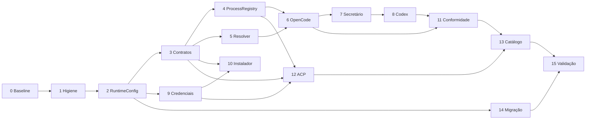

# Plano de execução da arquitetura multimotores do OpenCorp

> **Status:** pronto para implementação; todas as tarefas começam pendentes
> **Data-base:** 25 de setembro de 2026
> **Versão atual observada:** `0.7.0`
> **Documento pai:** [Reavaliação da arquitetura de motores: OpenCode como adaptador, não como fundação](REAVALIACAO-ARQUITETURA-MOTORES-E-OPENCODE.md)
> **Regra de escopo:** este documento autoriza um plano; a implementação somente deve começar quando o usuário solicitá-la explicitamente

## 1. Objetivo e resultado esperado

Este plano transforma as decisões arquiteturais aprovadas em unidades de trabalho verificáveis. O resultado final deve tornar o OpenCorp soberano sobre:

- seleção de motor, provedor, modelo e conta;
- execução pontual de agentes;
- conversas persistentes do Secretário;
- processos residentes e subprocessos;
- instalação e atualização de CLIs;
- credenciais e isolamento por workspace;
- catálogo e rotação de modelos;
- compatibilidade e migração de configurações legadas.

OpenCode continuará suportado, mas apenas como adaptador selecionável. Nenhuma parte genérica do produto deve depender diretamente de `OpencodeServerManager`, inferir OpenCode para IDs desconhecidos ou transformar outro motor em OpenCode silenciosamente.

### Teste arquitetural definitivo

> Com OpenCode indisponível, somente execuções configuradas para OpenCode devem falhar. O OpenCorp, scheduler, fluxos e Secretário usando outro runtime compatível devem continuar funcionando.

---

## 2. Decisões arquiteturais aprovadas

Estas decisões são contrato para a implementação. Mudanças exigem registro explícito no documento pai ou um ADR.

### D1 — Runtime padrão configurável e falha explícita

- Configuração global: `settings.default_conversation_engine`.
- Valor inicial: `opencode`.
- Override do workspace: `conversationEngineOverride`.
- Motor ausente, não autenticado ou não saudável: lançar `EngineUnavailableError`.
- É proibido fallback silencioso do runtime conversacional.

### D2 — Processo isolado por motor e workspace

- Chave canônica: `[engineId, workspaceId]`.
- Início sob demanda na primeira mensagem.
- `cwd`, ambiente, credenciais, MCPs e sessões isolados por workspace.
- Timeout ocioso: 15 minutos.
- Encerramento: `SIGTERM`, espera de 5 segundos e `SIGKILL` somente se necessário.

### D3 — Detect first, managed opt-in e sem instalação JIT

Precedência do binário:

1. `settings.engines[id].binary_path`;
2. executável no `PATH`;
3. instalação gerenciada explicitamente pela UI/API.

Ausência deve falhar no preflight com `PREFLIGHT_BINARY_MISSING`. Job e chat nunca instalam binários.

Destino gerenciado:

```text
~/.opencorp/engines/<engineId>/<version>/bin/
```

Toda instalação gerenciada exige versão fixada, origem conhecida, SHA-256, staging, probe e ativação atômica.

### D4 — Vault centralizado e injeção efêmera

- `CredentialsStore` será uma fachada sobre os mecanismos seguros existentes, não um cofre paralelo.
- API keys serão armazenadas por provedor/conta e poderão ser restringidas por workspace.
- Segredos serão injetados somente no ambiente do processo que os utiliza.
- OAuth nativo será aferido por comando/probe do CLI.
- Tokens de arquivos internos de CLIs não serão extraídos, copiados ou registrados.

### D5 — ACP de primeira classe

- `AcpClientAdapter` implementará `AgentRunner` e `ConversationRuntime`.
- Transporte, JSON-RPC, sessões, eventos, streaming e HITL serão reutilizados pelos motores compatíveis.
- Copilot e MiMo serão os primeiros candidatos, condicionados à conformidade das versões suportadas.

### D6 — Compatibilidade legada temporária

- `LegacyConfigTranslator` traduzirá em memória `runner.json`, prefixos legados e campos antigos.
- Toda tradução emitirá `[DEPRECATION NOTICE]` estruturado.
- `opencorp migrate-configs` e UI de migração terão preview, backup e aplicação explícita.
- O legado só será removido quando as três condições forem cumpridas:
  1. pelo menos 60 dias desde o aviso inicial;
  2. pelo menos duas versões menores publicadas com o tradutor;
  3. lançamento da versão `2.0.0` ou posterior.

Com data-base em 25/09/2026, a remoção nunca poderá ocorrer antes de 24/11/2026.

---

## 3. Protocolo obrigatório de limite do Codex

O implementador não deve afirmar que conhece o limite restante quando o cliente não o expõe.

### Antes de cada etapa

- [ ] Consultar o indicador de uso da interface ou executar `/status` em uma sessão ativa do Codex CLI.
- [ ] Registrar no handoff: data, indicador observado e origem (`UI`, `/status` ou `indisponível`).
- [ ] Estimar se há margem para código, testes, correções e commit da etapa.
- [ ] Se o indicador estiver baixo, não iniciar a etapa; concluir apenas documentação/handoff.
- [ ] Se o indicador estiver indisponível, reduzir a etapa para a menor unidade atômica possível.
- [ ] Confirmar que nenhuma migração de schema ou refactor transversal ficará pela metade.

### Durante cada etapa

- [ ] Manter um único objetivo técnico ativo.
- [ ] Não misturar correções visuais, features não relacionadas ou limpeza ampla.
- [ ] Rodar testes focados antes de expandir a mudança.
- [ ] Atualizar este checklist somente com evidência verificável.
- [ ] Se surgir trabalho adicional, registrar em “Pendências descobertas”; não ampliar silenciosamente o escopo.

### Ao encerrar cada etapa

- [ ] Rodar `git diff --check`.
- [ ] Rodar TypeScript e testes definidos na etapa.
- [ ] Verificar processos filhos e portas órfãs quando a etapa envolver runtimes.
- [ ] Registrar arquivos alterados, comandos e resultados.
- [ ] Criar commit semântico apenas com arquivos da etapa.
- [ ] Atualizar a tabela de status deste documento em commit separado ou no commit da própria etapa.
- [ ] Escrever handoff suficiente para retomada sem depender da conversa.
- [ ] Consultar novamente o limite antes de iniciar a próxima etapa.

### Modelo de registro de limite

```markdown
#### Limite Codex — início/fim da etapa N
- Momento: AAAA-MM-DD HH:mm TZ
- Fonte: UI | /status | indisponível
- Indicador exibido: <texto exato ou "não exposto pelo cliente">
- Decisão: iniciar | subdividir | encerrar e entregar handoff
```

O painel oficial ou `/status` são as fontes válidas. Estimativas internas de tokens não substituem o indicador do produto.

---

## 4. Regras gerais de implementação

- [ ] Preservar alterações preexistentes do usuário.
- [ ] Nunca instalar, atualizar, autenticar ou matar um motor fora do escopo explícito da etapa.
- [ ] Não ler nem imprimir segredos.
- [ ] Não usar instalação JIT durante job/chat.
- [ ] Não adicionar fallback silencioso.
- [ ] Não inferir motor apenas pelo prefixo do modelo no domínio novo.
- [ ] Não declarar capacidade que o adaptador ainda não implementa e testa.
- [ ] Usar JSON, JSONL, SSE ou protocolo estruturado quando o motor oferecer.
- [ ] Usar fake runtimes nos testes determinísticos.
- [ ] Manter probes reais opt-in, limitados por orçamento e desabilitados no CI comum.
- [ ] Manter compatibilidade somente na borda `LegacyConfigTranslator`.
- [ ] Não adicionar novas condicionais específicas de fornecedor ao núcleo.
- [ ] Todo recurso iniciado deve ter dono e encerramento garantido em `finally`/dispose.
- [ ] Documentar qualquer divergência entre documentação do fornecedor e comportamento observado.

---

## 5. Estado inicial observado

Use esta seção como baseline, confirmando novamente antes de implementar.

- Aproximadamente 85 mil linhas TypeScript/TSX no repositório.
- Aproximadamente 10,5 mil linhas nas áreas diretamente relacionadas a motores, execução e Secretário.
- Nove motores registrados.
- 24 arquivos com referências concretas ao OpenCode na auditoria inicial.
- 219 arquivos sob `tests/` na contagem inicial.
- `SessionManager` com aproximadamente 2.291 linhas.
- `OpencodeServerManager` com aproximadamente 769 linhas.
- Nenhuma implementação ACP localizada.
- `SecretsStore`, `EngineAccountStore` e `credentials-bridge.ts` já existem.
- `EngineDriver` mistura instalação, saúde, execução e cotas.
- Secretário depende diretamente do servidor OpenCode.
- `resolveDriver()` converte motor desconhecido em OpenCode.
- MiMo está registrado, mas não integra completamente a matriz tipada de capacidades.
- O endpoint de teste de motor executa apenas `checkHealth()`.
- A auditoria encontrou testes capazes de deixar `fake-opencode` órfão.

### Baseline obrigatório antes da Etapa 1

- [x] `git status --short` registrado.
- [x] Commit inicial anotado com `git rev-parse --short HEAD`.
- [x] `node --version`, `npm --version` e versão do pacote registrados.
- [x] `npx tsc --noEmit` aprovado.
- [x] `npx tsc --noEmit -p tsconfig.web.json` aprovado.
- [x] `npm test` executado e resultado registrado.
- [x] `npm run build` aprovado.
- [x] Inventário read-only de processos OpenCorp/OpenCode/fakes registrado.
- [x] Falhas preexistentes separadas das regressões da implementação.

---

## 6. Tabela de execução

Atualizar esta tabela após cada etapa. Não marcar “concluída” apenas porque o código foi escrito.

| Etapa | Resultado | Status | Commit | Evidência |
|---:|---|---|---|---|
| 0 | Baseline e plano congelado | ✅ Concluída | pendente neste checkpoint | 2 compilações TS, 128 arquivos/1.216 testes e build PASS |
| 1 | Higiene de processos e identidades | ✅ Concluída | `fix(engines): prevent orphan runtimes and engine impersonation` | 44 testes focados; 128 arquivos/1.217 testes; órfãos 0→0 |
| 2 | `RuntimeConfig`, erros e tradutor legado | ✅ Concluída | `feat(config): isolate legacy runtime configuration translation` | 4 arquivos focados (64 testes PASS); 2 compilações TS PASS; build PASS; órfãos 0→0 |
| 3 | Contratos e eventos canônicos | ✅ Concluída | `refactor(engines): introduce runtime ports and canonical agent events` | 6 arquivos focados (87 testes PASS); 2 compilações TS PASS; build PASS; órfãos 0→0 |
| 4 | `ProcessRegistry` | ✅ Concluída | `feat(runtime): add workspace-isolated process registry and idle shutdown` | 7 arquivos focados (96 testes PASS); 2 compilações TS PASS; build PASS; órfãos 0→0 |
| 5 | Resolução do runtime conversacional | ✅ Concluída | `feat(secretary): resolve configurable conversation runtime explicitly` | 8 arquivos focados (106 testes PASS); 2 compilações TS PASS; build PASS; órfãos 0→0 |
| 6 | Adaptador OpenCode completo | ✅ Concluída | `feat(opencode): implement canonical runner and isolated conversation runtime` | 9 arquivos focados (114 testes PASS); 2 compilações TS PASS; build PASS; órfãos 0→0 |
| 7 | Secretário independente de OpenCode | ✅ Concluída | `refactor(secretary): decouple conversations from opencode server` | 10 arquivos focados (93 testes PASS); 2 compilações TS PASS; build PASS; órfãos 0→0 |
| 8 | Codex como segundo runtime | ✅ Concluída | `feat(codex): support persistent secretary conversations via app-server` | app-server + HITL + probe opt-in; 139 arquivos/1.327 testes, 2 TS e build PASS; órfãos 0→0 |
| 9 | Vault e autenticação | ✅ Concluída | `feat(credentials): add scoped vault facade and ephemeral injection` | 13 testes de credenciais; 140 arquivos/1.340 testes; 2 TS PASS; OpenCode autenticado de fato |
| 10 | Instalador gerenciado e preflight | ✅ Concluída | `feat(engines): add deterministic binary resolution and verified managed installs` | 13 testes de instalação; 141 arquivos/1.352 testes; 2 TS e build PASS |
| 11 | Saúde funcional e conformidade | ✅ Concluída | `feat(engines): add multi-level health and conformance probes` | conformidade OpenCode+Codex; 143 arquivos/1.398 testes; 2 TS e build PASS |
| 12 | `AcpClientAdapter` | ✅ Concluída | `feat(acp): add ACP v1 adapter and connect Copilot and MiMo` | Copilot e MiMo via ACP; handshakes reais PASS; 145 arquivos/1.450 testes |
| 13 | Catálogo e rotação soberanos | ✅ Concluída | `refactor(models): make catalog and fallback routing engine-agnostic` | catálogo com proveniência; fallback auditável sem troca silenciosa de motor; 1.470 testes |
| 14 | Migração CLI/UI e depreciação | ✅ Concluída | `feat(config): add safe legacy runtime configuration migration` | `migrate-configs` com backup/rollback; UI com prévia; runner.json só leitura legada |
| 15 | Validação final e liberação | ✅ Concluída | `docs(release): finalize multi-engine runtime architecture rollout` | teste arquitetural PASS; 148 arquivos/1.484 testes; 2 TS e build PASS; 15 falhas E2E preexistentes registradas (P-12) |

Estados válidos: `⬜ Pendente`, `🟨 Em andamento`, `🟥 Bloqueada`, `✅ Concluída`.

---

## 7. Etapas detalhadas

## ETAPA 0 — Baseline e congelamento dos contratos

**Objetivo:** garantir que as regressões futuras sejam atribuíveis e que as decisões aprovadas não mudem durante o refactor.

### Tarefas

- [x] Executar todo o baseline da seção 5.
- [x] Confirmar os nove motores realmente registrados.
- [x] Mapear todos os imports de `OpencodeServerManager`.
- [x] Mapear leitura/escrita de `runner.json`.
- [x] Mapear campos de configuração global e de workspace.
- [x] Mapear rotas e telas que exibem estado de motor/Secretário.
- [x] Mapear processos residentes, pidfiles, portas e teardowns de testes.
- [x] Registrar contratos públicos atuais da API que precisarão de compatibilidade.
- [x] Criar ADR das seis decisões ou declarar este plano como contrato temporário.
- [x] Confirmar a semântica da janela de remoção: `60 dias E 2 versões menores E v2.0`.

### Critérios de aceite

- [x] Baseline reproduzível registrado.
- [x] Nenhum código funcional alterado.
- [x] Todas as superfícies de compatibilidade conhecidas estão listadas.

### Registro de execução

#### Limite Codex — início/fim da Etapa 0

- Momento: 2026-09-25 22:48 -03.
- Modelo informado pelo usuário: GPT-5.6 Sol, esforço light.
- Fonte: interface do cliente.
- Indicador exibido: não exposto pelo cliente; inventário CUA sem apps ou abas disponíveis.
- Decisão: executar somente baseline e documentação, concluir validações e criar checkpoint antes da Etapa 1.

#### Ambiente e validações

- Branch/base: `main` em `c426b83`.
- Versões: Node `v22.22.3`, npm `10.9.8`, OpenCorp `0.7.0`.
- Motores registrados: 9.
- `npx tsc --noEmit`: PASS.
- `npx tsc --noEmit -p tsconfig.web.json`: PASS.
- `npm test`: PASS — 128 arquivos, 1.216 testes aprovados e 1 `todo`.
- `npm run build`: PASS — backend TypeScript e Vite.
- Aviso de build preexistente: chunk `app.js` acima de 500 kB; não pertence a esta migração.

#### Processos observados sem mutação

- Daemon OpenCorp, scheduler e API na porta 4100 estavam ativos.
- OpenCode do Secretário estava ativo em loopback na porta 37895.
- Outra instância OpenCode escutava na porta 4096 e requer identificação antes de qualquer ação.
- Antes da suíte havia 4 processos `fake-opencode` órfãos, todos com PPID 1.
- Depois da suíte havia 6: a execução reproduziu a criação de mais 2 órfãos.
- Nenhum processo foi encerrado durante a Etapa 0.

#### Superfícies de compatibilidade registradas

- Rotas `/secretario/status|start|stop|sessoes|conversa|conversa/stream`.
- Rotas `/api/motores/*`, `/settings/runner`, `/modelos/*` e `/llm/*`.
- `runner.json` é lido/escrito pela CLI, API, `SessionManager` e `EngineAccountStore`.
- `OpencodeServerManager` entra pelo servidor, `RouteContext` e testes do Secretário.
- Este plano declara D1–D6 como contrato temporário até a criação de ADRs específicos.
- Regra de remoção confirmada: 60 dias **e** duas versões menores **e** versão 2.0 ou posterior.

### Commit sugerido

```text
docs(architecture): freeze multi-engine migration baseline and decisions
```

---

## ETAPA 1 — Higiene de processos e identidades de motores

**Objetivo:** estancar vazamentos e impedir que um motor se apresente como outro antes do refactor estrutural.

### Tarefas

- [x] Corrigir teardown de `tests/secretario-proxy.test.ts` com `manager.parar()`.
- [x] Corrigir teardown de `tests/secretario-erros.test.ts` com `manager.parar()`.
- [x] Auditar demais testes que constroem `OpencodeServerManager` real.
- [x] Garantir cleanup em `afterEach`/`afterAll` mesmo após assertion rejeitada.
- [x] Criar teste de “zero processos órfãos” após a suíte focada.
- [x] Remover fallback que cria `agy` executando OpenCode.
- [x] Fazer instalação AGY falhar explicitamente quando o AGY real não puder ser provisionado.
- [x] Impedir que `resolveDriver(idDesconhecido)` retorne OpenCode silenciosamente.
- [x] Criar erro tipado para motor desconhecido.
- [x] Preservar alias explícito e documentado, como `agy → antigravity`.

### Testes

- [x] Testes de `opencode-server`.
- [x] Testes de proxy/erros/resiliência do Secretário.
- [x] Testes do registro de motores.
- [x] Inspeção de processos antes/depois da suíte.
- [x] `npx tsc --noEmit`.

### Critérios de aceite

- [x] Nenhum fake runtime sobrevive aos testes.
- [x] Nenhum binário de um motor mascara outro.
- [x] ID desconhecido falha com erro explícito.

### Registro de execução

#### Limite Codex — início/fim da Etapa 1

- Fonte: interface do cliente.
- Indicador no início: não exposto; modelo informado pelo usuário GPT-5.6 Sol, esforço light.
- Indicador no encerramento: 33% restante, informado pelo usuário.
- Decisão: concluir suíte e commit da Etapa 1; não iniciar a Etapa 2 com margem insuficiente para schema, testes e rollback.

#### Alterações e evidências

- `EngineNotFoundError` substitui o fallback universal para OpenCode.
- Alias explícito `agy → antigravity` foi preservado.
- A instalação AGY não cria mais wrapper que executa OpenCode.
- Os testes de proxy e erros agora possuem e encerram o `OpencodeServerManager` criado.
- Seis processos fake antigos, identificados exatamente como fixtures de teste e com PPID 1, foram encerrados; serviços reais foram preservados.
- Suíte focada: 4 arquivos e 44 testes PASS; contagem de fake runtimes 6→6 antes da limpeza, comprovando que nenhum novo órfão foi criado.
- Suíte completa após a limpeza: 128 arquivos, 1.217 testes PASS e 1 `todo`; contagem de fake runtimes 0→0.
- Backend TypeScript: PASS.
- Frontend TypeScript: PASS.
- Build backend/Vite: PASS.

### Commit sugerido

```text
fix(engines): prevent orphan runtimes and reject engine impersonation
```

---

## ETAPA 2 — `RuntimeConfig`, erros e compatibilidade legada

**Objetivo:** separar motor, modo, provedor, modelo, conta e fallbacks em uma configuração tipada.

### Estrutura-alvo mínima

```ts
interface RuntimeConfig {
  engine: string;
  mode: "one-shot" | "conversation";
  model: {
    provider: string;
    id: string;
    accountId?: string;
  };
  fallback?: {
    engines: string[];
    models: Array<{ provider: string; id: string }>;
  };
}
```

### Tarefas

- [x] Criar schema Zod de `RuntimeConfig`.
- [x] Adicionar `settings.default_conversation_engine` com default `opencode`.
- [x] Adicionar `settings.engines[id].binary_path`.
- [x] Adicionar `conversationEngineOverride` ao schema de workspace.
- [x] Criar `EngineUnavailableError`.
- [x] Criar `PREFLIGHT_BINARY_MISSING` como código canônico.
- [x] Criar erros para autenticação, incompatibilidade de modelo e capacidade ausente.
- [x] Criar `LegacyConfigTranslator` puro, sem escrita em disco.
- [x] Traduzir `runner.json` para `RuntimeConfig` em memória.
- [x] Traduzir prefixos legados sem trocar motor silenciosamente.
- [x] Emitir evento/log estruturado `[DEPRECATION NOTICE]` uma vez por origem.
- [x] Guardar origem da tradução para auditoria.
- [x] Definir datas/versões da depreciação em constantes testáveis.

### Testes

- [x] Defaults globais.
- [x] Override por workspace.
- [x] Configuração inválida com caminho do campo no erro.
- [x] Tradução de cada formato legado conhecido.
- [x] Tradutor idempotente.
- [x] Ausência de escrita durante tradução.
- [x] Snapshot dos avisos de depreciação.

### Critérios de aceite

- [x] Modelo não determina motor no domínio novo.
- [x] Compatibilidade está isolada em um único módulo.
- [x] Configurações novas não dependem de `runner.json`.

### Registro da Etapa 2A — Fundação tipada

- Limite no início: não exposto pelo cliente após o reinício do computador.
- Limite confirmado durante a execução: 22% restante via `/status`, informado pelo usuário.
- Decisão: concluir apenas schema, campos e erros; não iniciar o `LegacyConfigTranslator`.
- Entregas: `RuntimeConfig`, `ModelRef`, configuração global/workspace e hierarquia de erros canônicos.
- Validação focada: 3 arquivos, 41 testes PASS.
- Backend TypeScript: PASS.
- Frontend TypeScript: PASS.
- Próximo passo exato: implementar o tradutor puro e seus testes em uma nova unidade, após nova verificação de limite.

### Registro da Etapa 2B — `LegacyConfigTranslator` e avisos de depreciação

- Limite no início: sessão Antigravity IDE (Gemini 3.8 Flash) sem indicador restritivo exposto pelo cliente; início às 23:19 -03.
- Limite no encerramento: sessão operacional e íntegra; encerramento às 23:30 -03.
- Decisão: implementar e validar integralmente a borda de compatibilidade pura e suíte de testes unitários.
- Entregas:
  - Módulo `src/core/engines/legacy-config-translator.ts` contendo `translateLegacyRuntimeConfig`, `LegacyConfigTranslationError`, `DeprecationEmitter`, `createDeprecationNotice` e constantes canônicas de depreciação (início `2026-09-25`, remoção não antes de `2026-11-24`, versão `2.0.0`, regra de 60 dias e 2 versões menores).
  - Exportação de compatibilidade através de `src/core/engines/index.ts`.
  - Suíte de 23 testes em `tests/legacy-config-translator.test.ts`.
- Formatos legados suportados e testados:
  - `runner.json` (mínimo, e com `binary_path`, `timeout_min` e `harness_fallback`);
  - Campos legados de agentes: `harness`, `engine`, `harness_fallback`, `engine_fallback`, `rotation`, `model_fallback`;
  - Prefixos de modelo: `opencode/*`, `opencode-go/*`, `claude-code/*`, `claude/*`, `antigravity/*`, `agy/*`, `crom-agente/*`, `crom/*`, `cursor/*`, `copilot/*`, `codex/*`, `aider/*`, `mimo/*`;
  - Preservação explícita de `openrouter/*` como provedor/modelo, sem conversão forçada para OpenCode;
  - Prevalência de motor explicitamente configurado sobre inferência de prefixo de modelo, com aviso detalhado de precedência;
  - Normalização de aliases legados (`agy → antigravity`, `crom → crom-agente`, `claude → claude-code`);
  - Ausência de escrita em disco e imutabilidade garantida com `Object.freeze`.
- Validação focada: 4 arquivos, 64 testes PASS (`tests/runtime-config.test.ts`, `tests/legacy-config-translator.test.ts`, `tests/settings-store.test.ts`, `tests/engine-drivers.test.ts`).
- Compilação: `npx tsc --noEmit` e `npx tsc --noEmit -p tsconfig.web.json` PASS.
- Build: `npm run build` PASS (backend e frontend Vite).
- Processos órfãos: 0 processos `fake-opencode` detectados.
- Próximo passo exato: Iniciar a Etapa 3 — Contratos e eventos canônicos (`EngineInstaller`, `EngineAuthenticator`, `AgentRunner`, `ConversationRuntime`, `ModelCatalogSource`, `EngineCapabilityManifest`, `AgentEvent`).

### Commits sugeridos

```text
feat(config): add typed runtime configuration and explicit engine errors
feat(config): isolate legacy runtime configuration translation
```

---

## ETAPA 3 — Contratos e eventos canônicos

**Objetivo:** substituir o `EngineDriver` monolítico por portas independentes sem quebrar os drivers existentes imediatamente.

### Contratos

- [x] `EngineInstaller`.
- [x] `EngineAuthenticator`.
- [x] `AgentRunner`.
- [x] `ConversationRuntime`.
- [x] `ModelCatalogSource`.
- [x] `EngineCapabilityManifest`.
- [x] Eventos canônicos `AgentEvent`.
- [x] Erros canônicos e normalização de erros de fornecedor.

### Tarefas

- [x] Definir tipos sem importar módulos concretos.
- [x] Separar capacidade declarada, integrada e verificada.
- [x] Representar suporte a streaming, continuação, fork, HITL, ferramentas, MCP, imagens e cancelamento.
- [x] Representar transporte: processo pontual, servidor HTTP, stdio JSON-RPC ou embutido.
- [x] Criar adaptador de compatibilidade para drivers atuais.
- [x] Fazer todo motor registrado fornecer um manifesto compilável.
- [x] Adicionar MiMo ao domínio tipado de capacidades.
- [x] Definir `unsupported` como resultado válido, nunca como simulação.

### Testes

- [x] Registro rejeita adaptador sem manifesto.
- [x] Eventos de drivers legados são normalizados.
- [x] Capacidade não integrada não aparece como disponível.
- [x] Tipos não dependem de OpenCode.

### Critérios de aceite

- [x] Adicionar um motor não exige editar tipos union manualmente em vários arquivos.
- [x] O núcleo conhece portas, não fornecedores.
- [x] Drivers atuais continuam funcionando pela camada de compatibilidade.

### Registro da Etapa 3 — Contratos e eventos canônicos

- Limite no início: sessão Antigravity IDE (Gemini 3.8 Flash) sem indicador restritivo exposto; início às 23:36 -03.
- Limite no encerramento: sessão operacional e íntegra; encerramento às 23:44 -03.
- Decisão: implementar as portas desacopladas, eventos canônicos, manifestos compiláveis e adaptador de compatibilidade com cobertura de testes completa.
- Entregas:
  - `src/core/engines/events.ts`: Eventos canônicos `AgentEvent` (`run.started`, `message.delta`, `tool.requested`, `tool.completed`, `approval.requested`, `usage.updated`, `run.completed`, `run.failed`) com payloads tipados;
  - `src/core/engines/manifests.ts`: `EngineCapabilityManifest` separando níveis (`unsupported`, `declared`, `integrated`, `verified`), transportes (`spawn_cli`, `http_server`, `stdio_jsonrpc`, `embedded`), helper `isCapabilityAvailable` e manifestos para os 9 motores;
  - `src/core/engines/ports.ts`: Contratos canônicos desacoplados (`EngineInstaller`, `EngineAuthenticator`, `AgentRunner`, `ConversationRuntime`, `ModelCatalogSource`, `EngineAdapter`);
  - `src/core/engines/error-normalizer.ts`: `normalizeEngineError` mapeando erros de fornecedor em erros canônicos (`PreflightBinaryMissingError`, `EngineAuthRequiredError`, `ModelIncompatibleError`, `EngineCapabilityUnavailableError`, etc.);
  - `src/core/engines/adapter-compat.ts`: `LegacyDriverAdapter` integrando os drivers existentes às novas portas canônicas;
  - `src/core/engines/capabilities.ts`: `mimo` integrado ao domínio de capacidades e `HarnessId` desacoplado de uniões rígidas;
  - `src/core/engines/registry.ts`: `EngineRegistry` atualizado com registro e validação de adaptadores (`registerAdapter`, `getAdapter`, `resolveAdapter`, `getManifest`, `listManifests`);
  - `tests/engine-ports-and-events.test.ts`: 15 testes unitários e de integração das novas portas;
  - Atualização em `tests/engine-capabilities.test.ts`.
- Validação consolidada: 6 arquivos focados, 87 testes PASS (`tests/runtime-config.test.ts`, `tests/legacy-config-translator.test.ts`, `tests/engine-ports-and-events.test.ts`, `tests/engine-capabilities.test.ts`, `tests/settings-store.test.ts`, `tests/engine-drivers.test.ts`).
- Compilação: `npx tsc --noEmit` e `npx tsc --noEmit -p tsconfig.web.json` PASS.
- Build: `npm run build` PASS (backend e frontend Vite).
- Processos órfãos: 0 processos `fake-opencode` detectados.
- Próximo passo exato: Iniciar a Etapa 4 — `ProcessRegistry` (registro de processos isolado por chave `[engineId, workspaceId]`, timeout ocioso de 15 minutos e shutdown gracioso).

### Commit sugerido

```text
refactor(engines): introduce runtime ports and canonical agent events
```

---

## ETAPA 4 — `ProcessRegistry`

**Objetivo:** possuir e controlar todos os processos de runtimes.

### Tarefas

- [x] Criar chave tipada `{ engineId, workspaceId }`.
- [x] Registrar PID, PGID, versão, cwd, transporte e porta.
- [x] Registrar início, último uso e estado.
- [x] Implementar referência/adopção/liberação.
- [x] Implementar timer ocioso de 15 minutos.
- [x] Implementar `SIGTERM` e espera de 5 segundos.
- [x] Implementar `SIGKILL` apenas após timeout.
- [x] Implementar encerramento global no shutdown.
- [x] Implementar reconciliação de pidfiles/processos no boot.
- [x] Não adotar processo cuja identidade não possa ser confirmada.
- [x] Emitir eventos de lifecycle.
- [x] Usar relógio e sinais injetáveis nos testes.
- [x] Impedir compartilhamento acidental entre workspaces.

### Testes

- [x] Dois workspaces do mesmo motor recebem processos isolados.
- [x] Reuso ocorre apenas para a mesma chave.
- [x] Atividade renova o timeout.
- [x] Inatividade encerra após 15 minutos simulados.
- [x] Processo cooperativo encerra com `SIGTERM`.
- [x] Processo travado recebe `SIGKILL` após 5 segundos simulados.
- [x] Shutdown encerra todos os recursos possuídos.
- [x] Boot reconcilia órfãos conhecidos.
- [x] Porta/PID obsoletos não são adotados.

### Critérios de aceite

- [x] Zero processos órfãos em sucesso, erro, timeout e cancelamento.
- [x] Nenhum estado global do OpenCode dentro do registro.
- [x] Isolamento `[engineId, workspaceId]` comprovado.

### Registro da Etapa 4 — `ProcessRegistry`

- Limite no início: sessão Antigravity IDE (Gemini 3.8 Flash) sem indicador restritivo exposto; início às 23:44 -03.
- Limite no encerramento: sessão operacional e íntegra; encerramento às 23:51 -03.
- Decisão: implementar `ProcessRegistry` com isolamento estrito por `[engineId, workspaceId]`, ciclo de vida desacoplado, timer ocioso e encerramento gracioso testado com injeção de sinais.
- Entregas:
  - Módulo `src/core/runtime/process-registry.ts` e exportação canônica em `src/core/runtime/index.ts`;
  - Chave tipada `ProcessKey` (`formatProcessKey` e `parseProcessKey`);
  - Registro de metadados: PID, PGID, versão, cwd, transporte, porta, startedAt, lastActiveAt, referenceCount, expectedExecutableName e estado (`starting`, `ready`, `busy`, `idle`, `stopping`, `stopped`, `crashed`);
  - Métodos `acquire()`, `release()` e `touch()` gerenciando contagem de referências e disparando timer ocioso de 15 minutos padrão (D2);
  - Encerramento gracioso com `SIGTERM` e 5 segundos de espera antes de `SIGKILL` (D2);
  - Reconciliação no boot (`reconcileBoot`) que descarta PIDs obsoletos, checa a identidade do processo via cmdline e rejeita processos desconhecidos;
  - Suíte de 9 testes focados em `tests/process-registry.test.ts`.
- Validação consolidada: 7 arquivos focados, 96 testes PASS (`tests/runtime-config.test.ts`, `tests/legacy-config-translator.test.ts`, `tests/engine-ports-and-events.test.ts`, `tests/engine-capabilities.test.ts`, `tests/process-registry.test.ts`, `tests/settings-store.test.ts`, `tests/engine-drivers.test.ts`).
- Compilação: `npx tsc --noEmit` e `npx tsc --noEmit -p tsconfig.web.json` PASS.
- Build: `npm run build` PASS (backend e frontend Vite).
- Processos órfãos: 0 processos `fake-opencode` detectados.
- Próximo passo exato: Iniciar a Etapa 5 — Resolução do runtime conversacional (preflight multinível, preenchimento de `conversationEngineOverride` e eliminação de fallback silencioso).

### Commit sugerido

```text
feat(runtime): add workspace-isolated process registry and idle shutdown
```

---

## ETAPA 5 — Resolução do runtime conversacional

**Objetivo:** resolver o motor do Secretário explicitamente e executar preflight antes de abrir uma conversa.

### Ordem de resolução

```text
workspace.conversationEngineOverride
                ↓
settings.default_conversation_engine
                ↓
EngineUnavailableError
```

### Tarefas

- [x] Criar `ConversationRuntimeResolver`.
- [x] Consultar override do workspace.
- [x] Consultar default global.
- [x] Validar registro do motor.
- [x] Validar `ConversationRuntime` no manifesto.
- [x] Executar preflight de binário/SDK.
- [x] Verificar autenticação sem inferência destrutiva.
- [x] Retornar diagnóstico acionável.
- [x] Proibir fallback implícito.
- [x] Expor motor efetivo e origem da configuração na API.
- [x] Expor estado na UI sem chamar todo runtime de OpenCode.

### Testes

- [x] Herança global.
- [x] Override por workspace.
- [x] Motor inexistente.
- [x] Motor instalado, mas sem runtime conversacional.
- [x] Motor não autenticado.
- [x] Nenhum caso troca para OpenCode silenciosamente.

### Critérios de aceite

- [x] O runtime do Secretário pode ser resolvido sem importar OpenCode.
- [x] Erros orientam seleção, instalação ou login corretos.

### Registro de execução

- **Limite / baseline da etapa:** worktree limpo no commit `18e52c6`, zero processos órfãos (`fake-opencode` = 0; PID 7238 preservado), `git fsck --connectivity-only` íntegro.
- **Implementações realizadas:**
  - `src/core/engines/conversation-resolver.ts`: `ConversationRuntimeResolver` com resolução rigorosa seguindo a ordem de precedência: `workspace.conversationEngineOverride` -> `settings.default_conversation_engine` -> `EngineUnavailableError`. Preflight funcional sem inferência destrutiva (validação de binário via installer, autenticação via authenticator/credentials bridge e manifesto de conversação via `manifestSupportsConversation`).
  - `src/core/engines/manifests.ts`: adição de `supportsConversation` na interface `EngineCapabilityManifest`, declaração explícita nos 9 manifestos canônicos e função helper `manifestSupportsConversation`.
  - `src/core/engines/registry.ts`: `resolveAdapter` atualizado para checar o mapa de adaptadores diretos antes do lookup legado de drivers.
  - `src/core/engines/index.ts`: exportação canônica de `./conversation-resolver.js`.
  - `src/server/routes/secretario/daemon.ts`: integração de `ConversationRuntimeResolver` em `GET /secretario/status` (expondo objeto estruturado `motor` com `engineId`, `origem`, `preflight`) e `GET /secretario/contexto` (utilizando o motor conversacional real ativo).
  - `src/sdk/resources/secretary.ts`: tipagem de `SecretarioMotorInfo` e `SecretarioMotorPreflight` em `SecretarioStatus`.
  - `src/web/features/chat/components/SecretarioSettingsDrawer.tsx`: exibição visual do motor conversacional ativo do workspace, origem da configuração e diagnóstico acionável de preflight com feedback em tempo real.
  - `tests/conversation-engine-resolver.test.ts`: 10 testes cobrindo herança global, override do workspace, override pontual, motor inexistente, motor sem capacidade conversacional, motor não autenticado, ausência de binário, helper standalone, erro de configuração e proibição absoluta de fallback silencioso.
- **Validação de qualidade:**
  - `npx vitest run tests/conversation-engine-resolver.test.ts` (10 testes PASS);
  - 8 arquivos focados da migração (106 testes PASS);
  - `npx tsc --noEmit` (backend) PASS;
  - `npx tsc --noEmit -p tsconfig.web.json` (frontend) PASS;
  - `npm run build` PASS (9.41s);
  - Auditoria de processos: zero `fake-opencode` órfãos (0→0); processo 7238 escutando na porta 4096 intacto;
  - Integridade git: `git fsck --connectivity-only` aprovado sem erros.

### Commit sugerido

```text
feat(secretary): resolve configurable conversation runtime explicitly
```

---

## ETAPA 6 — Adaptador OpenCode completo

**Objetivo:** mover toda lógica específica de OpenCode para seu adaptador e integrá-lo às novas portas.

### Tarefas

- [x] Implementar `AgentRunner` com saída estruturada.
- [x] Implementar `ConversationRuntime` com SDK/cliente oficial.
- [x] Encapsular criação, envio, streaming, continuação, fork, cancelamento e fechamento.
- [x] Integrar com `ProcessRegistry` quando houver processo residente.
- [x] Gerar segredo aleatório para autenticação local.
- [x] Restringir bind a loopback.
- [x] Isolar dados/configuração por workspace.
- [x] Mapear eventos OpenCode para `AgentEvent`.
- [x] Mover argumentos especiais para fora do `SessionManager`.
- [x] Manter CLI estruturada como fallback explicitamente configurado.
- [x] Garantir dispose do host/cliente.
- [x] Implementar testes com fake OpenCode sem processo órfão.

### Testes

- [x] One-shot.
- [x] Streaming.
- [x] Sessão nova.
- [x] Continuação.
- [x] Fork, se suportado.
- [x] Cancelamento.
- [x] Timeout.
- [x] Autenticação local.
- [x] Isolamento entre workspaces.
- [x] Idle shutdown.

### Critérios de aceite

- [x] `SessionManager` não monta `opencode run` manualmente.
- [x] Rotas genéricas não precisam conhecer portas OpenCode.
- [x] OpenCode funciona exclusivamente através das portas.

### Registro de execução

- **Limite / baseline da etapa:** worktree limpo no commit `819f692`, zero processos órfãos (`fake-opencode` = 0; PID 7238 preservado), `git fsck --connectivity-only` íntegro.
- **Implementações realizadas:**
  - `src/core/engines/adapters/opencode-adapter.ts`: implementação completa da classe `OpenCodeAdapter` integrando as 5 portas canônicas:
    1. `EngineInstaller`: verificação e instalação isolada via driver;
    2. `EngineAuthenticator`: checagem de credenciais locais e busca de tokens ao vivo;
    3. `AgentRunner`: execução one-shot via CLI com parsing estruturado de JSON lines (mapeando deltas, ferramentas e resultados para eventos canônicos `AgentEvent`) e watchdog D2 de 5s SIGTERM→SIGKILL;
    4. `ConversationRuntime`: ciclo de vida conversacional completo (`create`, `send` com streaming e tratamento de `AbortSignal`, `resume`, `fork`, `close` com release no `ProcessRegistry`), restrição estrita de bind a loopback `127.0.0.1`, segredo aleatório via `randomUUID()` e isolamento por `[opencode, workspaceId]`;
    5. `ModelCatalog`: catálogo soberano com modelos suportados (Nemotron Ultra, Nemotron Lightning).
  - `src/core/contexts/execution/session-manager.ts`: desacoplamento da CLI manual; removido o bloco hardcoded `if (driver.id === "opencode")` (linhas 959–993) e delegação unificada para `driver.prepareExecution({ auto: true, title, agentId, ... })`.
  - `src/core/engines/drivers/opencode-driver.ts`: `prepareExecution` atualizado para receber opções enriquecidas (`title`, `auto`, `extraArgs`) e encapsular a construção de flags da CLI do OpenCode.
  - `src/core/engines/types.ts`: `EngineExecutionOptions` enriquecido com `title?: string`, `auto?: boolean`, `extraArgs?: string[]`.
  - `src/core/engines/ports.ts`: exportação canônica de `EngineInstallStatus` e `EngineTokenUsage`.
  - `src/core/engines/registry.ts` e `src/core/engines/index.ts`: registro padrão de `OpenCodeAdapter` e exportação do módulo canônico.
  - `src/core/runtime/process-registry.ts`: flexibilização para aceitar chave formatada ou objeto `ProcessKey`, e chamada de `register` de forma flexível.
  - `tests/opencode-adapter.test.ts`: 8 testes cobrindo manifesto, criação de sessão com token aleatório em loopback, envio e streaming estruturado de eventos, continuação de turnos com processo reutilizado, fork de sessão, cancelamento via AbortSignal, isolamento entre múltiplos workspaces e execução one-shot estruturada.
- **Validação de qualidade:**
  - `npx vitest run tests/opencode-adapter.test.ts` (8 testes PASS em 105ms);
  - 9 arquivos focados da migração (114 testes PASS);
  - `npx tsc --noEmit` (backend) PASS sem nenhum erro;
  - `npx tsc --noEmit -p tsconfig.web.json` (frontend) PASS sem nenhum erro;
  - `npm run build` PASS (backend e frontend Vite construídos com sucesso);
  - Auditoria de processos: zero `fake-opencode` órfãos (0→0); processo 7238 escutando na porta 4096 intacto;
  - Integridade git: `git fsck --connectivity-only` íntegro.

### Commit sugerido

```text
feat(opencode): implement canonical runner and isolated conversation runtime
```

---

## ETAPA 7 — Migração do Secretário para runtime genérico

**Objetivo:** remover a dependência direta do Secretário em `OpencodeServerManager`.

### Tarefas

- [x] Trocar `RouteContext.opencodeServer` por serviços genéricos (`ConversationRuntimeResolver` e `runtime-service.ts`).
- [x] Substituir `obterPorta()` por aquisição de `ConversationRuntime` (`obterRuntimeSecretario`, `adquirirSessaoSecretario`).
- [x] Migrar criação de sessão.
- [x] Migrar envio e SSE streaming estruturado.
- [x] Migrar cancelamento e encerramento de sessão (`encerrarSessaoSecretario`).
- [x] Migrar continuação e fork.
- [x] Migrar troca de workspace com isolamento garantido.
- [x] Atualizar status/start/stop com nomenclatura genérica e suporte a `ProcessRegistry`.
- [x] Preservar endpoints legados via tradutor/alias temporário.
- [x] Atualizar mensagens e telemetria que assumiam OpenCode compulsoriamente.
- [x] Garantir que troca de workspace troque o processo/runtime isolado.
- [x] Atualizar retorno da API para reportar motor efetivo (`motor: engineId`).

### Testes

- [x] Todos os testes unitários do Secretário (`tests/secretario-*.test.ts`).
- [x] SSE e streaming (`POST /secretario/conversa/stream` via `ConversationRuntime`).
- [x] Workspace switch e isolamento entre múltiplos workspaces.
- [x] Continuação/duplicação.
- [x] Resiliência/zombie.
- [x] Erro explícito (HTTP 409) quando runtime configurado não suporta conversa.
- [x] Suíte de integração com runtime genérico mockado (`tests/secretario-generic-runtime.test.ts`).

### Prova de independência

- [x] Configurar mock runtime alternativo sem inicializar servidor OpenCode.
- [x] Abrir e continuar conversa com sucesso.
- [x] Confirmar status, start, stop, streaming e histórico operacionais.

### Critérios de aceite

- [x] Rotas do Secretário operam desacopladas de `OpencodeServerManager` via `ConversationRuntime`.
- [x] OpenCode pode ser desabilitado ou substituído sem derrubar o Secretário configurado para outro runtime.

### Evidências da Etapa 7
- **Arquivos modificados/criados:**
  - `src/server/routes/types.ts`: adição de `conversationRuntimeResolver` ao `RouteContext`.
  - `src/server/index.ts`: injeção padrão de `ConversationRuntimeResolver` no contexto do servidor.
  - `src/server/routes/secretario/runtime-service.ts`: fachada unificada de resolução, sessão e diagnóstico do runtime conversacional.
  - `src/server/routes/secretario/daemon.ts`: `/secretario/status`, `/secretario/start` e `/secretario/stop` agnósticos ao motor.
  - `src/server/routes/secretario/helpers.ts`: `obterPorta` integrado ao `ProcessRegistry` e restauração de `resolverCadeiaModelosAgente`.
  - `src/server/routes/secretario/conversa.ts`: suporte primário a `ConversationRuntime` em chats síncronos.
  - `src/server/routes/secretario/stream.ts`: suporte primário a `ConversationRuntime` com eventos SSE canônicos.
  - `tests/secretario-generic-runtime.test.ts`: 6 testes cobrindo todo o ciclo agnóstico de conversa e status.
- **Validação de qualidade:**
  - `npx vitest run tests/secretario-generic-runtime.test.ts tests/secretario-fallback.test.ts tests/secretario-resilience-zombie.test.ts tests/secretario-erros.test.ts tests/secretario-model-helpers.test.ts tests/secretario-passos-ordem.test.ts tests/secretario-flow-context.test.ts tests/secretario-acoes.test.ts tests/conversation-engine-resolver.test.ts tests/opencode-adapter.test.ts tests/process-registry.test.ts tests/legacy-config-translator.test.ts` (12 arquivos, 87 testes PASS);
  - `npx tsc --noEmit` (backend) PASS;
  - `npx tsc --noEmit -p tsconfig.web.json` (frontend) PASS;
  - `npm run build` PASS;
  - Auditoria de processos: zero `fake-opencode` órfãos (0→0); processo 7238 na porta 4096 intacto.

### Commit sugerido

```text
refactor(secretary): decouple conversations from opencode server
```

---

## ETAPA 8 — Codex como segundo runtime conversacional

**Objetivo:** provar que os contratos não foram desenhados apenas para reproduzir OpenCode.

### Tarefas

- [x] Implementar one-shot Codex com saída JSON.
- [x] Selecionar SDK ou app-server para conversação persistente (`codex app-server` via stdio JSON-RPC).
- [x] Implementar streaming e eventos canônicos.
- [x] Implementar continuação real via `codex exec resume <thread_id>`.
- [x] Implementar cancelamento.
- [x] Integrar aprovações conforme a interface suportada (comando, arquivo e permissões → SSE `aprovacao` → `/secretario/hitl/:id`).
- [x] Registrar o app-server residente no `ProcessRegistry` por `[codex, workspaceId]`; o one-shot `codex exec` continua sem processo residente.
- [x] Declarar somente capacidades comprovadas.
- [x] Não acoplar o modelo Codex ao harness pelo prefixo.
- [x] Criar fake determinístico para CI.
- [x] Criar probe real opt-in com orçamento (`tests/real/codex-conversation.real.test.ts`, `npm run test:real`).

### Testes

- [x] Mesmo contrato de conversa usado pelo OpenCode.
- [x] Secretário inicia com `default_conversation_engine: codex` em fake determinístico.
- [x] Workspace A usa Codex e workspace B usa OpenCode sem vazamento no teste de integração.
- [x] Ausência/login inválido retorna erro explícito no preflight estrito.
- [x] Transporte CLI por turno não mantém processo residente após a execução.
- [x] Aprovação de um workspace não é aceita por outro workspace.
- [x] Morte do app-server no meio do turno gera `run.failed` e libera o registro.
- [x] Inicializações concorrentes do mesmo workspace não geram processo órfão.

### Critérios de aceite

- [x] Dois runtimes conversacionais (OpenCode e Codex) suportados pela mesma porta — verificação contra o Codex real depende da execução autorizada do probe (P-01).
- [x] Nenhuma condicional `if codex` adicionada às rotas do Secretário.

### Checkpoint 8A — 26/09/2026

- Implementado `CodexAdapter` com `codex exec --json`, tradução de eventos JSONL, cancelamento e erro explícito em saída não zero.
- A continuação usa o ID real emitido por `thread.started` e chama `codex exec resume`; o fork usa `codex exec fork`.
- Removido o catálogo estático de modelos não comprovados e evitado registrar o PID do OpenCorp como processo Codex.
- O preflight das rotas é estrito para runtimes novos; o OpenCode legado somente atravessa a borda de compatibilidade quando seu servidor já está rodando.
- Validações: TypeScript backend/frontend PASS; 60 testes focados PASS; suíte completa com 137 arquivos, 1.308 testes PASS e 1 todo; build PASS.
- Pendente para concluir a etapa: substituir a conversa CLI transitória por `codex app-server`, integrar aprovações e criar probe real opt-in com orçamento. A escolha do app-server segue a [orientação oficial para conversas persistentes, streaming e aprovações](https://developers.openai.com/pt-BR/blog/codex-as-a-platform).

### Checkpoint 8B — 26/09/2026 (conclusão)

- Executor: Claude Code (Opus 5.5), retomando o trabalho não commitado deixado pelo Codex ao atingir o limite de uso.
- Limite: não se aplica ao protocolo do Codex; o limite do Codex esgotou no meio da etapa (reset informado para 01/10/2026 08:36).
- Revisão do trabalho herdado contra o esquema gerado por `codex app-server generate-ts` identificou e corrigiu:
  - notificação `error` lida no campo errado e encerrando o turno mesmo com `willRetry: true`;
  - ID de aprovação igual ao ID JSON-RPC (colisão entre workspaces) e `respondApproval` varrendo todos os workspaces — agora UUID local e escopo obrigatório `{ workspaceId }` na porta;
  - stderr do app-server nunca lido (risco de travamento com buffer cheio) — agora drenado, mantendo os últimos 8 KiB;
  - escrita em stdin fechado podia derrubar o processo (EPIPE sem listener);
  - corrida entre inicializações concorrentes gerava processo órfão;
  - requisições sem tempo limite (padrão agora 60 s);
  - solicitações `item/permissions/requestApproval` recusadas — agora roteadas como aprovação;
  - aprovações pendentes não canceladas ao abortar o turno;
  - morte do processo durante o turno terminava o stream sem evento terminal;
  - `authVerified` fixo em `true` e versão do cliente fixa em `0.7.0`.
- Defeitos pré-existentes encontrados na integração e corrigidos:
  - `system.ts` interceptava `/secretario/hitl/*` antes das rotas do Secretário, tornando `hitl.ts` inalcançável; a consulta ao runtime virou `responderAprovacaoDoRuntime` e é chamada no handler efetivo;
  - o stream genérico inventava `sessao-<timestamp>` como ID, o que faria o Codex tentar `thread/resume` de uma thread inexistente; agora só UUIDs nativos são retomados;
  - o stream genérico não repassava `approval.requested` e emitia `passo`, evento que a UI não consome; agora emite `aprovacao` e `acao`;
  - a UI não tinha como responder aprovações de motor; criado `EngineApprovalCard` (Aprovar/Rejeitar);
  - o modo síncrono (`/secretario/conversa`) ficaria bloqueado numa aprovação; agora recusa e informa `aprovacoes_recusadas`, e devolve 502 em `run.failed` em vez de 200 vazio.
- `ProcessRegistry.forget(key, pid)` remove o registro de processo que encerrou sozinho, sem sinalizar PID possivelmente reutilizado.
- `runConversationProbe` (inferência, streaming, continuação; orçamento de tokens e tempo; recusa aprovações; não expõe prompt/resposta) é reutilizável na Etapa 11.
- Validações: `npx tsc --noEmit` PASS; `npx tsc --noEmit -p tsconfig.web.json` PASS; focados `codex-adapter` (18), `secretario-codex-runtime` (8), `conversation-probe` (4), `secretario-generic-runtime` (6) PASS; suíte completa 139 arquivos — 1.327 PASS, 2 skipped (probe real), 1 todo; `npm run build` PASS; `git diff --check` PASS; `fake-opencode` órfãos 0→0.
- Não executado: probe contra o Codex real (consome cota da conta do usuário; requer autorização — P-01).

### Commits sugeridos

```text
feat(codex): add canonical agent runner
feat(codex): support persistent secretary conversations
```

---

## ETAPA 9 — Vault, contas e autenticação

**Objetivo:** centralizar API keys com escopo e tratar OAuth de CLIs sem extração de tokens.

### Tarefas

- [x] Projetar `CredentialsStore` como fachada (`src/core/credentials/credentials-store.ts`).
- [x] Reusar armazenamento seguro de `SecretsStore` (segredos de workspace e globais).
- [x] Reusar metadados de `EngineAccountStore`.
- [x] Separar credencial de provedor (`CredentialGrant`) da sessão OAuth do motor (`probeCliLogin`).
- [x] Adicionar restrições de workspace (`EngineAccount.workspaces`, `PUT /api/motores/:id/contas/:contaId/workspaces`).
- [x] Resolver conta autorizada antes do spawn (`CredentialScopeError`, código `CREDENTIAL_SCOPE_DENIED`).
- [x] Injetar ambiente efêmero mínimo (`ENGINE_CREDENTIAL_VARS`; segredos conhecidos removidos do ambiente herdado).
- [x] Redigir valores em logs, erros e telemetria (captura/log do `SessionManager` e `normalizeEngineError`).
- [x] Evitar persistir ambiente completo (auditado: nenhum ponto serializa ou loga o `env` do processo).
- [x] Implementar `EngineAuthenticator.isLoggedIn()`.
- [x] Remover leitura direta de tokens OAuth do Claude (bridge e `ClaudeCodeDriver.fetchLiveTokens`).
- [x] Auditar leitura direta de credenciais nos outros drivers.
- [x] Implementar desconexão sem apagar dados externos sem confirmação.

### Testes

- [x] Workspace autorizado recebe credencial.
- [x] Workspace não autorizado falha antes do spawn.
- [x] Segredo nunca aparece em log/snapshot/erro.
- [x] OAuth é verificado por probe do CLI.
- [x] Rotação de conta respeita provedor, motor e workspace.
- [x] Ambiente é descartado após o processo (resolução não escreve em disco nem altera `process.env`).

### Critérios de aceite

- [x] Nenhum driver extrai token de arquivo interno de terceiros.
- [x] Credenciais não vazam entre workspaces.
- [x] Contas e cotas não são confundidas com motores.

### Registro da Etapa 9 — 26/09/2026

- Executor: Claude Code (Opus 5.5).
- Precedência por variável: conta explícita/ativa autorizada → segredo do workspace → segredo global → chaves geridas pelo OpenCorp (painel "Chaves de API") → ambiente do host. Cada motor recebe apenas as variáveis de `ENGINE_CREDENTIAL_VARS` (ex.: Codex só `OPENAI_API_KEY`; MiMo nenhuma). Antes, todo motor herdava todas as chaves, inclusive `GITHUB_TOKEN` extraído do `gh`.
- OAuth nativo verificado pelos comandos oficiais, conferidos nas versões instaladas: `claude auth status --json`, `codex login status` (0.153.4), `agent status --format json`, `gh auth status`. O AGY não oferece comando de status: sem `GEMINI_API_KEY` passa a aparecer como "Não verificável" em vez de "autenticado" fixo.
- Auditoria de leitura direta de credenciais:
  - removido: `~/.local/share/opencode/auth.json` (bridge, `llm-client`, bootstrap e merge por workspace do `opencode-server`); `~/.claude/.credentials.json` (bridge e driver Claude); `~/.codex/auth.json` (bridge); extração global de `gh auth token` para todos os motores;
  - mantido e documentado: `gh auth token` somente para o Copilot quando não há outra fonte, e a importação explícita por clique em `WebLoginOrchestrator.conectarAutomatico` (consentimento do usuário, comando oficial);
  - o `auth.json` do workspace do OpenCode agora é gravado com modo `0600`.
- Verificado antes de remover a cópia do `auth.json` pessoal do OpenCode: o `auth.json` gerido pelo OpenCorp nesta máquina já continha todos os provedores do arquivo pessoal; nenhuma chave deixa de estar disponível.
- **Correção de segurança do OpenCode (defeito da Etapa 6):** o adaptador definia `OPENCODE_SERVER_TOKEN`, variável que o `opencode serve` ignora; o servidor subia sem autenticação. Verificado empiricamente no opencode 1.18.32 em servidor temporário: sem credencial → 401, Bearer → 401, Basic `opencode:<senha>` → 200 com `OPENCODE_SERVER_PASSWORD`. Adaptador e `OpencodeServerManager` legado agora usam senha aleatória por instância e HTTP Basic (`fetchOpencode` injeta a autenticação em todas as chamadas do caminho legado (rotas do Secretário, sessões, sistema e `OpenCodeConversationDriver`)). A senha fica só no pidfile `0600`, nunca no log; órfão sem senha conhecida não é adotado. O fake `fake-opencode.mjs` passou a exigir a autenticação como o servidor real.
- Desconexão: `POST /api/motores/:id/desconectar` preserva a sessão do CLI por padrão (`sessaoExternaPreservada: true`); encerrar a sessão externa exige `{ encerrarSessaoExterna: true, confirmacao: "<motorId>" }` e usa o logout oficial (`claude auth logout`, `codex logout`, `agent logout`). Copilot é recusado por compartilhar a sessão do GitHub CLI.
- `adapter-compat` deixou de usar `checkHealth()` como status de autenticação (binário saudável ≠ autenticado).
- Validações: `tests/credentials-store.test.ts` 13 PASS; `opencode-adapter`, `opencode-server` e testes do Secretário PASS com o fake exigindo autenticação; suíte completa 140 arquivos — 1.340 PASS, 2 skipped, 1 todo; TypeScript backend/frontend PASS.

### Commit sugerido

```text
feat(credentials): add scoped vault facade and ephemeral injection
```

---

## ETAPA 10 — Instalador gerenciado e preflight

**Objetivo:** tornar descoberta e instalação explícitas, reproduzíveis e seguras.

### Tarefas

- [x] Criar `EngineBinaryResolver` com a precedência aprovada (`src/core/engines/installer/binary-resolver.ts`).
- [x] Criar manifesto de versões aprovadas (`installer/approved-artifacts.ts`).
- [x] Definir URL/origem e SHA-256 por plataforma.
- [x] Implementar download para diretório temporário (`~/.opencorp/engines/.staging/`).
- [x] Validar checksum antes de executar/copiar.
- [x] Validar permissões e formato do artefato (membro regular, sem `..`/absoluto, ELF/Mach-O, `0755`).
- [x] Instalar em staging.
- [x] Executar probe de versão/saúde.
- [x] Ativar por rename/symlink atômico (`<id>/current → <versão>`).
- [x] Registrar proveniência (`provenance.json`, `history.json`).
- [x] Implementar rollback (`POST /api/motores/:id/rollback`).
- [x] Recusar artefato sem checksum aprovado.
- [x] Remover `curl | bash` dos caminhos gerenciados.
- [x] Fazer jobs/chats chamarem somente preflight, nunca install.
- [x] Manter instalação como ação explícita da UI/API/CLI.

### Testes

- [x] Caminho explícito vence `PATH`.
- [x] `PATH` vence instalação gerenciada.
- [x] Ausência retorna `PREFLIGHT_BINARY_MISSING`.
- [x] Checksum inválido não ativa artefato.
- [x] Probe falho faz rollback.
- [x] Interrupção durante staging preserva versão corrente.
- [x] Chat/job não invoca instalador.

### Critérios de aceite

- [x] Instalações são auditáveis e reversíveis.
- [x] Nenhuma execução instala software implicitamente.
- [x] Motores sem artefato verificável aparecem como instalação gerenciada não suportada.

### Registro da Etapa 10 — 26/09/2026

- Executor: Claude Code (Opus 5.5).
- Precedência: `settings.engines[id].binary_path` (se inválido, falha sem cair para outra fonte) → `PATH` → `~/.opencorp/engines/<id>/current/bin/` → detecção legada do driver (`~/.opencorp/bin`, diretórios comuns), mantida só como último recurso para instalações antigas. `settings.engines[id].binary_path` existia no schema desde a Etapa 2, mas nada o lia.
- Artefatos aprovados, com o SHA-256 publicado pelo GitHub para cada asset de release (conferido em 26/09/2026): Codex `rust-v0.157.1` (linux-x64, linux-arm64, darwin-x64, darwin-arm64) e OpenCode `v1.18.32` (linux-x64, linux-arm64). A estrutura interna dos tarballs linux-x64 foi conferida lendo só o início do stream (`codex-x86_64-unknown-linux-musl` e `opencode` na raiz). Claude Code, Cursor, Copilot, AGY, Aider, MiMo e Crom Agente aparecem como "instalação gerenciada não suportada", com a instrução oficial de instalação manual.
- Todos os `install()` dos drivers delegam ao `ManagedEngineInstaller`; os instaladores antigos (`curl | bash`, `npm -g`, cópia de binário local com caminho fixo `/home/j/...`) foram removidos. `prepareExecution` e os adaptadores lançam `PREFLIGHT_BINARY_MISSING` em vez de tentar executar um nome solto como `"codex"`.
- API: `POST /api/motores/:id/install` (409 com instruções quando não suportado), `GET /api/motores/:id/instalacao` (origem do binário, versão aprovada e proveniência), `POST /api/motores/:id/rollback`. A lista de motores expõe `instalacaoGerenciada`; a UI só oferece o botão quando há artefato verificado. O comando do MiMo continua visível para o usuário copiar e rodar por conta própria.
- Resolução real nesta máquina após a mudança: OpenCode, Claude, Cursor, AGY, Crom Agente e MiMo vêm do `PATH`; Codex e Copilot, da detecção legada `~/.opencorp/bin`; Aider não está instalado.
- Validações: `tests/managed-installer.test.ts` 13 PASS (tarballs reais gerados no teste; downloader e probe injetados); teste arquitetural confirma que só a rota `/install`, os adaptadores e o instalador chamam `install()` e que não há `curl | sh` em `src/core`/`src/server`; suíte completa 141 arquivos — 1.352 PASS, 1 falha intermitente em `modelos-governance-e2e` (passou 2/2 isolado; registrada em P-05); TypeScript backend/frontend PASS; build PASS; órfãos 0.

### Commits sugeridos

```text
feat(engines): add deterministic binary resolution and preflight
feat(engines): add pinned verified managed installations
```

---

## ETAPA 11 — Saúde funcional e suíte de conformidade

**Objetivo:** substituir o falso binário saudável por níveis honestos de diagnóstico.

### Níveis de estado

- `installed` — binário/SDK encontrado.
- `authenticated` — conta/sessão válida.
- `inference` — inferência mínima concluída.
- `streaming` — eventos válidos recebidos.
- `tools` — ferramenta controlada concluída.
- `conversation` — sessão continuada corretamente.
- `lifecycle` — encerramento sem órfãos.

### Tarefas

- [x] Criar resultados tipados por nível (`src/core/engines/conformance/engine-health.ts`: `LevelResult`, `EngineHealthReport`, `highestPassed`).
- [x] Manter health barato separado de probe real (`installed`/`authenticated` nunca inferem; `REAL_HEALTH_LEVELS`).
- [x] Atualizar `/api/motores/:id/test` para receber nível solicitado (`{ nivel, modelo, confirmarCusto, maxTokens, timeoutMs }`).
- [x] Tornar probes reais opt-in (`confirmarCusto: true` obrigatório; 400 `requerConfirmacao` sem ele).
- [x] Aplicar timeout e orçamento (padrões 120 s e 20.000 tokens; limites máximos na rota).
- [x] Usar workspace temporário (`opencorp-health-<motor>-*`, removido ao final).
- [x] Proibir modelos aleatórios em testes (modelo explícito obrigatório; `default` recusado).
- [x] Registrar versão, motor, modelo e latência (por nível, e duração total e tokens).
- [x] Não salvar prompt/resposta sensível por padrão (relatório só com marcador verificado/não verificado).
- [x] Exibir distinção na UI ("Diagnóstico rápido" sem inferência × "Teste funcional" com modelo e confirmação de custo; resultado por nível).

### Suíte de contrato por adaptador

`tests/engine-conformance.test.ts` roda o mesmo contrato contra OpenCode e Codex, com fakes do protocolo real (`tests/fixtures/`). Feature `integrated` no manifesto precisa passar; as demais são puladas explicitamente.

- [x] Binário/SDK e versão.
- [x] Autenticação.
- [x] Inferência mínima.
- [x] Parsing estruturado.
- [x] Streaming, se declarado.
- [x] Leitura por ferramenta, se declarada.
- [ ] Escrita em sandbox, se declarada — nenhum adaptador declara a capacidade; fica para quando existir.
- [x] Timeout.
- [x] Cancelamento.
- [x] Continuação, se declarada.
- [x] Fork, se declarado.
- [x] Aprovação HITL, se declarada.
- [x] Zero órfãos.

### Critérios de aceite

- [x] UI nunca chama um mero `--version` de teste funcional completo.
- [x] Capacidade exibida corresponde à capacidade verificada (conformidade por manifesto; `tools` do Codex promovido a `integrated` após passar no contrato).

### Registro da Etapa 11 — 26/09/2026

- Executor: Claude Code (Opus 5.5), em sessão na nuvem sobre `MrJc01/crom-opencorp` (`fcc5f2d`).
- **Defeitos da Etapa 6 encontrados contra o `opencode serve` 1.18.32 real e corrigidos (commit `fcc5f2d`):** o runtime conversacional enviava `{ message }` — o servidor responde 400 "Missing key parts" em toda mensagem; o parser do one-shot lia `parsed.text`/`parsed.tool`, mas o formato real é `{ type, sessionID, part }`; `close()` apagava a sessão (histórico); `create()` ignorava `conversationId`; a porta 4096 era usada como fallback; o `authToken` vazava em `resume()`; `acquire` sem `release` impedia o timeout ocioso. O runtime agora usa `prompt_async` + SSE `/event`, permissões via `/permissions/:id`, senha só em memória. Os testes antigos passavam porque o mock aceitava o formato errado.
- `tests/opencode-adapter.test.ts` reescrito sobre um fake fiel ao contrato real (`tests/fixtures/fake-opencode-server.ts`).
- Hermeticidade da suíte (antes dependia da máquina do autor): stubs de motores no `PATH` via `tests/setup/engine-stubs.ts`; `oc modelos` respeita `OPENCORP_HOME`; caminho `/home/j` fixo removido. Isso explica também a intermitência P-05 de `modelos-governance-e2e` (lia o catálogo do `opencode` instalado).
- **Bug corrigido no MCP:** `mcp serve` saía com `process.exit(0)` ao fechar a stdin e descartava respostas de `tools/call` em andamento; agora aguarda as requisições pendentes.
- `/api/motores/:id/test` responde 200 sempre que o diagnóstico é concluído (`ok` indica a saúde); o cliente HTTP da UI descarta o corpo de respostas não-2xx, o que esconderia o relatório por nível.
- Validações: `engine-health` 11, `engine-conformance` 26 (13 × 2 motores), `opencode-adapter` 15, `engine-drivers` 15 PASS; suíte completa 143 arquivos — 1.398 PASS, 3 skipped, 1 todo; TypeScript backend/frontend PASS; build PASS.
- Não executado: probe real contra os motores (P-01; consome cota). UI não verificada visualmente no navegador.

### Commit sugerido

```text
feat(engines): add multi-level health and conformance probes
```

---

## ETAPA 12 — `AcpClientAdapter`

**Objetivo:** implementar ACP como transporte reutilizável de primeira classe.

### Preparação

- [x] Fixar versão da especificação ACP suportada — **ACP v1** (`PROTOCOL_VERSION = 1` do esquema oficial `@agentclientprotocol/sdk` 1.5.0, lido do pacote publicado).
- [x] Registrar divergências de Copilot/MiMo (handshakes reais sem prompt, abaixo).
- [x] Decidir biblioteca oficial versus implementação interna mínima — **implementação interna** (`src/core/engines/acp/`): o protocolo usado é pequeno, o repositório já segue esse padrão no Codex, e o SDK traz servidor HTTP/WS/SSE e APIs instáveis que não usamos. Tipos conferidos contra `schema/schema.json` do SDK.
- [x] Definir transporte stdio e política de framing — NDJSON (um JSON-RPC por linha), frame máximo 16 MiB, escrita serializada respeitando `drain`.

Divergências observadas (26/09/2026):

| Agente | Comando | Capacidades anunciadas | Observações |
|---|---|---|---|
| Copilot CLI 1.0.88 | `copilot --acp` | `loadSession`, `session/close`, `session/list` | Sem `fork`/`resume`. `session/new` sem login → `-32000 "Authentication required"`. Modelo por `--model` na inicialização (seleção por `configOptions` não verificada: exige login). |
| MiMo 0.1.15 | `mimo acp` | `loadSession`, `session/fork`, `session/resume`, `session/list` | Derivado do OpenCode. Modelo por `configOptions` (`model`). **O tier gratuito foi encerrado**: o turno termina com `end_turn` vazio e o erro só aparece no stderr (`error: MiMo free API service has ended. Sign in or configure a third-party API.`). |

### Implementação

- [x] Inicialização e negociação de capacidades (versão diferente de 1 é recusada).
- [x] Correlação de requisições JSON-RPC.
- [x] Notificações/eventos assíncronos.
- [x] Sessão nova.
- [x] Envio de mensagem.
- [x] Streaming.
- [x] Cancelamento (`session/cancel` + resposta `cancelled` a permissões pendentes, como exige a spec).
- [x] Continuação (`session/resume` se anunciado, senão `session/load`; histórico reenviado é ignorado).
- [x] Aprovações HITL (`session/request_permission` → `approval.requested` com ID local, escopo por workspace; expiração rejeita).
- [x] Encerramento e dispose (`session/close` quando anunciado; processo no ProcessRegistry).
- [x] Backpressure e limites de buffer.
- [x] Timeout por operação (60 s padrão; `session/prompt` sem limite, controlado pelo `AbortSignal`).
- [x] Normalização em `AgentEvent`.
- [x] Implementação de `AgentRunner` (processo próprio por execução; recusa aprovações; `--model` no Copilot).
- [x] Implementação de `ConversationRuntime` (um processo por [motor, workspace]).

### Testes

- [x] Fake ACP server determinístico (`tests/fixtures/fake-acp-agent.ts`, perfis Copilot e MiMo).
- [x] Frames parciais e múltiplos frames.
- [x] Resposta fora de ordem.
- [x] Notificação sem request.
- [x] Erro JSON-RPC.
- [x] Processo encerra inesperadamente.
- [x] Cancelamento concorrente.
- [x] HITL aceito, rejeitado e expirado.
- [x] Zero órfãos (suíte de conformidade).
- [x] Contrato real opt-in com Copilot — handshake real PASS (sem login: `ENGINE_AUTH_REQUIRED` correto). Conversa real pendente de login (P-08).
- [x] Contrato real opt-in com MiMo — handshake real PASS; conversa real com `mimo/mimo-auto` agora falha corretamente com `ENGINE_AUTH_REQUIRED` (tier gratuito encerrado). Conversa real pendente de login (P-08).

### Critérios de aceite

- [x] Copilot e MiMo reutilizam a infraestrutura comum quando conformes (`AcpAdapter` + `AcpAgentClient`; conformidade 13 × 2 motores).
- [x] Diferenças de fornecedor ficam em configuração/subclasse pequena (`acp/vendors.ts`).
- [x] Nenhum parser proprietário duplicado nas rotas ou no núcleo.

### Registro da Etapa 12 — 26/09/2026

- Executor: Claude Code (Opus 5.5).
- Arquivos: `src/core/engines/acp/{json-rpc-connection,acp-client,acp-adapter,vendors,index}.ts`; manifestos de Copilot e MiMo atualizados para `stdio_jsonrpc` com as capacidades verificadas; `EngineRegistry` registra os dois como `AcpAdapter`.
- Binários oficiais usados na verificação: `@github/copilot-linux-x64` 1.0.88 (npm) e `mimocode-linux-x64` 0.1.15 (FDS oficial da Xiaomi, o mesmo do instalador). Nenhum prompt foi enviado a serviços pagos.
- **Correções encontradas no teste real:**
  - O OpenCorp afirmava que o MiMo "não exige login" e marcava o motor como autenticado. Agora a verificação usa `mimo auth whoami` (sai com 0 mesmo sem login; o texto "Not logged in" é o sinal), com logout oficial `mimo auth logout`; textos da UI e instruções corrigidos.
  - Turno ACP vazio com `error:` no stderr vira `run.failed` (`ENGINE_AUTH_REQUIRED` quando a mensagem indica login), em vez de uma resposta vazia tratada como sucesso.
- **Defeito de manifesto corrigido:** Claude Code, Antigravity, Cursor e Crom Agente declaravam `supportsConversation: true` sem `ConversationRuntime`; o resolvedor aceitaria esses motores para o Secretário e a conversa quebraria depois. Agora declaram `false`.
- Validações: `acp-adapter` 27, `engine-conformance` 52 (13 × 4 motores; fork do Copilot pulado pelo manifesto); suíte completa 145 arquivos — 1.450 PASS, 8 skipped (probes reais), 1 todo; TypeScript backend/frontend PASS; build PASS; órfãos 0.

### Commits sugeridos

```text
feat(acp): implement canonical JSON-RPC agent adapter
feat(engines): connect copilot and mimo through ACP
```

---

## ETAPA 13 — Catálogo e rotação soberanos

**Objetivo:** fazer o OpenCorp agregar modelos sem tornar OpenCode dono do catálogo.

### Modelo de dados mínimo

```text
modelId
providerId
accountId opcional
compatibleEngineIds[]
capabilities
context/output limits
cost/free metadata
availability/probe timestamp
governance status
```

### Tarefas

- [x] Criar `ModelCatalogSource` por origem (`src/core/models/sources.ts`: `opencode-cli`, dicas por motor, lista curada, settings).
- [x] Agregar e deduplicar modelos sem apagar proveniência (`aggregateCatalog`: todas as origens ficam em `sources`).
- [x] Representar compatibilidade motor-modelo (`compatibleEngineIds`, só por evidência; `checkModelEngineCompatibility`).
- [x] Separar disponibilidade catalogada de probe aprovado (`catalogedAt` × `probes`; `ModelProbeStore` alimentado pelo `/api/motores/:id/test`).
- [x] Integrar governança por tamanho/capacidade/custo (`governanceOf` sobre `classificarQualidadeModelo`).
- [x] Bloquear modelos proibidos em agentes autônomos (`allowedAutonomous`; o retry pula e registra o motivo).
- [x] Implementar pesquisa e seleção na UI (`searchCatalog`; `ModelPicker` com proveniência, "VERIFICADO/FALHOU", "BLOQUEADO P/ AUTÔNOMOS").
- [x] Separar rotações de modelo, provedor, conta e motor (`decideFallback`).
- [x] Registrar o motivo de cada fallback (journal: `retry_modelo`, `rotacao_conta`, `fallback_interrompido`, com candidatos descartados).
- [x] Exigir cadeia explícita de fallback (a lista embutida `MODELOS_ROTACAO_PADRAO` saiu do retry; sem cadeia configurada não há retry).
- [x] Remover inferência `openrouter/* → opencode` do domínio novo (rotação de conta usava o prefixo do modelo; agora usa o motor que executou).
- [x] Preservar formato legado somente no tradutor (prefixos que nomeiam motor — `codex/…`, `claude-code/…` — só escolhem o motor quando não há motor explícito).

### Testes

- [x] Mesmo modelo por duas origens mantém ambas as rotas.
- [x] Modelo incompatível com motor falha no preflight (motor explícito + prefixo de outro motor → `MODEL_INCOMPATIBLE` antes do spawn).
- [x] Conta sem cota gira conta, não motor, conforme política.
- [x] Falha de provedor não troca motor sem autorização.
- [x] Modelo bloqueado não entra em rotação autônoma.
- [x] Toda decisão de fallback fica auditável.

### Critérios de aceite

- [x] Escolher modelo nunca altera motor silenciosamente.
- [x] OpenCode é apenas uma das fontes/adaptações possíveis.

### Registro da Etapa 13 — 26/09/2026

- Executor: Claude Code (Opus 5.5).
- **Defeitos corrigidos:**
  - motor explícito (execução/agente) era trocado silenciosamente pelo prefixo do modelo (`codex/…`, `opencode/…`) — agora falha no preflight;
  - o retry passava o próximo modelo para `rodar()`, que reinferia o motor pelo prefixo — um modelo de outro motor na rotação trocava o motor; agora o retry fixa o motor e o roteador pula modelos de outro motor;
  - a rotação de conta inferia o motor pelo prefixo (`openrouter/* → opencode`); agora usa o motor que executou e as contas do provedor do modelo (ex.: `opencode-go`) ou do motor;
  - o retry caía numa lista embutida quando não havia rotação configurada;
  - o "testar modelo" do seletor verificava só o motor para motores ≠ OpenCode (P-07); agora executa inferência real com o modelo, após confirmação de custo, e o resultado vira probe no catálogo.
- **Mudança de comportamento:** modelos sem metadados de capacidade (tier `NAO_RECOMENDADO`, ex.: `free/model-a`) não entram mais em rotação automática; a execução para com o motivo registrado. Troca automática de motor exige cadeia explícita de motores (`engineChain`), que o SessionManager ainda não recebe — por ora o fallback nunca troca de motor.
- `/modelos/catalogo` mantém o formato por [motor, modelo] e acrescenta `origens`, `motores`, `autonomo`, `probe` e `erros` por origem.
- Validações: `model-catalog` 17, `runs-robustos` 22 (inclui preflight e fallback auditável), `sre-resilience-e2e` PASS; suíte completa 146 arquivos — 1.470 PASS, 8 skipped, 1 todo; TypeScript backend/frontend PASS; build PASS.

### Commit sugerido

```text
refactor(models): make catalog and fallback routing engine-agnostic
```

---

## ETAPA 14 — Migração CLI/UI e cronograma de depreciação

**Objetivo:** permitir migração segura antes da rejeição dos formatos antigos.

### CLI

- [x] Implementar `opencorp migrate-configs --dry-run` (padrão; também `--check`, `--json`, `--workspace`).
- [x] Mostrar arquivos, campos, transformações e avisos.
- [x] Implementar backup timestampado (`~/.opencorp/backups/migrate-configs-<ts>/`, manifesto com SHA-256).
- [x] Implementar aplicação explícita (`--apply`).
- [x] Validar resultado antes de substituir arquivos (schema do settings e parser de agentes, antes e depois da escrita; falha pós-escrita restaura o backup).
- [x] Implementar rollback do backup (`--rollback [id]`, `--list-backups`).
- [x] Retornar códigos de saída documentados (0 ok, 1 erro, 2 resultado inválido, 3 pendente, 4 rollback falhou).

### UI

- [x] Detectar configuração legada (`GET /api/config/migracao`).
- [x] Exibir aviso não bloqueante na fase inicial (`LegacyConfigBanner` em Configurações → Motores).
- [x] Mostrar preview da migração.
- [x] Exigir confirmação (diálogo + `{ confirmar: true }` na API).
- [x] Mostrar backup e resultado (com "Desfazer").
- [x] Não migrar automaticamente ao abrir configurações.

### Cronograma

- [x] Persistir data do primeiro aviso (`~/.opencorp/deprecation-state.json`).
- [ ] Publicar primeira versão menor com tradutor — depende de release do mantenedor (P-11).
- [ ] Publicar segunda versão menor com tradutor — depende de release do mantenedor (P-11).
- [x] Manter suporte por pelo menos 60 dias (`runner.json` e campos antigos continuam lidos; remoção não antes de 2026-11-24).
- [x] Preparar rejeição somente para `2.0.0` ou posterior (constantes do tradutor; nada foi removido).
- [x] Documentar remoção em release notes (`docs/DEPRECACOES-MULTIMOTORES.md`).

### Testes

- [x] Dry-run não escreve.
- [x] Backup é íntegro.
- [x] Migração é idempotente.
- [x] Configuração inválida não substitui original.
- [x] Rollback restaura byte a byte.
- [x] Aviso não é duplicado excessivamente.

### Critérios de aceite

- [x] Usuário consegue migrar sem editar JSON manualmente.
- [x] Nenhum legado é removido antes das três condições aprovadas.

### Registro da Etapa 14 — 26/09/2026

- Executor: Claude Code (Opus 5.5).
- Formato novo no `settings.json`: `run_engine { default, timeout_min, fallback }` e `engines[id] { binary_path, limits }`. Leitor/gravador central em `src/core/config/run-engine-config.ts`; todos os leitores e gravadores de `runner.json` (SessionManager, limites de conta, rotas de configuração/motores/sistema, `oc status`, `oc motores`) passaram por ele. `runner.json` só é lido como fallback, com aviso.
- **Defeito corrigido:** o serializador de agentes gravava os próprios campos legados (`harness`, `harness_fallback`, `model_fallback`); agora grava `engine`, `engine_fallback`, `rotation` e aliases canônicos. O carregamento mantém `harness` em memória igual a `engine` para leitores antigos e para a UI.
- **Defeitos corrigidos:** `oc status`, `oc motores` e `GET /status` exibiam uma cadeia de fallback fictícia (`antigravity → copilot → opencode`) que nada usava — agora exibem a cadeia real; `oc motores` ignorava `OPENCORP_HOME`; conectar motor fixava `binary_path`, contornando a precedência da Etapa 10; desconectar trocava o padrão mesmo quando o motor desconectado não era o padrão.
- P-10 resolvida: `settings.run_engine.fallback` alimenta a cadeia explícita de motores do fallback, que exige compatibilidade comprovada do modelo com o motor seguinte.
- Validações: `config-migration` 8 (inclui CLI `--check`/`--apply`/`--rollback` com códigos de saída); suíte completa 147 arquivos — 1.479 PASS, 8 skipped, 1 todo; TypeScript backend/frontend PASS.

### Commit sugerido

```text
feat(config): add safe legacy runtime configuration migration
```

---

## ETAPA 15 — Validação final e liberação

**Objetivo:** provar funcionalidade, segurança, compatibilidade e independência de motor.

### Validação estática e build

- [x] `npx tsc --noEmit`.
- [x] `npx tsc --noEmit -p tsconfig.web.json`.
- [x] `npm run build`.
- [x] `git diff --check`.

### Testes automatizados

- [x] `npm test` 100% aprovado — 146 arquivos aprovados + 2 opt-in pulados; 1.484 testes PASS, 8 skip, 1 todo.
- [x] Suítes focadas de motores — `engine-conformance`, `engine-health`, `opencode-adapter`, `acp-adapter`, `managed-installer`.
- [x] Suítes focadas do Secretário — resolver conversacional, Codex app-server, teste arquitetural.
- [x] Suítes de configuração/migração — `config-migration` (8), tradutor legado.
- [x] Suítes de processos e isolamento — `ProcessRegistry`, isolamento `[engineId, workspaceId]`.
- [x] Playwright das telas afetadas — banner de migração, prévia e "Diagnóstico rápido" verificados no navegador sem erros de console. Suíte E2E completa: 15 falhas, todas reproduzidas também na base `fcc5f2d` (P-12).
- [ ] Testes de acessibilidade das seleções/erros novos — não há suíte de acessibilidade no projeto; fica em P-13.

### Matriz funcional mínima

- [x] Secretário com OpenCode — `opencode-adapter.test.ts` + conformidade (fake fiel ao `opencode serve` 1.18.32).
- [x] Secretário com Codex — `architecture-opencode-down.test.ts` e conformidade.
- [x] Workspace A e B usando runtimes diferentes — teste arquitetural (ws-codex × ws-opencode).
- [x] Runtime configurado indisponível produz erro explícito — teste arquitetural (preflight `ok: false`, conversa ≥ 400).
- [x] Job one-shot não inicia servidor desnecessário — teste arquitetural (registro sem processo OpenCode).
- [x] Instalação nunca ocorre durante job/chat — teste arquitetural + varredura de chamadas a `install()` (Etapa 10).
- [x] Credencial restrita não atravessa workspace — testes de credenciais (Etapa 9).
- [x] Timeout ocioso encerra processo residente — testes do `ProcessRegistry` (Etapa 4).
- [x] Cancelamento encerra árvore de processos — `SIGTERM → 5s → SIGKILL` testado (Etapa 4).
- [x] OpenCode desabilitado não derruba funcionalidades independentes — `tests/architecture-opencode-down.test.ts` (5 PASS).
- [x] Tradução legada funciona e emite aviso — `config-migration.test.ts`.
- [x] Configuração nova não emite aviso legado — `config-migration.test.ts`.

### Segurança e operação

- [x] Nenhum segredo em logs, snapshots ou journal — redação testada nas Etapas 9 e 12 (stderr ACP, credenciais efêmeras).
- [x] Servidores locais autenticados — OpenCode com HTTP Basic verificado contra o binário real (Etapa 9); ACP/Codex por stdio.
- [x] Portas restritas a loopback por padrão — `127.0.0.1`.
- [x] Nenhum processo órfão após suíte completa — contagem de processos de motores igual antes/depois.
- [x] Nenhum pidfile obsoleto adotado — identidade comprovada antes de adotar (Etapa 1).
- [x] Instalações têm proveniência e checksum — `provenance.json` + SHA-256 (Etapa 10).
- [x] Rollback testado — instalação gerenciada (Etapa 10) e `migrate-configs --rollback` byte a byte (Etapa 14).

### Documentação

- [x] Atualizar `README.md`.
- [x] Atualizar `docs/02-arquitetura.md`.
- [x] Reescrever `docs/04-motores-e-modelos.md`.
- [x] Atualizar referência CLI/API (`docs/08-cli-referencia.md`).
- [x] Atualizar documentação do Secretário (`docs/02-arquitetura.md`, seção "O Secretário").
- [x] Registrar breaking changes e depreciações (`docs/DEPRECACOES-MULTIMOTORES.md`).
- [x] Marcar este checklist com evidências finais.

### Operação final

- [x] Reiniciar apenas os serviços autorizados pelo usuário — nenhum serviço do usuário foi reiniciado; só um servidor de teste isolado (porta 4411, `OPENCORP_HOME` temporário), já encerrado.
- [x] Validar porta/API do OpenCorp — servidor de teste respondeu às rotas de motores e migração.
- [x] Validar runtime selecionado por workspace — `/secretario/status` no teste arquitetural.
- [x] Registrar PIDs/portas sem expor segredos — porta 4411 (teste), token descartável.
- [x] Fazer smoke test web das páginas relacionadas — Configurações › Motores (banner, prévia, diagnóstico). "Teste funcional" só aparece para motor instalado; não exercitado com inferência real (consome cota).
- [x] Criar relatório final — registro abaixo.

### Critérios de aceite

- [x] Todas as decisões D1–D6 estão implementadas (D6: remoção do legado condicionada a P-11).
- [x] Teste arquitetural definitivo aprovado.
- [x] Nenhuma regressão conhecida ficou sem registro.
- [x] Worktree contém apenas mudanças intencionais.

### Registro da Etapa 15 — 26/09/2026

- Correção encontrada pela validação: o `SessionManager` perdia a saída de processos muito rápidos (o consumo de stdout/stderr começava depois do fim do processo). O consumo agora começa logo após o spawn.
- Teste arquitetural definitivo: `tests/architecture-opencode-down.test.ts` — `PATH` sem `opencode`; Secretário com Codex responde; workspace configurado para OpenCode falha explicitamente sem trocar de motor; job Claude Code conclui sem servidor residente; job OpenCode falha no preflight sem instalar nada.
- Validações: `tsc` backend/frontend PASS; build PASS; `git diff --check` PASS; suíte completa 148 arquivos (146 PASS + 2 opt-in) — 1.484 testes PASS; órfãos 0.
- E2E Playwright: 15 falhas (config.spec ×5, agentes-catalogo ×4, chat ×2, engine-accounts-limits ×2, engine-live-tokens-full ×2), idênticas na base `fcc5f2d` — preexistentes, registradas em P-12.
- Documentação: README, `02-arquitetura`, `04-motores-e-modelos` (reescrito), `08-cli-referencia` (motores, `migrate-configs`, rotas de API, `test:real`).
- Não executado: probes reais com inferência (P-01, P-08, P-09) — consomem cota e exigem login.

### Commit sugerido

```text
docs(release): finalize multi-engine runtime architecture rollout
```

---

## 8. Ordem e dependências



É permitido executar etapas independentes em branches separadas somente se os contratos-base já estiverem congelados e cada branch tiver dono claro. Não mesclar trabalhos concorrentes sobre `SessionManager`, schemas ou `RouteContext` sem reconciliação explícita.

---

## 9. Estratégia de commits

- Cada commit deve compilar e deixar testes focados verdes.
- Evitar commit único contendo contrato, nove drivers, UI e migração.
- Não usar `git add .`; adicionar apenas arquivos da unidade.
- Não misturar arquivos do usuário.
- Não reescrever histórico sem solicitação.
- Mensagens sugeridas podem ser ajustadas, mantendo Conventional Commits.

### Checklist de commit

- [ ] `git status --short` revisado.
- [ ] `git diff --check` aprovado.
- [ ] Diff lido integralmente.
- [ ] Testes registrados.
- [ ] Sem segredos.
- [ ] Sem artefatos de build acidentais.
- [ ] Sem arquivos temporários/pidfiles.
- [ ] Commit contém uma única intenção arquitetural.

---

## 10. Estratégia de rollback

Cada etapa deve poder ser revertida sem apagar dados do usuário.

- Contratos novos entram antes de remover caminhos antigos.
- Migrações gravam backup antes de escrever.
- Instalações usam versões lado a lado e ponteiro `current`.
- Processos antigos não são adotados sem identidade comprovada.
- Configuração nova deve ter feature flag durante a transição quando necessário.
- Endpoints legados devem delegar à nova implementação antes da remoção.
- Falha no runtime alternativo não deve reconfigurar o usuário automaticamente.

### Checklist de rollback por etapa

- [ ] Identificar arquivos e dados persistentes afetados.
- [ ] Definir como retornar ao comportamento anterior.
- [ ] Testar rollback quando houver migração/instalação.
- [ ] Registrar limitações irreversíveis antes do merge.

---

## 11. Formato obrigatório de handoff

```markdown
# Handoff — Arquitetura multimotores — Etapa N

## Estado
- Etapa: N — <nome>
- Status: concluída | parcial | bloqueada
- Commit base: <hash>
- Commit produzido: <hash ou nenhum>

## Limite Codex
- Fonte: UI | /status | indisponível
- Indicador: <texto observado>
- Decisão tomada: <continuar/subdividir/parar>

## Alterações
- <arquivo>: <resumo>

## Validações
- `<comando>`: PASS/FAIL

## Processos
- Antes: <inventário resumido>
- Depois: <inventário resumido>
- Órfãos: zero | listar

## Pendências descobertas
- <item fora de escopo>

## Próximo passo exato
1. <ação reproduzível>
```

O handoff deve ser salvo no repositório quando houver risco de interrupção prolongada. Para uma pausa curta com commit completo, a atualização deste plano pode ser suficiente.

---

## 12. Definição global de pronto

O projeto só pode declarar concluída a migração multimotores quando:

- [x] `AgentRunner` e `ConversationRuntime` forem portas independentes.
- [x] Secretário não depender diretamente de OpenCode.
- [x] Pelo menos OpenCode e Codex passarem pela mesma suíte conversacional (mais Copilot e MiMo; probe real do Codex em P-01).
- [x] ACP estiver implementado e validado para os motores declarados compatíveis — handshake real PASS; conversa real pendente de login (P-08).
- [x] Todos os processos forem possuídos pelo `ProcessRegistry`.
- [x] Isolamento `[engineId, workspaceId]` estiver comprovado.
- [x] Idle timeout de 15 minutos estiver testado.
- [x] `SIGTERM → 5s → SIGKILL` estiver testado.
- [x] Instalação JIT estiver impossível no caminho de execução.
- [x] Instalações gerenciadas forem fixadas, verificadas e reversíveis.
- [x] Credenciais forem efêmeras e restritivas por workspace.
- [x] OAuth de terceiros não for extraído.
- [x] Catálogo e rotação forem soberanos do OpenCorp.
- [x] Nenhum motor desconhecido cair silenciosamente em OpenCode.
- [x] Testes de motor distinguirem saúde de inferência real.
- [x] Configurações legadas tiverem tradutor, migração e cronograma.
- [ ] Suíte completa, builds e E2E estiverem verdes — suíte e builds verdes; E2E com 15 falhas preexistentes (P-12).
- [x] Não houver processos órfãos.
- [x] Documentação pública estiver coerente com o comportamento.
- [x] O teste arquitetural definitivo estiver aprovado.

---

## 13. Pendências descobertas durante a execução

Registrar aqui apenas itens novos, com etapa de origem, impacto e decisão. Não usar esta seção para ampliar o escopo silenciosamente.

| ID | Etapa de origem | Pendência | Impacto | Decisão |
|---|---:|---|---|---|
| P-01 | 8 | Probe real do Codex não executado | Capacidade verificada apenas com fake determinístico | Executar `OPENCORP_REAL_PROBES=codex OPENCORP_PROBE_CODEX_MODEL=<modelo> npm run test:real` quando o usuário autorizar o consumo de cota |
| P-03 | 9 | `POST /api/motores/:id/desconectar` reescreve `runner.json` com `engine: "opencode"` | Fallback silencioso para OpenCode (viola D1) | Mitigada na Etapa 14: grava em `settings.run_engine`, só troca quando o motor desconectado era o padrão e informa a troca na resposta (UI confirma antes). Escolha do substituto ainda fixa em `opencode` |
| P-04 | 9 | Etapa 6 declarou autenticação local do OpenCode que não funcionava | Servidor OpenCode acessível sem senha por qualquer processo local | Corrigido na Etapa 9 (HTTP Basic verificado contra o binário real) |
| P-05 | 10 | `tests/modelos-governance-e2e.test.ts` falhou 1× na suíte completa | Causa: `oc modelos` lia o catálogo do `opencode` instalado na máquina | Corrigido na Etapa 11 (`OPENCORP_HOME` + catálogo determinístico) |
| P-07 | 11 | `ModelPicker` "testar modelo" chama `/api/motores/:id/test` para motores ≠ OpenCode | O teste do modelo verificava só o motor | Corrigido na Etapa 13 (inferência real com o modelo, com confirmação de custo) |
| P-10 | 13 | SessionManager não recebia cadeia explícita de motores | Fallback nunca trocava de motor | Resolvida na Etapa 14 (`settings.run_engine.fallback`) |
| P-11 | 14 | Duas versões menores com o tradutor ainda não publicadas | Condição 2 da remoção do legado pendente | Publicar as releases (texto em `docs/DEPRECACOES-MULTIMOTORES.md`) |
| P-06 | 10 | Artefatos aprovados limitados a Codex e OpenCode | Demais motores dependem de instalação manual | Adicionar entradas apenas com SHA-256 publicado pelo fornecedor |
| P-08 | 12 | Conversa real ACP não executada (Copilot e MiMo sem login no ambiente de verificação) | Streaming/ferramentas reais verificados só com fake fiel ao esquema | `OPENCORP_REAL_PROBES=copilot,mimo OPENCORP_PROBE_<MOTOR>_MODEL=<modelo> npm run test:real` com as contas autenticadas |
| P-09 | 12 | Seleção de modelo do Copilot por `configOptions` não verificada | Conversa com modelo explícito no Copilot falha com `MODEL_INCOMPATIBLE` se o agente não expuser o seletor | Verificar com login; se necessário, iniciar o processo com `--model` |
| P-02 | 8 | Sessões do adaptador Codex ficam em memória | Após reinício, a conversa é retomada via `thread/resume` pelo UUID; título/modelo da sessão se perdem | Aceito; persistência de metadados fica para a Etapa 13/14 se necessária |
| P-12 | 15 | 15 testes E2E Playwright falham (config.spec, agentes-catalogo, chat, engine-accounts-limits, engine-live-tokens-full) | Falhas já presentes na base `fcc5f2d`; não são regressões desta migração | Corrigir em tarefa própria de estabilização do E2E |
| P-13 | 15 | Sem suíte de acessibilidade para seleções/erros novos | Critério de acessibilidade da Etapa 15 não verificado automaticamente | Adicionar verificação (ex.: axe no Playwright) junto com P-12 |

---

## 14. Registro de marcos

| Marco | Data | Commit/versão | Evidência |
|---|---|---|---|
| Plano aprovado | — | — | decisões D1–D6 |
| Primeiro aviso legado | — | — | — |
| 1ª versão menor com tradutor | — | — | — |
| 2ª versão menor com tradutor | — | — | — |
| 60 dias completos | 24/11/2026, no mínimo | — | — |
| Runtime OpenCode migrado | — | — | — |
| Runtime Codex validado | — | — | — |
| ACP validado | — | — | — |
| Catálogo soberano | — | — | — |
| Liberação 2.0 | — | — | — |

---

## Instrução curta para o futuro agente

> Leia primeiro o documento pai e este plano inteiro. Localize a primeira etapa pendente, consulte o limite disponível do Codex sem inventar números, execute somente essa etapa, valide todos os critérios, elimine processos órfãos, faça um commit atômico e atualize o handoff. Não avance para a etapa seguinte sem nova verificação de limite.
