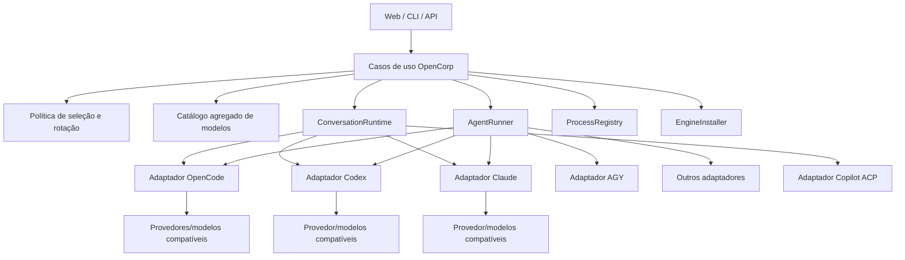

# Reavaliação da arquitetura de motores: OpenCode como adaptador, não como fundação

> **Status:** proposta arquitetural para decisão; nenhuma migração está implícita neste documento
> **Data:** 25 de setembro de 2026
> **Escopo:** motores de agentes, modelos, sessões conversacionais, instalação, processos residentes, testes e Secretário Executivo
> **Motivação:** explicar por que o OpenCode está presente em tantas camadas e definir uma arquitetura em que ele seja apenas um dos motores suportados

> **Documento operacional relacionado:** consulte o [Plano de execução da arquitetura multimotores](PLANO-EXECUCAO-ARQUITETURA-MULTIMOTORES.md) para decisões aprovadas, etapas, checklists, critérios de aceite, testes, commits e protocolo de limite do Codex.

## 1. Resposta direta

O OpenCorp **não precisa do OpenCode para tudo**.

O OpenCode é um bom motor e oferece uma API conveniente para sessões, eventos, ferramentas e múltiplos provedores. Porém, no estado atual, ele ocupa simultaneamente três papéis:

1. motor de execução selecionável;
2. gateway de modelos e provedores;
3. runtime conversacional exclusivo do Secretário.

Essa sobreposição não nasceu de uma exigência técnica. Ela é consequência da evolução histórica do projeto:

- o OpenCorp foi concebido inicialmente em torno do `opencode run` e do `opencode serve`;
- a abstração `EngineDriver` e os demais motores foram adicionados depois;
- os fluxos e agentes passaram a aceitar outros motores, mas o Secretário continuou falando diretamente com a API do OpenCode;
- defaults, fallbacks, nomes de arquivos, mensagens e mecanismos de sessão continuaram OpenCode-cêntricos;
- o catálogo de modelos acessível pelo OpenCode passou a ser confundido com o catálogo nativo do OpenCorp.

Portanto, a “fissura de usar OpenCode” é, na prática, **acoplamento histórico e assimetria de capacidades**, não uma decisão arquitetural que ainda deva ser preservada.

### Decisão recomendada

O OpenCorp deve ser o **orquestrador soberano**. OpenCode, Codex, Claude Code, Antigravity, Cursor, Copilot, MiMo, Crom Agente e Aider devem ser adaptadores substituíveis, cada um expondo apenas as capacidades que realmente implementa.

O Secretário deve depender de um contrato `ConversationRuntime`, e não de `OpencodeServerManager`. Fluxos e execuções pontuais devem depender de um contrato `AgentRunner`. O catálogo de modelos deve ser agregado pelo OpenCorp, sem depender de um único motor.

---

## 2. O que existe hoje

### 2.1 O projeto não clona CLIs automaticamente

O comando de clonagem de agente duplica a definição do agente; ele não clona repositórios de CLIs externos.

O registro atual contém nove motores em `src/core/engines/registry.ts`:

| Motor | Forma principal de integração atual |
|---|---|
| OpenCode | CLI para jobs e servidor HTTP para o Secretário |
| Crom Agente | CLI |
| Claude Code | CLI |
| Antigravity / AGY | CLI |
| Cursor | CLI |
| GitHub Copilot | CLI |
| OpenAI Codex | CLI |
| Aider | CLI |
| MiMo | CLI |

A instalação ocorre por uma ação explícita da API/UI. Uma execução não deveria instalar silenciosamente um motor ausente. Hoje, se o binário não estiver disponível, o caminho normal é a tentativa de execução falhar.

### 2.2 O contrato atual mistura responsabilidades

`EngineDriver`, em `src/core/engines/types.ts`, exige que todo motor saiba:

- descobrir se está instalado;
- instalar-se;
- verificar saúde;
- preparar um comando de execução;
- consultar cotas e tokens.

Esse contrato é insuficiente para representar diferenças importantes:

- execução pontual versus conversa persistente;
- texto versus JSON/JSONL estruturado;
- streaming;
- continuação e bifurcação de sessão;
- aprovações;
- cancelamento;
- ferramentas e MCP;
- anexos/imagens;
- necessidade ou não de processo residente;
- autenticação separada de instalação;
- disponibilidade real de inferência.

Ao mesmo tempo, ele é amplo demais: instalar um binário e executar uma conversa são responsabilidades diferentes, mas estão agrupadas no mesmo objeto.

### 2.3 O OpenCode ainda é o fallback estrutural

Existem vários pontos onde a escolha volta silenciosamente ao OpenCode:

- `EngineRegistry.resolveDriver()` usa `opencode` como padrão e também como fallback de ID desconhecido;
- `SessionManager` inicia `runnerConfigEngine` com `opencode`;
- ausência de configuração de agente ou runner termina em `opencode`;
- prefixos `opencode/*` e `opencode-go/*` forçam o harness OpenCode;
- modelos `openrouter/*` são tratados como pertencentes ao motor OpenCode durante parte da rotação de contas;
- a detecção do harness de uma execução também termina em `opencode` quando não encontra evidência melhor.

Um motor desconhecido jamais deveria virar OpenCode silenciosamente. O comportamento correto é erro explícito de configuração ou seleção deliberada por uma política documentada.

### 2.4 O Secretário não usa a abstração de motores

O Secretário é implementado como cliente direto de um `opencode serve`:

```text
Web do Secretário
        │
        ▼
Rotas /secretario/*
        │
        ▼
OpencodeServerManager
        │
        ▼
opencode serve + API HTTP/SSE
```

`src/server/routes/secretario/helpers.ts` pede uma porta ao `OpencodeServerManager` e pode iniciar o servidor automaticamente. Isso significa que selecionar Codex, Claude Code ou outro motor para agentes não torna esse motor capaz de atender o chat do Secretário.

O nome apresentado ao usuário é genérico — “motor do secretário” — mas o componente concreto continua sendo exclusivamente OpenCode.

### 2.5 Jobs e conversa têm ciclos de vida diferentes

Os agentes e nós de fluxo normalmente usam processos pontuais:

```text
ordem → spawn do CLI → eventos/stdout → resultado → processo termina
```

O Secretário usa um servidor residente:

```text
primeira mensagem → inicia opencode serve → cria/reutiliza sessões → servidor permanece vivo
```

Manter um processo aquecido durante uma conversa ativa é defensável. Mantê-lo indefinidamente, sem expiração por ociosidade, registro uniforme de processos e autenticação local obrigatória, não é.

O daemon do OpenCorp e o servidor do OpenCode também não são a mesma coisa:

- **daemon OpenCorp:** supervisiona componentes do próprio produto, como scheduler/API;
- **scheduler:** dispara fluxos agendados;
- **`opencode serve`:** runtime conversacional de um motor específico.

O terceiro não deve ser requisito permanente dos dois primeiros.

---

## 3. Por que a abstração atual não eliminou o acoplamento

Criar uma interface chamada `EngineDriver` não basta para tornar o sistema agnóstico. O comportamento real ainda contém caminhos privilegiados.

### 3.1 Caminho especial no executor

No `SessionManager`, OpenCode possui construção manual própria de argumentos, ambiente isolado e flags. Os outros motores passam por `driver.prepareExecution()`. Há, portanto, dois sistemas de execução dentro do mesmo método.

### 3.2 Motor e modelo estão indevidamente acoplados

O prefixo do modelo pode substituir o motor escolhido. Isso mistura duas decisões diferentes:

- **motor/harness:** quem executa o loop do agente;
- **provedor/modelo:** qual backend de inferência atende o motor.

`openrouter/...` não é sinônimo de OpenCode. OpenRouter é um provedor que pode ser consumido por diferentes runtimes. Do mesmo modo, “Codex” pode significar harness Codex, família de modelo ou produto, e esses conceitos não devem ser inferidos apenas de uma string.

### 3.3 Capacidades declaradas não equivalem a capacidades integradas

A matriz de capacidades registra continuação nativa em vários CLIs, mas o caminho de continuação do `SessionManager` admite que somente OpenCode e Crom Agente recebem a sessão de ponta a ponta. Outros motores caem em reidratação de transcript.

Isso cria uma diferença crítica entre:

- capacidade anunciada pelo binário;
- capacidade implementada pelo adaptador;
- capacidade verificada em produção.

Esses três estados precisam ser representados separadamente.

### 3.4 Saúde não comprova funcionamento

`POST /api/motores/:id/test` chama apenas `checkHealth()`. Em geral, isso comprova binário, versão e talvez autenticação. Não comprova:

- inferência mínima;
- streaming;
- chamada de ferramenta;
- escrita controlada;
- continuação de sessão;
- cancelamento;
- limpeza do processo.

Uma tela pode, assim, declarar um motor saudável mesmo quando ele falha no primeiro trabalho real.

### 3.5 O catálogo do OpenCode virou catálogo de fato

O OpenCode agrega muitos provedores e expõe seus modelos, o que foi útil para evoluir rapidamente. Mas isso criou uma dependência conceitual: modelos descobertos por ele parecem “modelos do OpenCorp”.

O catálogo correto do OpenCorp deve indicar a origem de cada entrada:

```text
modelo + provedor + conta + motores compatíveis + capacidades + custo + disponibilidade
```

Um modelo não deve escolher implicitamente o motor, e um motor não deve possuir modelos que na realidade pertencem a um provedor externo.

---

## 4. Riscos já evidenciados

### 4.1 Processos órfãos em testes

A auditoria de 25/09/2026 encontrou servidores `fake-opencode` iniciados por testes e reparentados para PID 1. Os testes fechavam a API e removiam diretórios temporários, mas não chamavam `manager.parar()` no teardown.

Isso demonstra uma falha de contrato de ciclo de vida: quem cria o runtime precisa possuir e encerrar o recurso, inclusive em exceções.

### 4.2 Servidor local sem política completa de segurança

O servidor fica em loopback, o que reduz exposição externa, mas a documentação oficial do OpenCode prevê `OPENCODE_SERVER_PASSWORD`. Um processo local não autenticado ainda pode ser acessado por outros processos da máquina.

Também faltam como política geral:

- segredo aleatório por instância;
- tempo máximo ocioso;
- registro de dono/workspace;
- reconciliação de órfãos;
- encerramento gracioso e escalonamento para `SIGKILL`;
- limites de memória e sessões;
- isolamento claro de credenciais entre workspaces.

### 4.3 Instalação e cadeia de suprimentos

Os instaladores atuais variam entre `npm`, `pip`, scripts remotos e cópia de binários. Falta uma política uniforme com:

- versão aprovada e fixada;
- checksum ou assinatura;
- staging antes da ativação;
- probe pós-instalação;
- manifesto de proveniência;
- troca atômica;
- rollback.

O fallback que cria um comando `agy` apontando para OpenCode deve ser removido: um adaptador nunca pode se identificar como um motor e executar outro por baixo sem transparência.

### 4.4 Fragilidade dos contratos CLI

Vários drivers dependem de flags e parsing de stdout não estruturado. Os próprios CLIs já oferecem, em graus diferentes, JSON, JSONL/stream-json, sessões e protocolos de integração. Não usar essas interfaces torna o OpenCorp mais frágil do que precisa ser.

### 4.5 MiMo incompleto na matriz

MiMo está no registro de motores, mas não está representado no tipo `HarnessId` nem na matriz de capacidades. Isso é um sinal de que registro, roteamento e capacidades podem divergir sem uma verificação compilável única.

---

## 5. Arquitetura-alvo

### 5.1 Princípio central

O OpenCorp deve possuir os contratos, o estado, a política, a auditoria e o ciclo de vida. Cada motor deve apenas adaptar sua interface nativa a esses contratos.



### 5.2 Contratos separados

#### `EngineInstaller`

Responsável apenas por:

- detectar instalação;
- instalar/atualizar versão aprovada;
- verificar integridade;
- registrar proveniência;
- reverter versão.

#### `EngineAuthenticator`

Responsável por:

- descobrir estado de autenticação;
- iniciar login quando suportado;
- validar credencial sem expô-la;
- desconectar ou alternar conta.

#### `AgentRunner`

Responsável por uma execução delimitada:

```ts
interface AgentRunner {
  run(input: AgentRunInput, signal: AbortSignal): AsyncIterable<AgentEvent>;
  cancel(runId: string): Promise<void>;
}
```

#### `ConversationRuntime`

Responsável por sessões persistentes:

```ts
interface ConversationRuntime {
  create(input: ConversationCreateInput): Promise<ConversationRef>;
  send(ref: ConversationRef, input: MessageInput): AsyncIterable<AgentEvent>;
  resume(ref: ConversationRef): Promise<ConversationState>;
  fork?(ref: ConversationRef): Promise<ConversationRef>;
  close(ref: ConversationRef): Promise<void>;
}
```

#### `ModelCatalogSource`

Responsável por descobrir modelos sem definir o motor global:

```ts
interface ModelCatalogSource {
  listModels(account?: AccountRef): Promise<ModelDescriptor[]>;
  probe(model: ModelRef): Promise<ModelProbeResult>;
}
```

#### `ProcessRegistry`

Responsável por todo processo residente ou filho:

- PID e grupo de processos;
- motor e versão;
- workspace e proprietário;
- porta/transporte;
- horário de início e último uso;
- estado de autenticação;
- contagem de referências;
- timeout ocioso;
- encerramento e reconciliação após reinício.

### 5.3 Eventos canônicos

Todos os motores devem produzir os mesmos eventos internos, independentemente de JSONL, SSE, ACP ou stdout:

```ts
type AgentEvent =
  | { type: "run.started"; runId: string }
  | { type: "message.delta"; text: string }
  | { type: "tool.requested"; call: ToolCall }
  | { type: "tool.completed"; result: ToolResult }
  | { type: "approval.requested"; approval: ApprovalRequest }
  | { type: "usage.updated"; usage: Usage }
  | { type: "run.completed"; result: AgentResult }
  | { type: "run.failed"; error: EngineError };
```

A UI não deve analisar stdout específico de fornecedor.

### 5.4 Seleção explícita

A seleção deve seguir uma estrutura tipada, não inferência por prefixo:

```yaml
runtime:
  engine: codex
  mode: conversation
model:
  provider: openai
  id: gpt-5-codex
policy:
  fallback_engines: [claude-code, opencode]
  fallback_models: []
```

Fallback entre motores só ocorre se estiver declarado. Motor inexistente gera erro. Modelo incompatível gera erro de validação antes da execução.

---

## 6. Qual deve ser o papel do OpenCode

### Manter

- adaptador de execução pontual via CLI estruturada;
- adaptador conversacional via SDK/cliente oficial;
- acesso aos provedores que o usuário conectou nele;
- suporte a sessões, eventos e ferramentas quando o OpenCode for selecionado;
- opção recomendada quando suas capacidades forem adequadas.

### Remover como responsabilidade implícita

- fallback universal para ID desconhecido;
- runtime obrigatório do Secretário;
- proprietário do catálogo global do OpenCorp;
- sinônimo de OpenRouter;
- daemon iniciado indefinidamente sem política de ociosidade;
- ponte silenciosa para representar outro motor;
- caminho especial espalhado pelo `SessionManager`.

### Política de processo recomendada

- **fluxos e jobs:** `opencode run` pontual, encerrado ao final;
- **Secretário usando OpenCode:** host/cliente oficial criado sob demanda;
- **sessão ativa:** runtime pode permanecer aquecido;
- **ociosidade de 10–20 minutos:** fechar se não houver referências;
- **encerramento do OpenCorp:** fechar todos os filhos possuídos;
- **reinício:** reconciliar pidfiles e órfãos antes de criar novos processos.

---

## 7. Integração adequada por motor

| Motor | Jobs pontuais | Conversa persistente | Integração preferida |
|---|---|---|---|
| OpenCode | Sim | Sim | SDK/cliente oficial; CLI estruturada como fallback |
| Codex | Sim | Sim | `codex exec --json` para jobs; SDK/app-server para produto conversacional |
| Claude Code | Sim | Sim | print mode com `json`/`stream-json` e `--resume`; SDK quando aplicável |
| AGY | Sim | Sim, se o contrato for estável | saída estruturada e IDs de conversa |
| Cursor | Sim | Sim, se suportado pela versão | saída estruturada e resume/continue |
| Copilot | Sim | Sim | ACP para integração persistente; CLI como fallback |
| MiMo | Sim | Potencialmente | ACP/API compatível ou CLI estruturada, após contrato testado |
| Crom Agente | Sim | Parcial | CLI e sessão nativa já repassada |
| Aider | Sim | Não como prioridade | one-shot; não forçar equivalência com runtimes conversacionais |

Nem todo motor precisa implementar tudo. Uma arquitetura plugável saudável permite declarar “não suportado” sem fingir equivalência.

---

## 8. Plano de migração proposto

### Fase 0 — Estancar riscos sem redesenho amplo

1. Corrigir teardown dos testes que iniciam servidor.
2. Remover o wrapper AGY que executa OpenCode.
3. Proteger servidores locais com segredo aleatório por instância.
4. Adicionar timeout de ociosidade e encerramento no shutdown.
5. Separar na UI/API os estados:
   - instalado;
   - autenticado;
   - inferência funcional;
   - streaming funcional;
   - sessão funcional.
6. Trocar fallback de motor desconhecido por erro explícito.

**Critério de saída:** nenhuma suíte deixa processos órfãos e nenhum motor pode mascarar outro.

### Fase 1 — Definir contratos e testes de conformidade

1. Criar os contratos separados descritos na seção 5.
2. Definir eventos canônicos e erros tipados.
3. Criar manifesto de capacidades por adaptador.
4. Fazer o compilador garantir que todo motor registrado possua manifesto.
5. Preservar os drivers atuais atrás de adaptadores de compatibilidade.

**Critério de saída:** registrar um novo motor não exige editar o Secretário nem criar condicionais no `SessionManager`.

### Fase 2 — Extrair o caminho OpenCode do núcleo

1. Mover a montagem especial de `opencode run` para o adaptador OpenCode.
2. Fazer `SessionManager` depender apenas de `AgentRunner`.
3. Substituir `OpencodeServerManager` nas rotas por `ConversationRuntime`.
4. Manter OpenCode inicialmente como runtime conversacional padrão, mas por configuração explícita.
5. Renomear endpoints/status que hoje escondem o vínculo com OpenCode.

**Critério de saída:** o núcleo não importa módulos chamados `opencode-*` para executar casos de uso genéricos.

### Fase 3 — Habilitar mais de um runtime conversacional

Ordem recomendada:

1. OpenCode via SDK/cliente oficial, para estabilizar o contrato com comportamento conhecido.
2. Codex via SDK/app-server.
3. Claude com stream-json e continuação real.
4. Copilot via ACP.
5. AGY, Cursor e MiMo após testes contratuais das versões suportadas.

**Critério de saída:** o Secretário abre, transmite, cancela e continua uma thread com pelo menos dois motores diferentes.

### Fase 4 — Catálogo e roteamento soberanos

1. Agregar catálogos por provedor e por motor.
2. Mostrar compatibilidade entre modelo e motor.
3. Fazer probes reais, baratos e opt-in.
4. Separar rotação de modelo, conta, provedor e motor.
5. Registrar motivo de cada fallback.
6. Impedir modelos reprovados pela governança de entrarem em agentes autônomos.

**Critério de saída:** escolher um modelo nunca muda o motor silenciosamente.

### Fase 5 — Instalação e ciclo de vida confiáveis

1. Criar manifesto de versões aprovadas.
2. Implementar download em staging, validação e ativação atômica.
3. Registrar proveniência e oferecer rollback.
4. Centralizar processos no `ProcessRegistry`.
5. Adotar `SIGTERM`, prazo de graça e `SIGKILL` somente como último recurso.

**Critério de saída:** instalação e atualização são reproduzíveis, auditáveis e reversíveis.

---

## 9. Matriz mínima de testes

Cada adaptador deve passar por testes de contrato proporcionais às capacidades que declara.

| Teste | One-shot | Conversacional |
|---|---:|---:|
| Binário/SDK presente e versão suportada | obrigatório | obrigatório |
| Autenticação válida | obrigatório | obrigatório |
| Inferência mínima real | obrigatório | obrigatório |
| Parsing estruturado | obrigatório | obrigatório |
| Streaming de texto/eventos | se declarado | obrigatório |
| Ferramenta de leitura | se declarado | se declarado |
| Escrita em sandbox | se declarado | se declarado |
| Timeout e cancelamento | obrigatório | obrigatório |
| Continuação da mesma sessão | não | se declarado |
| Fork de sessão | não | se declarado |
| Aprovação HITL | se declarado | se declarado |
| Encerramento sem órfãos | obrigatório | obrigatório |

Os testes reais devem ser opt-in, usar orçamento máximo, modelo explicitamente selecionado e workspace temporário. `checkHealth()` continua útil, mas não deve receber o nome de teste funcional.

---

## 10. Decisões que precisam ser tomadas antes de implementar

1. **Runtime padrão do Secretário:** manter OpenCode como padrão configurável durante a migração ou não ter padrão e exigir seleção?
2. **Escopo por workspace:** cada workspace pode escolher runtime conversacional próprio ou existe um runtime global com sessões isoladas?
3. **Instalação:** o OpenCorp gerencia versões dos CLIs ou apenas detecta instalações externas? A recomendação é oferecer ambos, mas nunca instalar durante uma execução.
4. **Credenciais:** ficam centralizadas por provedor/conta ou isoladas por motor? O modelo de dados precisa impedir duplicação e vazamento entre workspaces.
5. **Protocolos:** ACP será tratado como adaptador de primeira classe ou apenas implementação interna de alguns motores?
6. **Compatibilidade:** por quanto tempo `runner.json`, prefixos de modelo e campos legados serão aceitos?

---

## 11. Recomendação de sequência imediata

A ordem de maior retorno e menor risco é:

1. eliminar processos órfãos nos testes;
2. remover identidades falsas entre motores;
3. tornar o teste de motor honesto e multinível;
4. autenticar e expirar o runtime OpenCode;
5. impedir fallback silencioso para OpenCode;
6. separar `AgentRunner` de `ConversationRuntime`;
7. migrar o Secretário para o contrato genérico usando OpenCode como primeiro adaptador;
8. adicionar Codex como segundo runtime conversacional e provar a independência;
9. só então expandir para os demais motores.

Essa sequência evita uma reescrita simultânea de nove integrações. Primeiro cria-se o contrato correto; depois prova-se com dois motores; por fim migram-se os restantes conforme capacidade e valor real.

---

## 12. Fontes e evidências

### Código e documentos internos

- `src/core/engines/registry.ts` — registro e fallback atual de motores.
- `src/core/engines/types.ts` — contrato atual `EngineDriver`.
- `src/core/engines/capabilities.ts` — matriz de capacidades declaradas.
- `src/core/contexts/execution/session-manager.ts` — resolução de motor, caminho especial OpenCode e continuação.
- `src/core/contexts/execution/opencode-server.ts` — ciclo de vida do `opencode serve`.
- `src/server/routes/secretario/helpers.ts` — dependência do Secretário na porta OpenCode.
- `src/server/routes/config.ts` — instalação, ativação, health check e status.
- `tests/secretario-proxy.test.ts` e `tests/secretario-erros.test.ts` — evidência de teardown sem encerramento do manager na auditoria.
- `docs/ESTUDO-ARQUITETURA-E-PADRONIZACAO-AGENTES.md` — desenho original explicitamente OpenCode-cêntrico.
- `docs/PADRONIZACAO_ARQUITETURAL_OPENCORP.md` — diagnóstico de acoplamento e necessidade de portas/adaptadores.
- `docs/RELATORIO-AUDITORIA-MODELOS-2026-09-25.md` — catálogo, probes e falhas observadas em modelos/provedores.

### Documentação oficial externa

- [OpenCode Server](https://dev.opencode.ai/docs/server/) — API HTTP/OpenAPI, eventos e autenticação do servidor.
- [OpenCode SDK](https://opencode.ai/v2/docs/build/sdk) — host embutido, cliente e ciclo de vida explícito.
- [OpenCode Providers](https://opencode.ai/docs/providers) — provedores, credenciais e catálogo de modelos.
- [OpenAI: SDKs and CLI](https://developers.openai.com/api/docs/libraries) — distinção entre SDK de aplicação e CLI.
- [OpenAI Agents architecture](https://developers.openai.com/api/docs/guides/agents-api/architecture) — separação entre harness, ambiente e application server.
- [Claude Code CLI](https://docs.anthropic.com/en/docs/claude-code/cli-usage) — JSON/stream-json, limites, permissões e resume.
- [GitHub Copilot CLI ACP server](https://docs.github.com/en/copilot/reference/copilot-cli-reference/acp-server) — integração ACP para clientes e sistemas multiagente.

---

## Conclusão

OpenCode não é o problema; **a ausência de uma fronteira clara ao redor dele é o problema**.

Ele pode continuar sendo um excelente adaptador e até o padrão inicial do Secretário. O que deve acabar é sua condição de dependência invisível do produto. A arquitetura correta permite removê-lo, trocá-lo ou executá-lo ao lado de outros motores sem alterar fluxos, UI, memória, políticas ou domínio do OpenCorp.

O teste definitivo da nova arquitetura é simples:

> Desabilitar OpenCode deve indisponibilizar apenas as execuções e conversas configuradas para OpenCode — nunca o OpenCorp inteiro, o scheduler, os fluxos ou o Secretário quando outro runtime compatível estiver selecionado.
